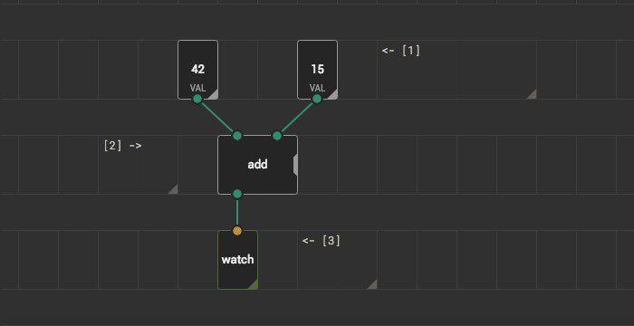

# Guide Writing Guidelines

This article summarizes general recommendations for creating articles which appear in [XOD User’s Guide](/docs/guide/) section.

Disclaimer: existing articles are not perfect and might violate some points. The rules are introduced based on the experience gained from the past publications.

## Describe by example

For many topics, it is a good idea to take a particular example and explain the material along with it. That is, if you are going to tell how to deal with I²C interface communication in XOD, do not list nodes/steps/requirements for an abstract case. Instead, take a simple I²C piece of hardware (such as RTC clock) and explain how to initialize the bus, read and write data for this particular part.

The example should be as accessible as possible. Avoid rare parts or niche knowledge requirements (chemistry, voodoo dances, whatever). A simplistic model is OK.

## Outline

A rough recommended structure for a guide is:

- A paragraph about what a reader will learn (e.g., doing things sequentially)
- A sentence about the example (e.g., traffic light model)
- What prior knowledge is required (e.g., creating patch nodes)
- Schematics and hardware setup
- Programming
- Result demo (a short MP4 is the best, GIF or photo is OK too)
- Link to the program source (xodball)
- Application ideas (i.e., how the knowledge can be applied further)
- See also articles

A particular guide article is free to omit some points, change the order, or add others if it makes sense to describe the topic better.

## Three level nesting

For an article use no deeper than third level headings.

Any article will have precisely one H1 heading (the title), and several H2 headings. If it is absolutely required, use H3 headings.

When an H4 heading is required, stop yourself. Deep nesting creates to much cognitive load to be correctly followed by a reader. Restructure your content instead.

---

For the conclusion section prefer the three-dot ruler instead of regular heading (because you don’t have a paired “Introduction” heading, right?):

```markdown
---
```

## Headings style

- Capitalize Main H1 Title (Like in Newspapers)
- Use usual sentence case for H2 and H3
- Use [headlinese](https://en.wikipedia.org/wiki/Headlinese) form: omit articles and “to be”

## Essential H1

For the main heading choose a phrase describing the piece of knowledge you are talking about, not the example.

- Not OK: “Traffic Light Example”
- Not OK: “Doing Things Sequentially with Traffic Light Example”
- OK: “Doing Things Sequentially”

## Detailed front matter title

Contrary to H1 the `title` field in the front matter which is later used for the browser tab title is better to be complete:

“Doing Things Sequentially — Traffic Light Example”

## Derive permalink from H1

For the article directory name choose one that repeats H1, but is normalized for URLs. For example: `doing-things-sequentially`.

## Short headings

Prefer shorter headings. They help to scan the article faster.

- So-so: “Building device circuit”
- Better: “Circuit”

## No word wrap for prose

Despite that programming code is usually hard-wrapped at 80 columns, for _prose_ the enforced word wrap is impractical. There’s an illusion that wrapping Markdown helps to produce fewer Git diffs and precisely point to problems during the review. That’s just isn’t true.

Merely fixing a typo might easily reflow _all_ lines in the paragraph producing even larger diff. And if a paragraph is so large that pointing to a particular place in it is problematic, shouldn’t it be split into smaller chunks?!

Many applications such as GitHub, Discourse, Grammarly expect content without hard-wrapping, and that makes exchange problematic if our content does not follow the same rules.

## Write units properly

Prefer the abbreviated form for units. Remember to delimit units with space, capitalize the unit itself if it is derived from a human name, and use the correct case for a modifier (m for milli-, M for mega-, etc.):

- Bad: 10K ohm, 5 mamp, 3KG
- OK: 10 kΩ, 10 mA, 3 kg

## Hyperlink paths

When placing a hyperlink to another guide prefer relative paths:

```markdown
Now it is a good idea to [document your node](../documenting-nodes/).
```

In cases of deep nesting, it is OK to use the absolute path starting with `/docs/`:

```markdown
All built-in [data types](/docs/reference/data-types/) support the feature.
```

When placing hyperlinks to pages of xod.io which are not under `/docs/`, use the full URL:

```markdown
Place a new [`xod/core/pid`](https://xod.io/libs/xod/core/pid) node.
```

Using this principle the links stay functional on the xod.io site and in GitHub previews at the same time.

## Provide meta tags

For better article shareability provide `description` and `image` fields in the front matter:

```yaml
---
title: ...

# 180 characters max. Appears in share link preview in social networks.
description: |
  How to exchange data between two Arduino boards and how to control LEDs via
  UART interface.

# Path to an image placed next to the source to be used as a link preview
# in social networks.
image: ./uart-example.jpg
---

```

## 700 pixels width

The maximal content width for documentation on the xod.io site is 700 px. So it is a good idea to keep diagrams, photos, screenshots, and screencasts no wider than 700 pixels.

Exact 700 pixels in width works best.

Don’t be tempted to make a screenshot with a larger size (say, 850 px) and minify it to 700 px in an image editor. It will introduce distortion and undesired scale variety. Instead, make the screenshot frame precisely 700 pixels wide to create a 1-to-1 image.

## Attach all media sources

Regardless of software used to create images, diagrams, or other artifacts place and put under Git control all source files that are enough for anyone to make a fix or adjustment.

For example, if an article includes a PNG-drawing created with QCad, place the source DXF files as well so that anyone can re-create the PNG while fixing a minor issue.

## Automate image generation

Where possible provide shell scripts to convert the initial media sources into the final images used in the article. That way a minor change in the source will not end with a significant shift in result size, area, quality, etc.

Notably, for XOD programs and patches use the [command-line screenshot tool](https://github.com/xodio/xod/blob/master/tools/screenshot-xodball). Use `.patch.png` extension for produced images to clearly distinguish them from manual screenshots.

Example:

```bash
$ cat ./update-screenshots.sh
#!/bin/sh

# The $SHOT env should contain the full path to the `screenshot-xodball` tool
"$SHOT" "./sharp-irm.step1.xodball" main ./step1.patch.png 620
"$SHOT" "./sharp-irm.step2.xodball" gp2y0a02-range-meter ./step2a.patch.png 700
```

## Use number footnotes on patches

When using a complex patch screenshot which requires some elaboration add numbered comments to it rather than comments with actual descriptions. Explain the numbers in the text below the screenshot.

Example:



1. Place two constants
2. Use the `add` node to compute the sum
3. Observe the result with the `watch` node

Using the footnote-style commenting makes it possible to translate the originally-English article without XOD patches duplication and adjustments.
