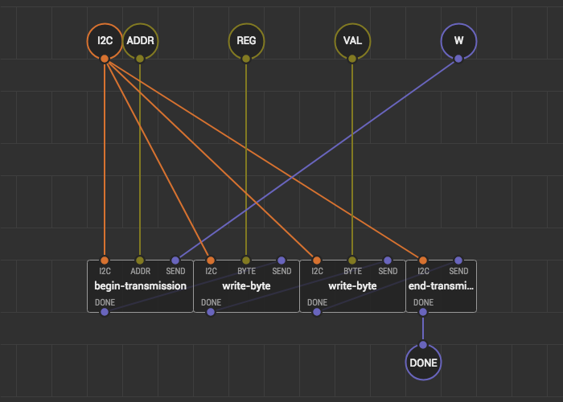
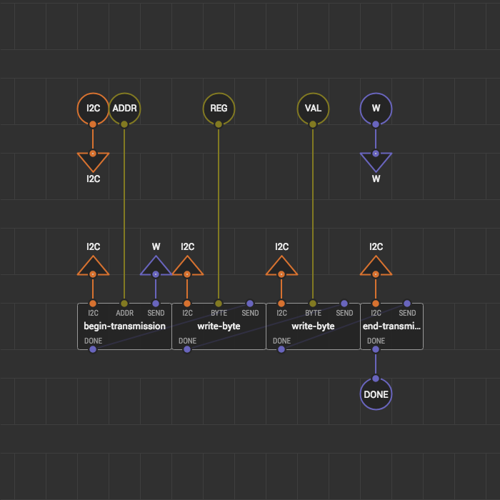

# Buses

When you have a complex patch, drawing all links as visible straight lines may produce much of visual noise.

Buses are an alternative way to link nodes’ pins. They allow creating “invisible” links. There are two node types in `xod/patch-nodes` that work in tandem:

- `to-bus` — defines a new bus
- `from-bus` — sources data from an existing bus

Bus nodes with the same label are considered to be implicitly interconnected by XOD.

Note

Buses are used in electronics extensively. You’ll rarely see many wires on schematics leading toward a single GND (Ground) point or Vcc (power source). Instead, the wires are terminated with special symbols of GND and Vcc buses, and anyone understands that all the symbols are effectively connected together.

XOD borrows the idea from electronic schemes.

We can refactor the patch shown above using buses to reduce the visual clutter:

The triangles are bus nodes. The one pointing down is a `to-bus` sink, and the up-triangle is `from-bus` source. Pay attention, how we used two terms `I2C` and `ADDR` to label the bus nodes. In other words, we’ve introduced two buses to our patch.

The bus nodes do not affect performance or other characteristics of the compiled program anyhow. When XOD transpiles a program, it replaces all matching bus node pairs with a straight link.

Buses are local to the patch where they are defined. That is, two different patches may have a bus with the same label, and they will not be related anyhow. There is no way to teleport a link from one patch to another, use the [patch nodes](../nodes-for-xod-in-xod/) mechanism to achieve it.

## IDE shortcuts

It might be annoying to place a `to-bus` and `from-bus`, then giving both a label manually for each bus link. XOD IDE provides a few keyboard shortcuts to assist you when dealing with buses.

1.  You can start linking and when you see the rubber link which follows the cursor press the `B` key. It will create a bus node under the cursor with a label matching the pin name which started the link.
2.  You can select an existing link or several links at once and press the `B` key to convert the selected links into buses: the links are broken, and a matching bus pair labeled after output pin is created.

## When to use buses

Line intersections—especially with small angles—make patch reading hard. When a link introduces many intersections, replace it with a bus.

When you feedback an output back to an input of some upstream node, the reverse link might seem awkward. Replacing it with a bus is a good idea.

Delivering a common constant or an input like `RST`, `UPD`, or `ADDR` to multiple places may introduce bulky webs. Replacing them with a bus will make a patch much lighter.

On the other hand excessive use if buses might make a patch harder to follow visually. So, if you’ve made three or more buses on a patch, ask yourself whether it will be better to extract some parts of it into separate patches.

## Validity rules

To be successfully compiled the bus nodes should follow several pretty intuitive rules:

- A `from-bus` node should have a corresponding `to-bus` node with the same label. Otherwise, it will mean a floating undefined value.
- There should be no more than a single `to-bus` node with a particular label on a patch. Otherwise, it would be possible to link an input to multiple outputs which make no sense in XOD.
- The data type of an input linked to `from-bus` should be [castable](/docs/reference/data-types/#casting-rules) from a type of the matching `to-bus` node.

If a bus violates some rules, it will be rendered red in XOD IDE. Hover the node to see the error details.
