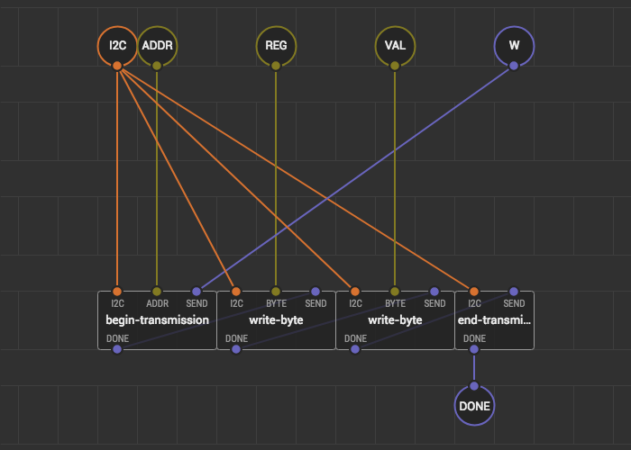
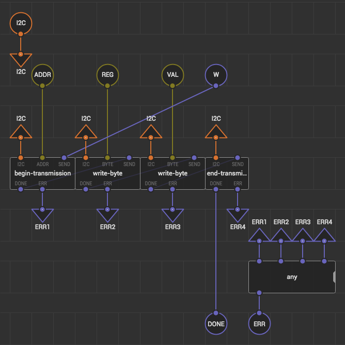

# Шины

Когда у вас сложный патч, отображение всех линков в виде видимых прямых линий может привести к значительному визуальному шуму.

Шины - это альтернативный способ соединения пинов нод. 
Они позволяют создавать “невидимые” линки. Существует два типа нод в `xod/patch-nodes`, которые работают в тандеме:

- `to-bus` — определяет новую шину
- `from-bus` — источники данных из существующей шины

Ноды-шины с одним и тем же названием считаются незримо связанными в XOD.

Примечание

Шины широко используются в электронике. Вы редко увидите много проводов на 
схемах, ведущих к одной точке GND (Земля) или Vcc (источник питания). 
Вместо этого соединения заканчиваются специальными символами шин GND и Vcc, и 
каждый понимает, что все эти порты связаны друг с другом.

XOD заимствует идею из электронных схем.

Мы можем реорганизовать патч, показанный выше, используя шины, чтобы уменьшить визуальный беспорядок:

Треугольники - это ноды-шины. Треугольник, направленный вниз - это `to-bus` , а направленный вверх 
  `from-bus`. Обратите внимание, как мы использовали два терминала `I2C` и `ADDR` и обозначали 
 ноды-шины. Другими словами, мы сделали две шины для нашего патча.

Ноды-шины не влияют на производительность или другие характеристики скомпилированной программы. 
Когда XOD компилирует программу, он заменяет все соответствующие пары нод прямыми линками.

Шины являются локальными для патча, где они определены. То есть, у двух разных патчей 
может быть шина с одним и тем же названием, и они никак не будут связаны. Невозможно 
передать ссылку с одного патча на другой, используйте [patch nodes](../nodes-for-xod-in-xod/) механизм для этого.

## Ярлыки IDE

Вас может раздражать, что для того, чтобы поместить `to-bus` и`from-bus`, надо вручную давать оба названия для каждой шины. 
XOD IDE предоставляет несколько сочетаний клавиш, которые помогут вам при работе с шинами.

1.  Начните линкование, и когда вы увидите растягивающийся линк, который следует за курсором, нажмите 
    `B` клавишу. Он создаст ноду-шину под курсором с названием, соответствующим имени пина, с которого тянется линк.
2.  Вы можете выбрать существующий линк или несколько линков одновременно и нажать `B`
    клавишу, чтобы преобразовать выбранные линки в шины: линии связи исчезнут, и соответствующие пары шин, будут
    названы соответственно.

## Когда использовать шины

Пересечения линков - особенно с небольшими углами. 
Когда линк имеет много пересечений, замените его на шину.

Когда вы возвращаете результат обратно на вход какой-либо начальной ноды, обратный линк может показаться неудобным. 
Замена его на шину - хорошая идея.

Назначая общую константу или вход как `RST`, `UPD` или `ADDR` в нескольких местах может привести к загромождению патча. 
Замена их на шину сделает патч намного легче.

С другой стороны, чрезмерное использование шин, может сделать патч сложнее для визуального отслеживания цепочки взаимодействий. 
Так, если вы сделали три или более шины в патче, то спросите себя, может будет лучше извлечь некоторые его части в отдельные патчи.

## Правила действия

Для успешной компиляции ноды-шины должны следовать нескольким довольно интуитивным правилам:

- `from-bus` нода должна иметь соответствующий `to-bus` ноду с таким же названием. 
  В противном случае это будет означать плавающее неопределенное значение.
- `to-bus` нода должна быть с уникальным названием. В противном случае было бы возможно связать вход с несколькими выходами, 
  которые не имеют смысла в XOD.
- Тип данных связанных `from-bus` и `to-bus` нод должны соответствовать [Правилам преобразования](/docs/reference/data-types/#casting-rules).
  
Если шина нарушает некоторые правила, в XOD IDE она будет красной. Наведите указатель мыши наноду, чтобы просмотреть сведения об ошибке.
