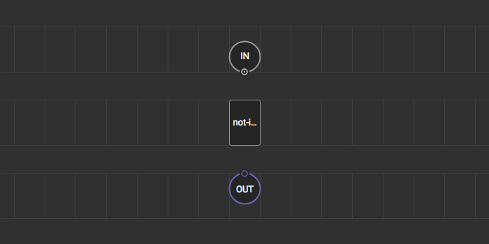
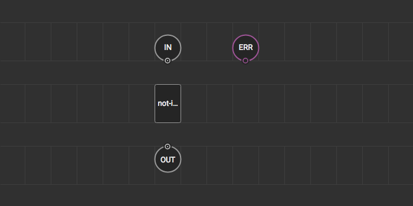

# Dealing with Errors in C++

Sometimes, when making own C++ nodes, you'll want to express that some kind of error happened and stop downstream nodes from the evaluation. For example, a sensor failed to initialize or there is no network connection to perform a request. Or you'll want to create nodes that catch errors to allow some kind of recovery. Take a look at [errors concept guide](../errors/) for a more detailed explanation.

In this article, we'll learn the C++ API to deal with errors in XOD.

## The task

We're going to reimplement from scratch two essential nodes that catch and raise errors — [`xode/core/pulse-on-error`](https://xod.io/libs/xod/core/pulse-on-error) and [`xod/core/error`](https://xod.io/libs/xod/core/error).

## Catching errors

Just like `pulse-on-error`, our catcher should have a generic input and a pulse output. The input will be checked for upstream errors, and if there is one, a pulse will be emitted from the output.

As always, when you [make a C\++ node](../nodes-for-xod-in-cpp), start with a new patch, add required terminals, and the `not-implemented-in-xod` node.



C++ implementation is quite brief:

```cpp
#pragma XOD error_catch enable

node {
    void evaluate(Context ctx) {
        if (getError<input_IN>(ctx)) {
            emitValue<output_OUT>(ctx, 1);
        }
    }
}
```

The `#pragma XOD error_catch enable` directive declares that our node catches errors. Without it, the node will refuse to evaluate if it inherits an error propagated from an upstream node.

Error checking is performed with `getError<input_IN>(ctx)`. It returns `true` if the pin has an upstream error, and `false` otherwise.

## Raising errors

Our `error` node clone should have generic `IN` and `OUT` pins and a boolean `ERR` input.



If `ERR` is false, a value from `IN` will be passed through. If `ERR` is true, an error will be raised from the `OUT` pin.

```cpp
#pragma XOD error_raise enable

node {
    void evaluate(Context ctx) {
        if (getValue<input_ERR>(ctx)) {
            raiseError<output_OUT>(ctx);
        } else {
            emitValue<output_OUT>(ctx, getValue<input_IN>(ctx));
        }
    }
}
```

The `#pragma XOD error_raise enable` declares that our node raises errors. If it is omitted XOD transpiler looks whether you use the `raiseError` function somewhere in the node implementation and automatically enables the feature if it is found. So in this particular case, the directive might be omitted. Using it explicitly makes the intent clear though.

Errors can be raised for an individual pin with `raiseError<output_OUT>(ctx)` or for all output pins at once with `raiseError(ctx)`.

<div class="ui segment note">
<span class="ui ribbon label">Note</span>
A seasoned XODer may notice that this generic implementation will not work quite right with the pulse data type. That's why we have a separate specialization for pulses — <a
href="https://xod.io/libs/xod/core/error(pulse)"><code>error(pulse)</code></a>. 
</div>
