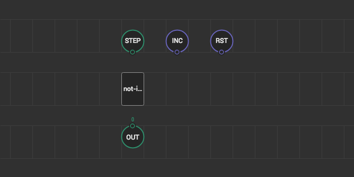

# Dealing with State in C++

Nodes outputs of which depend _solely_ on their inputs in at any point of time
are cool. They easy to understand, test, and compose. But building a useful
device using only such pure nodes is not realistic. Someone needs to keep state
along program run time.

A node can define state data that will persist for the time the program
executes. In other words, a node can put some value to the state in `evaluate`
call and retrieve that value in any of subsequent `evaluate` invocations.

## The task

Let’s make a simple `count` node that will increment a value by one each time a
pulse is sent to it. Also, we’ll make the step size configurable and provide a
pulse input to reset the counter to zero.

<div class="ui segment note">
<span class="ui ribbon label">Note</span>
XOD standard library already includes <a
href="/libs/xod/core/count/"><code>xod/core/count</code></a>
node with similar functionality. But let’s forget about it for a moment.
</div>

## Prepare the node

As always, when you [make a C\++ node](../nodes-for-xod-in-cpp), start with a
new patch, add required terminals, and the `not-implemented-in-xod` node.



It’s a good idea to provide a resonable default value for `STEP`. We’ll set it
to 1.

Double-click on `not-implemented-in-xod` node to open the code editor.

## Define a state shape

You can define the persistent state in the `node` struct just like you would define fields in a regular C\++ struct.
In our case, we need to store a single counter value, so we'll add a single field.
Let’s call it `counterValue`:

```cpp
node {
    Number counterValue = 0;

    void evaluate(Context ctx) {
        // ...
    }
}
```

All state values, regardless of type, start with their default values. The
default value for numbers is `0` anyway, so this initialization of
`counterValue` through assignment is not required. Although the definition of
the field is necessary, of course. We set it to `0` here just to demonstrate a
possibility to initialize with another value like `42`.

## Accessing state

Now you can use defined fields just like in a regular C\++ struct. The outline is:

```cpp
node {
    Number counterValue = 0;

    void evaluate(Context ctx) {
        // Read
        Number x = counterValue;

        // Do some magic with `x`

        // Write
        counterValue = x;
    }
}
```

Of course, you may use the fields directly without any intermediate variables.

## Put all together

As you know from [Data types](../data-types/) article pulses have no values. To
check whether a pulse on the pin was fired in the current transaction we should
use [`isInputDirty`](/docs/reference/node-cpp-api/#isInputDirty) function, not
`getValue`. It doesn’t read values, instead it returns `true` if an upstream
node just emitted a new value for the pin specified.

Finally, here is an example implementation of our counter:

```cpp
node {
    Number counterValue;

    void evaluate(Context ctx) {
        if (isInputDirty<input_INC>(ctx)) {
            // Update the state
            Number step = getValue<input_STEP>(ctx);
            counterValue += step;
        } else if (isInputDirty<input_RST>(ctx)) {
            // Reset the state
            counterValue = 0;
        } else {
            // The evaluation caused by `STEP` update. Do nothing, return early to
            // avoid emission of a duplicate value.
            return;
        }

        // Emit the updated value
        emitValue<output_OUT>(ctx, counterValue);
    }
}
```

## Moving state to outputs

The user-defined fields are not the only thing which keeps data across transactions.
Any node owns its output value as well. And the
[`getValue`](/docs/reference/cpp-node-api/#getValue) function is allowed to
access the most recent values set on outputs.

In our case, the `OUT` value always matches the value we store in `counterValue`. So
it’s a duplication we can get rid off to save few bytes of RAM and make the code
more compact:

```cpp
node {
    // The internal state is no longer required

    void evaluate(Context ctx) {
        if (isInputDirty<input_RST>(ctx)) {
            // On reset unconditonally emit 0
            emitValue<output_OUT>(ctx, 0);
        } else if (isInputDirty<input_INC>(ctx)) {
            Number step = getValue<input_STEP>(ctx);
            // Read the most recent value...
            Number counterValue = getValue<output_OUT>(ctx);
            // ...and immediately emit a new one
            emitValue<output_OUT>(ctx, counterValue + step);
        }
    }
}
```

Note how we changed the order of pulse checks to preserve the priority of `RST`
pulse over the `INC` pulse.

## Test it

Well done! The node is ready. Use a couple of buttons and a `watch` node to test
and play with it.


## Conclusion

Using persistent state is easy. Remember though, data stored in it consumes RAM.
Also, stateful nodes in many cases are more complicated than their pure
counterparts; it’s easier to seed a bug in it. Use them with care.

When possible, split a big stateful node into two smaller nodes: a stateful thin
node and pure fat node. In other words, try to keep the most functionality in
stateless nodes.
