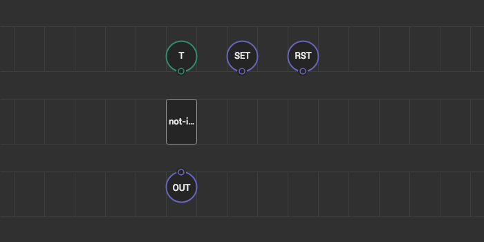
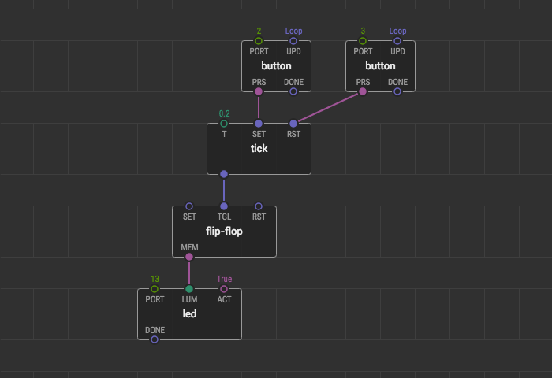

# Dealing with Time in C++

Many nodes respond to input changes immediately, but some nodes control processes lasting for long time spans. They force themselves to be re-evaluated after some delay to repeat a task or complete the job.

[XOD C\++ node API](/docs/reference/node-cpp-api/) provides scheduling functions to deal with these cases. In this article, we’ll learn them by example.

## The task

We’re a going to implement a `tick` node which when triggered by `SET` pin starts sending pulses at equal time intervals `T`. A user should be able to cancel the series in progress by sending a pulse on `RST` input.

Although you could trivially express such node with a combination of [`flip-flop`](/libs/xod/core/flip-flop/) and [`clock`](/libs/xod/core/clock/) without touching C\++ at all, let’s ignore it for now.

## Prepare the node

As always, when you [make a C\++ node](../nodes-for-xod-in-cpp), start with a new patch, add required terminals, and the `not-implemented-in-xod` node.



Don’t forget to provide a resonable default value for `T`. 1 second is fine.

Double-click on `not-implemented-in-xod` node to open the code editor.

## Set timeout

First, we should handle pulses on `SET` input. When set, we’ll use [`setTimeout`](/docs/reference/node-cpp-api/#setTimeout) function to ask XOD engine to call `evaluate` again after given timeout:

```cpp
node {
    void evaluate(Context ctx) {
        if (isInputDirty<input_SET>(ctx)) {
            // Get T-input value. Conventionally it should be expressed in seconds
            Number t = getValue<input_T>(ctx);

            // However, XOD API works with millisecond values, so convert
            TimeMs milliseconds = t * 1000;

            // Schedule re-evaluation after calculated number of milliseconds
            setTimeout(ctx, milliseconds);
        }
    }
}
```

## Handle timeout

Good. We scheduled ourselves. Now we need to react. Use [`isTimedOut`](/docs/reference/node-cpp-api/#isTimedOut) function for this. We need an explicit check of whether the current evaluation caused by the timeout because the reasons for `evaluate` calls differ. It could be an input value update before the time interval elapsed.

```cpp
node {
    // Note, we extracted a function to read `T` input and set timeout
    // with that value. The function helps us to avoid code duplication
    // in `evaluate` since we need the code twice.
    void charge(Context ctx) {
        Number t = getValue<input_T>(ctx);
        TimeMs milliseconds = t * 1000;
        setTimeout(ctx, milliseconds);
    }

    void evaluate(Context ctx) {
        if (isInputDirty<input_SET>(ctx)) {
            charge(ctx);
        }

        if (isTimedOut(ctx)) {
            // Timeout has been elapsed, emit an output pulse
            emitValue<output_OUT>(ctx, true);
            // To be re-evaluated next time we need to set timeout again
            charge(ctx);
        }
    }
}
```

## Cancel timeout

The only thing left to be done is reset handling. When a pulse is sent to `RST` we’ll use [`clearTimeout`](/docs/reference/node-cpp-api/#clearTimeout) function to stop counting.

```cpp
node {
    void charge(Context ctx) {
        Number t = getValue<input_T>(ctx);
        TimeMs milliseconds = t * 1000;
        setTimeout(ctx, milliseconds);
    }

    void evaluate(Context ctx) {
        if (isInputDirty<input_RST>(ctx)) {
            // When pulsed on `RST` we cancel the timeout countdown regardless
            // whether it was set or not
            clearTimeout(ctx);
            // Return from `evaluate` early giving priority to `RST` so that
            // pulse on `SET` and timeout will not be even checked at this
            // evaluation pass
            return;
        }

        if (isInputDirty<input_SET>(ctx)) {
            charge(ctx);
        }

        if (isTimedOut(ctx)) {
            emitValue<output_OUT>(ctx, true);
            charge(ctx);
        }
    }
}
```

## Test

That’s all. Our node is ready. Test it with two buttons connected to `SET` and `RST` and a flip-flop with LED on another side



## Conclusion

XOD provides quite a basic API to manage time. Although it is simple, you get all tools you need to control lengthy processes. Main principles are:

- Use `setTimeout` to schedule re-evaluation of self. Remember, the timeout is expressed in milliseconds.
- Always use `isTimedOut` to be sure you’re evaluating because the time has passed.
- If you want to run a task periodically, call `setTimeout` again manually when `isTimedOut`.
- Use `clearTimeout` to ensure no timeout countdown is in progress.
