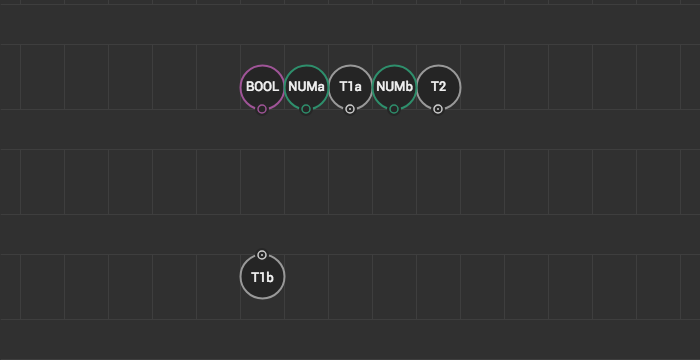
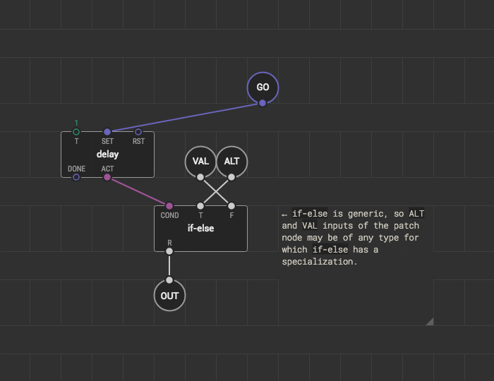
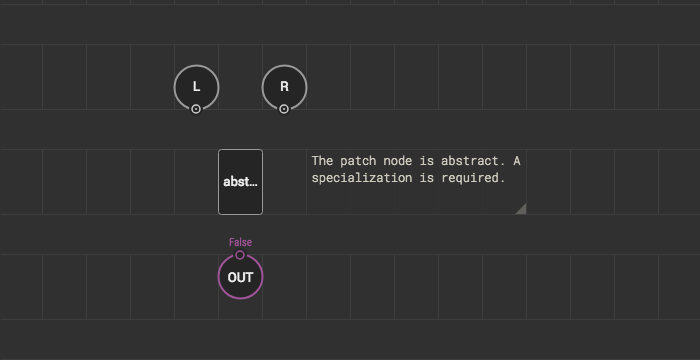

# Creating Generic Patch Nodes

If you’re going to make a patch node that should work regardless of the concrete
data types on its pins, making your patch node generic is the way to go.
Otherwise, you’d have to provide users with a repetitive set of nodes which
differ only in pin types but act in the same way:

- `foobar-number`
- `foobar-boolean`
- `foobar-string`

To follow the guide you have to know
[patch node creation](../nodes-for-xod-in-xod/) basics. Also, make sure you’re
familiar with the [generic nodes](../generics/) concept and understand how the
resolution process works.

## Generic terminals

The process of creating a generic patch itself is almost the same as creating a
regular patch. The difference is that in case of a generic patch node, instead
of placing terminals of specific types, you use:

- `xod/patch-nodes/input-t1`
- `xod/patch-nodes/input-t2`
- `xod/patch-nodes/input-t3`
- `xod/patch-nodes/output-t1`
- `xod/patch-nodes/output-t2`
- `xod/patch-nodes/output-t3`

Your patch may contain generic terminals only or mix regular and generic
terminals.

## Composition

The most straightforward way of implementing a generic patch is to build it out
of other generic nodes. That is, make it a common XOD
[patch node](../nodes-for-xod-in-xod/).

Let’s implement a generic node which always passes an input value to its output,
but once a pulse is triggered it outputs another input’s value for one second.

If you can find all the nodes required to compose your patch node, no extra
steps are necessary. You and users of your library can start using the node
right away.

## Abstract marker

If it is impossible to express a generic patch node as a pure composition, you
have to mark it abstract. To make a patch abstract, place a
`xod/patch-nodes/abstract` marker node on it.

That forces XOD to search for a matching specialization patch when it processes
the program. If a necessary specialization is not found, an error will show up,
and the program will fail to transpile. Which is a good thing since it shows a
xoder what’s missing so that he can provide an implementation for himself. See
[generics resolution process](../generics/#resolution-process-overview) for
details.

## Specialization patches

For a generic patch, you may provide several specialization patches. XOD
searches for a matching specialization every time it encounters a generic node.
It replaces the generic node with a specialized one if found.

The specialization patch is a regular patch, which either:
- conventionally named `<basename>(<t1>,<t2>,<t3>)` where `basename` defines the base generic patch
  name and `t𝑛` define particular types for which the specialization was created.
  For example `if-else(number)` is a specialization for a generic patch `if-else`
  for cases when a `number` is bound to its inputs.
- named just `<basename>`, when it’s a specialization for a custom type defined within the
  same library.
  For example `xod-dev/w5500/open-tcp` is a specialization for a generic patch `xod/net/open-tcp`
  for cases when a `xod-dev/w5500/w5500-inet` is bound to one of the inputs.

Note, you can create specialization patches for generic patches created in other
libraries, and XOD will pick them up correctly. That way, you can improve others’
work by making missing or optimized implementations.

## Rules

To let XOD resolve generic nodes properly, you have to follow some rules while
creating generic patch nodes and their specializations:

1.  If a patch contains generic _output_ terminal, a generic _input_ terminal of
    the same generic type should present. In other words, if you use
    `output-t2`, then `input-t2` should appear as well.
2.  There should be no more than a single specialization patch for a particular
    generic patch. Otherwise, the choice will be ambiguous, and an error will be
    shown. A xoder will be forced to resolve manually, that is choose
    specialization by hand.

## Summary

If you’re creating a generic patch node, you have a few options:

- Create a single generic patch node and implement it as a composition of other
  nodes.
- Create the base generic patch node and mark it abstract. Then create
  specialization patches for each supported type combination which in their turn
  are implemented in XOD or C++.
- Create the base generic patch node as a composition, and add a few
  specialization patches for better performance or wider type support.
