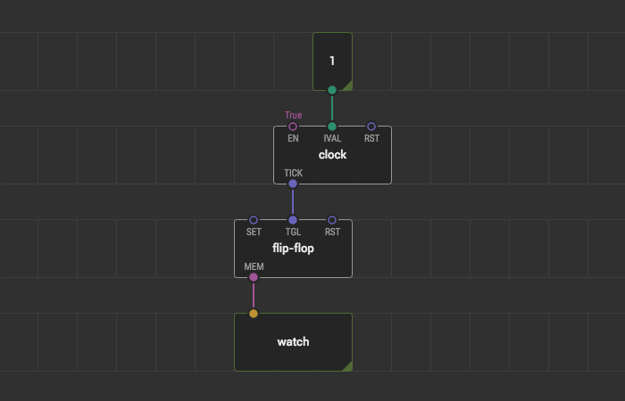
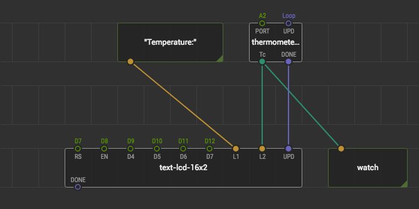

# Debugging

Debugging is the process of detecting and removing existing and potential errors in a program that can cause it to behave unexpectedly or crash. Such errors are also called "bugs." We all make mistakes. So, if you want to get a bulletproof program, you have to debug it.

## Debug nodes

The XOD standard library [`xod/debug`](/libs/xod/debug) contains debug nodes. They are common nodes with inputs or outputs, that can have links with other nodes in your program. However, they become interactive when a so-called live session is started.

**Watch node**

`xod/debug/watch`

This node outputs the value of its input pin inside itself. For example, you can link it with the output of `system-time` and see the current time value in real-time right on the patch.

**Log node**

`xod/debug/console-log`

The same as the watch node, but it outputs values in the log inside the Deployment pane. Sometimes it's handy to log long messages to the log instead of node body on the patch.

**Tweak nodes**

`xod/debug/tweak-number`, `xod/debug/tweak-string-16` and so on

These nodes work like a constant node, but you can change the value in the real-time. When a live session is running, select the tweak node and change its value in the Inspector pane to change the value in the running program.

Note

You may have noticed that `xod/deubg/tweak-string-16` indicates the _maximum_ length of the string. Since C++ allocates static memory for strings and microcontrollers are limited in memory the restriction is necessary. You can use multiple `tweak-string-16` nodes and a `concat` node if you need a longer string.

To enliven these nodes you need to start a session. Two modes of the live session are available: simulation and debug on the board.

## Simulation

In the simulation mode, you run the program without any extra hardware, right on your computer. It is useful to test math, logic, and algorithms.

A program for the simulation compiles in the XOD cloud, so you need an internet connection to start it. Under the hood the program gets compiled using a complex toolchain (Emscripten) which is hard to setup locally. This guarantees that the simulated program is sandboxed and even if a malicious third-party library contains dangerous code, it can’t harm your PC or hijack your data.

Note

One more good point of the simulation, that you can run it in the browser IDE, not only in the desktop version.

To run simulation hit Deploy → Simulate in the menu or click on the gamepad icon in the Deployment pane. Then you have to wait for a few seconds. When the simulation starts, the XOD IDE opens a new tab called "Debugger."

To stop the simulation close the debugger tab or click the "Stop" button. Whenever you rerun the simulation, XOD compiles the program in the cloud again and then starts from the beginning.

Here is an example to try simulation:

By changing the value of `tweak-number`, you change the time interval between pulses and see true/false switching in real-time inside the `watch` node.

## Debug on board

In contrast to simulation, debugging on the board allows us to work and interact with the program using real sensors and actuators: thermometers, photoresistors, gyroscopes, LEDs, servos, and so on.

To start debugging on the board, follow these steps:

- Hit Deploy → Upload to Arduino in the main menu
- Select your board model
- Select a port with the connected board
- Turn on the "Debug after upload" checkbox
- Click the "Upload" button.

XOD IDE compiles code, uploads it onto the board, and opens the same debugger tab, as in simulation, with alive debug nodes.

Note

It's much faster to click on the "bug" icon in the Deployment pane. The checkbox automatically turns on.

The debugger performs serial USB communication between your board and computer. When you stop the debug session the program still runs on the board and sends debug protocol messages via serial but XOD IDE no longer cares. To debug again, upload the program to the board one more time.

Try on-board debugging with the example:

Now you can see the temperature from your thermometer right on the screen of your computer and on the LCD. Also, you can change the text on the LCD directly from your computer.

## Drill-down

When your program becomes complex, it's an excellent practice to [encapsulate small pieces](/docs/guide/nodes-for-xod-in-xod/) of the logic into separate patches and compose them on the higher level of the program. Soon you will need to debug something inside these small pieces to make sure that the whole program works fine.

The panel on the top of the debugger tab shows a series of breadcrumbs. It's a path to the currently open patch in the debugger tab.

By double clicking on any node on the patch, you can drill-down to the particular instance of the patch behind this node. The breadcrumbs make it possible to return back to the higher level of your program.

When you're drilling-down to the particular instance of the patch, you can check the values of the `watch` nodes in this particular instance. You can have several nodes of the same type and drill down to each of them will show different values.

---

Here is a quick summary of XOD debugging features:

- Use debug nodes for the debugging, they are available in the `xod/debug` library
- Debug your program in the simulation mode or right on the board whatever makes more sense

In addition, a few other opportunities are available:

- You can use the Serial tab in the Deployment pane to communicate with your hardware. Hit Deploy → Connect Serial and select the port. This is useful to talk to UART hardware directly to configure a module or better understand its protocol.
- XOD supports automated testing, called [tabular tests](/docs/guide/testing-patches). This feature allows you to debug individual parts of the program faster.
