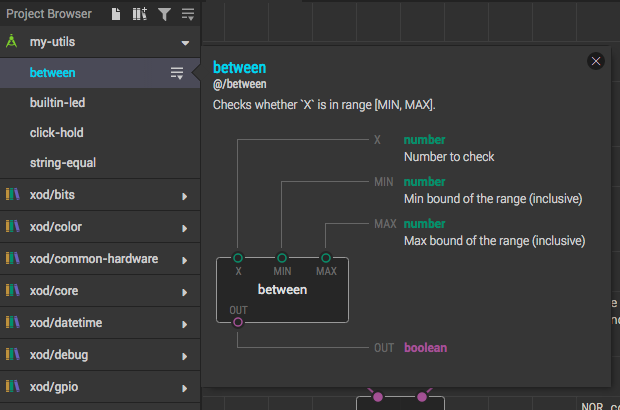
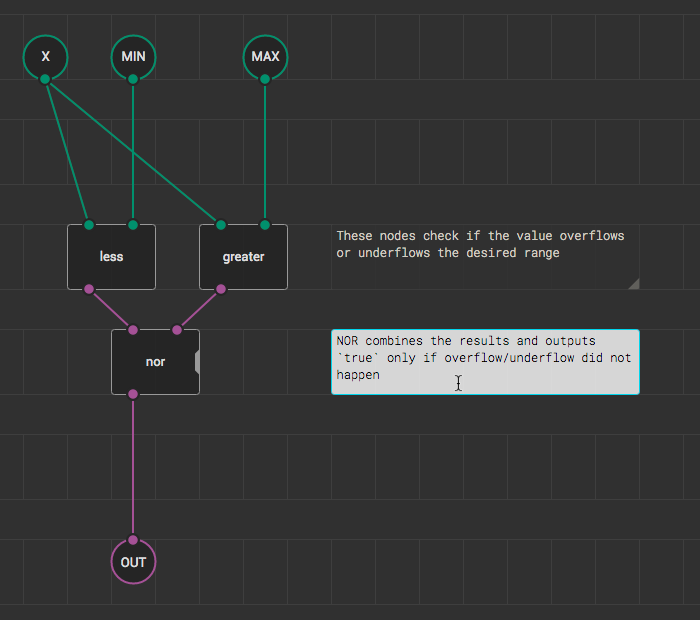

# Описание ноды

Если вы делаете ноду только для себя, то добавить краткое описание является хорошей идеей . Такое описание поможет вам вспомнить, что это за нода и как она ведет себя. Если же вы собираетесь опубликовать ноду в виде библиотеки, то нормальное описание обязано быть.

К счастью, описание ноды и её контактов – это простой процесс. Написание
текста в пару строк сделает вашу нроду на порядок лучше и понятнее, чем недокументированная нода.

Давайте закомментируем ноду `between` которую вы создали, следуя
[Creating nodes for XOD in XOD guide](../nodes-for-xod-in-xod/).

## Описание патча

Во-первых, нам нужно описать наш патч `between` в целом. Откройте патч,
Ничего не выбирайте В Инспекторе вы увидите поле “Description”. Здесь можно сделать короткое описание.

## Описание пинов

Затем мы поместим короткую строку описания к пинам. Выберите ноду, для
которой вы собираетесь добавить описание и добавьте описание в инспекторе, как вы это сделали выше.

## Просмотр описания

Выберите `between` ноду в Project Browser и нажмите клавишу `H` для вызова справки по ноде. Посмотрите, как выглядит описание с заполненными полями (которые вы заполнили ранее). Красиво, не правда ли?

Примечание
Обратите внимание, что мы опустили описание пина <tt>OUT</tt> поскольку его назначение
вполне очевидно. Старайтесь поддерживать баланс между лаконичностью и детализацией,
сделайте ваши ноды приятными для работы.

## Добавление комментариев патча

Другой инструмент аннотации, доступный в XOD – это комментарии патча. Они помогают
понять, что происходит с патчем, если его открыть для просмотра или редактирования.

Вы можете добавить комментарий, нажав “Edit → Insert Comment.” Затем измените размер и перетащите комментарий к нужной позиции. Дважды щелкните, чтобы изменить его содержимое. Когда закончите, нажмите Ctrl + Enter или щелкните вне комментария для фиксации написаного.

## Markdown

Используйте [Markdown](https://en.wikipedia.org/wiki/Markdown) форматирование, если обычного текста недостаточно. В частности:

- *stars* для подчеркивания
- `backticks` для ссылки на название `pin`, `node`, `file`
- пустая строк для нового параграфа
- начните строку с  “* ” для формирования списка элементов
- начните строку с “1. ” для формирования нумерации

Примечание:
Хотя Markdown пока ещё не поддерживается на каждом носителе, но мы работаем над этим. В конце концов все документы будут отображаться с Markdown форматированием.

