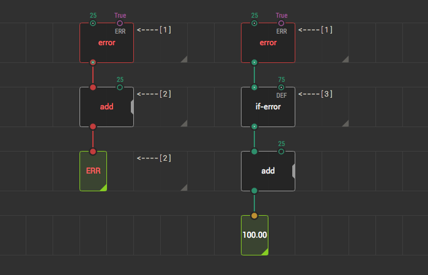
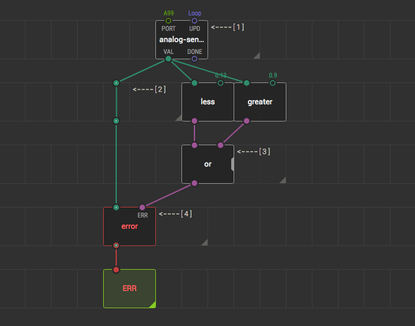

# Errors

During the execution of a program something may go wrong: wrong input on the pin, hardware module can't respond so quickly, no network connection, etc. To debug the program or handle problems in the runtime XOD has _errors_.

Errors are an additional possible value for any [data type](../data-types/). For example, the byte type can contain values: 0...255 or `Error`. When a node sets the error value on one or several its output pins, we say the node _raised_ an error.

Pro Tip

If you are coming from conventional programming, errors in XOD are similar to the optional values (Java, C#) or maybe monads (Haskell). But in contrast, the potentially error’ish outputs may be linked to regular inputs of the same type: in the sense of propagation rules, XOD errors resemble the exceptions mechanism.

When an error has occurred, it propagates to all downstream pins and prevents evaluation of their nodes, except so called _catcher_ nodes. These nodes are used to handle errors somehow: fallback to default values, run a recovery program, and so on.

## Propagation

When an error is raised, it propagates down to all linked nodes. The affected nodes pass the error further to their downstream nodes through their outgoing links. And so on. As a result, all downstream nodes of the pin which originally raised an error become inherently “infected”. This propagation mechanism does not depend on nodes’ implementation. Nodes which get the inherited error do not follow the common [execution model](../execution-model/) and do not re-evaluate on their input changes, timeouts, etc.

Errors on value typed pins persist across transactions. Only the node that raised an error can remove it by overwriting the errored output pin with a valid non-error value. Pay attention to the fact that the node which originally raised an error is handled normally: it gets evaluated on inputs change, incoming pulses, timeouts, and other triggers.

Errors on the pulse type work differently though. As the pulse type, they are reactive too. Errors from pulse outputs are cleared before the node's evaluation. Even if a new pulse was not emitted from the cleared output, downstream nodes will be evaluated to get a chance to react to the error cleaning.

Note

When implementing a C++ node, always use [`isTimedOut`](../../reference/node-cpp-api#isTimedOut), [`isInputDirty`](../../reference/node-cpp-api#isInputDirty), [`isSettingUp`](../../reference/node-cpp-api#isSettingUp) to explicitly check the reason of the node evaluation. Guessing is a bad idea.

## Detecting errors

Run the program in the simulation or debug mode, and XOD IDE will outline nodes which currently raise errors with the red color. Moreover, it will mark all affected downstream pins red too. So when you make the program, you can ensure that you handle all errors.

To handle errors, you have to use error catcher nodes. There a few error catchers in the standard library:
- [`xod/core/if-error`](/libs/xod/core/if-error/) — fall back to the default value from the errored one or pass the valid value through without changes
- [`xod/core/pulse-on-error`](/libs/xod/core/pulse-on-error/) — pulses when an error has occurred
- [`xod/core/has-error`](/libs/xod/core/has-error/) — outputs `True` when the upstream pin is in the error state

In addition to nodes from the standard library, other nodes can catch errors too. It can be a composite node with error catcher nodes inside or a C++ node that [deals with errors in C++](../cpp-errors/).

1. The [`xod/core/error`](/libs/xod/core/error/) node raises an error. Note, that the node has a red outline.
2. These nodes are affected by the error and will not evaluate until the error disappears. Pay attention to pin colors.
3. One of error catcher nodes. It falls back the errored value to the specified one, so downstream nodes evaluate.

One more important thing, if you're using feedback loops in your program and there is a node that may raise an error — you have to handle the possible error to avoid deadlock. Otherwise, the error will propagate through the loop back to the error raiser. The program will not hang but the part of the program with the feedback loop will never be evaluated anymore.

Here is the demonstration:

<video controls autoplay muted loop>
    <source src="./feedback-loops.mp4" type="video/mp4">
</video>

On the left hand, a feedback loop without any catcher node. Note, that the whole loop is marked as affected by the error and it hangs despite the changes in the `tweak-number` node.

On the other hand — an `if-error` catcher node cleans the error by falling back to the original value. The `0` value is still less than `1`, so error kept in the `error` node output. However, it reacts to the change of the `tweak` node value.

## Raising errors

The standard library nodes that work with I/O already raise errors: a wrong port, can't read the byte from an I2C device, etc. However, there is one general-purpose error raiser [`xod/core/error`](/libs/xod/core/error/), that you can use in your patches.

For example, let's imagine that you're implementing the node that works with a specific analog sensor, which valid output values are in the range 0.13...0.9 and other values mean that something went wrong. For example, Sharp infrared distance measuring sensor GP2Y0A02YK0F works such way.

1. Read the analog value
2. Pass the value through the `xod/core/error` node.
3. Check that value is in the valid range
4. If the value is out of the range — switch `ERR` to True, and it will replace the value with the error value.

When you create a node using C++, you can also raise errors: for all outputs or only some outputs. Read more in the [Dealing with errors in C++](../cpp-errors/) guide.

---

The errors in XOD is a separate and powerful mechanism which works on top of the regular execution model, at its own layer. It allows errors to pop from nested nodes up to the nodes which know how to handle them. All this without boilerplate. If an error is not handled anyhow it stops everything that depends on it directly or indirectly from being updated. It effectively freezes the program state part at the moment when the error was initially raised.
