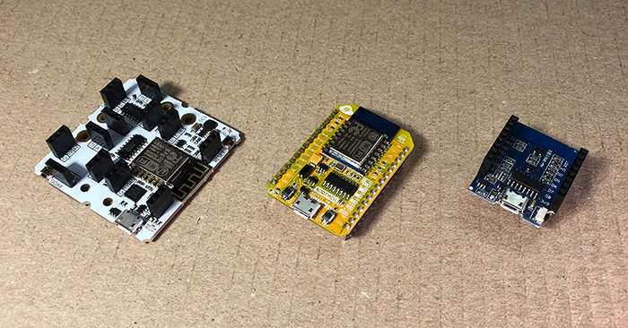
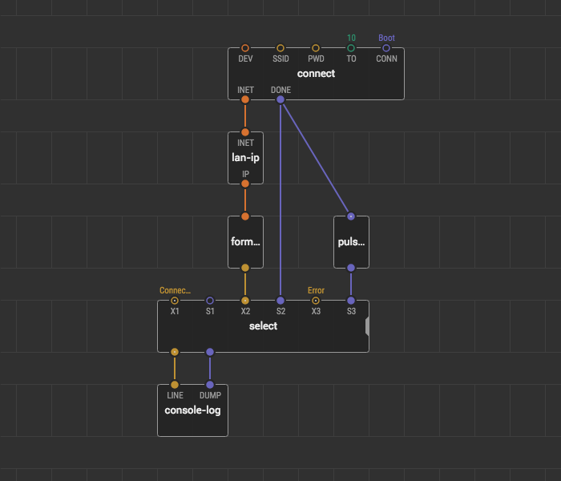
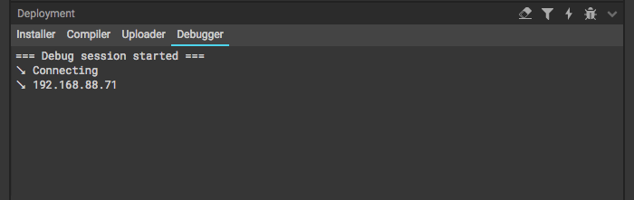

# Соединение с интернетом с помощью ESP8266 MCU

Платы на базе ESP8266, такие как NodeMCU и WeMos D1 Mini, довольно популярны для проектов, которым требуется подключение к Интернету по причине встроенного модуля для соединения к сети по Wi-Fi.

XOD имеет [`xod-dev/esp8266-mcu`](https://xod.io/libs/xod-dev/esp8266-mcu/) библиотеку, которая упрощает подключение к Интернету. Все, что вам нужно, это [`connect`](https://xod.io/libs/xod-dev/esp8266-mcu/connect/) нода:

Для подключения просто введите логин и пароль в параметы пинов `SSID` и `PWD`.

## Проверка подключения

Давайте создадим небольшой патч, чтобы убедиться, что соединение установлено успешно.

Сначала программа напечатает «Connecting» при подключении, затем (после небольшой задержки) ваш локальный IP-адрес, если соединение было успешным, или «Error», если что-то пошло не так.

Нода [`xod-dev/esp8266-mcu/lan-ip`](https://xod.io/libs/xod-dev/esp8266-mcu/lan-ip/) получает Ip адрес по пину `INET` и далее нода [`xod/net/format-ip`](https://xod.io/libs/xod/net/format-ip/) форматирует его в удобочитаемую строку, например «192.168.88.101».

Для вывода прогресса в отладчик мы используем ноды `select` и `console-log`. Укажите `"Connecting"` в пине `X1` ноды `select`, `On Boot` в пине `S1` и `"Error"` в пине `X3`.

Загрузите патч на свою плату в режиме отладки. Вы должны увидеть что-то вроде этого:

## Что дальше

Теперь, когда у вас есть работающее подключение к Интернету, пришло время сделать с этим что-нибудь полезное. Например, [получить некоторые данные с помощью HTTP-запросов](../http-get/).
