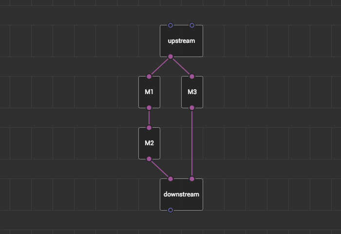

# Execution Model in Detail

In contrast to conventional programming, XOD is a data flow language rather than a control flow language. That means there is no such thing as an instruction pointer that determines what command will be executed at the next moment. Instead, updates are done in semi-instantaneous _transactions_ in which all data is evaluated simultaneously.

## Program life cycle

At any particular moment, a XOD program is either in a transaction or in an idle state.

While idle, the system remains stable, nothing changes. A board can even choose to go to sleep to preserve the battery. Receiving a new external signal from a node like system clock or sensor, is what makes the program leave the idle state.

A signal causes the program to enter a new _transaction_. The updated values flow downstream along links and cause the nodes they hit to update. The process of updating a node is called _evaluation_ in XOD.

After all nodes affected by the update are evaluated the transaction is complete and the system returns to the idle state.

## Transaction rules

### No external signals while a transaction is in progress

All transaction prevent any external update from occuring while the current transaction is in progress. Such a signal would be postponed and trigger a new transaction after the current transaction is complete.

### Evaluation order

During a transaction, a node is evaluated only after all nodes it depends on via links have been evaluated.

Consider the following example.

The result node will only be evaluated after both branches are evaluated, despite the fact that they have node chains of different length. You can’t know the order in which the branches will be evaluated. It could be M1-M2-M3, M3-M1-M2, M1-M3-M2, or even M1-M2 and M3 in parallel. Furthermore, evaluation of the result node might be postponed until its values are actually required (so-called “lazy evaluation”). The target platform decides.

The only thing that does matter is that a node will be never evaluated with incomplete data.

That is the reason why inputs can’t have more than one incoming link. Otherwise, there would be ambiguity if two or more links tried to deliver different values.

### Buffering

Nodes’ outputs are _buffered_ when changed. In other words, the outputs keep their most recent value. The data is persistent between transactions. So a node will “see” the buffered value from an old transaction via a link if the node must be evaluated again due to a change in another input's value.

Pro Tip
If you’re familiar with conventional programming, think of pins and their
buffered values as <em>variables</em>. They hold the program state and evolve
over time.

### Feedback loops handling

A link that goes back to a direct or indirect upstream node creates a loop also known as graph cycle. Such links break the rules because having them makes evaluation order ambiguous: each node in the cycle depends on itself in the final turn.

To solve the problem a special [`defer`](https://xod.io/libs/xod/core/defer/) node exists. It breaks the deadlock and passes a received value through the outgoing link on the next transaction. In other words, XOD supports the feedback loops, but the cycle path must have at least one [`defer`](https://xod.io/libs/xod/core/defer/) node in it to clarify the correct evaluation order.

### Errors

Some nodes may raise an error instead of setting a value or emitting a pulse. The errors propagate recursively down through the program graph and block the evaluation of all affected nodes even if they should re-evaluate by other means. See details in the [Errors guide](../errors/).

## Summary

The program's life cycle can be looked at as a infinite series of transactions that run whenever an external impact occurs.

Transactions are protected from sudden effects that could change or make ambiguous the order of node evaluation.
