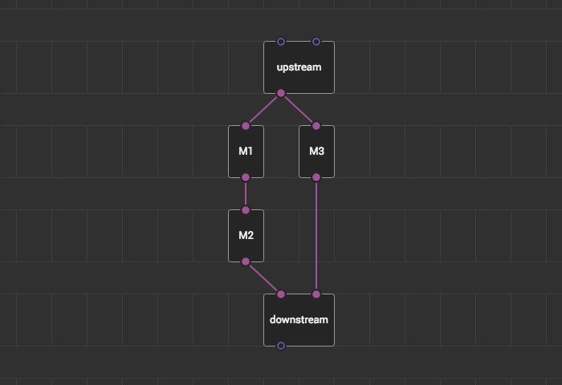

# Модель исполнения в деталях

В отличие от обычного программирования, XOD является языком потока данных, а не 
языком потока управления. Это означает, что нет такой вещи, как указатель/инструкции, 
которая бы определили, какая команда будет выполнена в следующий момент. Вместо этого 
обновления выполняются в полумаксимальных _транзакциях_, в которых все данные оцениваются 
одновременно.

## Жизненный цикл программы

В любой конкретный момент программа XOD либо находится в транзакции, либо в состоянии ожидания.

В режиме ожидания система остается стабильной, ничего не меняется. Плата может даже засыпать, 
чтобы сохранить батарею. Получение нового внешнего сигнала от ноды, такого как системные часы или датчик, 
является причиной того, что программа выйдет из состояния ожидания.

Сигнал заставляет программу ввезти новую _транзакцию_. Обновленные значения перемещаются вниз 
по линкам и заставляют обновиться ноды с которыми они связаны. Процесс обновления нод 
называется _оценкой_ в XOD.

После оценки всех нод, затронутых обновлением, транзакция завершена, и система возвращается в состояние ожидания.

## Правила транзакции

### Нет внешних сигналов во время транзакции

Сама транзакция предотвращает возникновение любого внешнего обновления во время текущей транзакции. 
Такой сигнал будет отложен и инициирует новую транзакцию после завершения текущей транзакции.

### Порядок оценки

Во время транзакции нода оценивается только после того, как все ноды, влияющие на неё будут оценены.

Рассмотрим следующий пример.

Результирующая нода будет оцениваться только после оценки обеих ветвей, несмотря на то, 
что они имеют цепочки нод разной длины. Вы не можете знать порядок, в котором будут 
оцениваться ветви. Это могут быть M1-M2-M3, M3-M1-M2, M1-M3-M2 или даже M1-M2 и M3 параллельно. 
Кроме того, оценка результирующей ноды может быть отложена до тех пор, пока не будут необходимы её 
значения (так называемая “ленивая оценка”).

Единственное, что имеет значение, это то, что нода никогда не будет оцениваться с неполными данными.

Именно по этой причине входы не могут иметь более одной входящей ссылки. В противном случае возникла 
бы двусмысленность, если две или несколько линков попытались бы доставить разные значения.

### Буферизация

Выходы нод _буферизуются_ при изменении. Другими словами, выходы сохраняют самое последнее значение. 
Данные сохраняются между транзакциями. Таким образом, нода будет “видеть“ буферизованное значение из 
старой транзакции по линкам, если нода должен быть снова оценен из-за изменения значения другого ввода.

Для профи
Если вы знакомы с обычным программированием, думайте о пинах и их буферизированных значениях в 
качестве <em>переменных</em>. Они сохраняют состояние программы и изменяются со временем.

### Обработка обратной связи

В XOD циклические ссылки не допускаются. Они приведут к взаимоблокировкам и зависанию.

XOD T0D0
В конечном итоге XOD будет поддерживать циклические ноды, которые могут будут ломать взаимоблокировки. 
Это позволило бы создавать цепочки обратной связи. Если вы считаете, что эта функция высоко приоритетна, тогда 
мы просим вас <a href="//forum.xod.io">поделиться своим мнением на нашем форуме</a>.

## Итог

Жизненный цикл программы можно рассматривать как бесконечную серию транзакций, которые выполняются всякий раз, 
когда происходит внешнее воздействие.

Транзакции защищены от внезапных эффектов, которые могут изменить или сделать неоднозначным порядок оценки нод.
