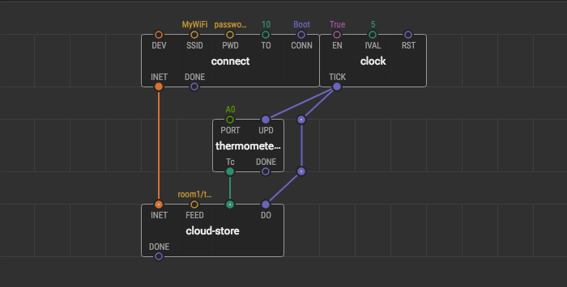
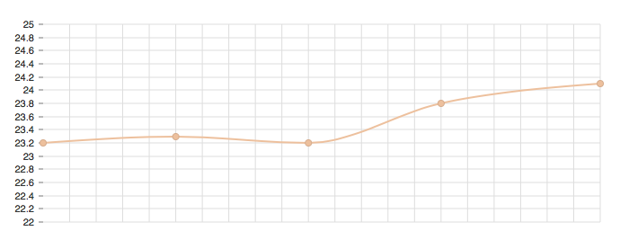

# Getting Started with Feeds

XOD Cloud provides the Feeds service. Feeds are something like logs or data tables, where you can append values of your choice, for example, measurements from your sensors. Then, other devices can consume the data, or you can use it to monitor the values in real-time. Also, the past values get stored in history, so you can analyze the time series data using spreadsheets or XOD web interface.

Each feed has a unique name that looks like a URL path: a string separated with slashes. For example, `alice/meteo/garden/humidity`. They are used to organize data. Different devices may work with the same feed. And vice versa, a single device may work with multiple feeds.

The feeds are private by default. Only you can read and write the feeds you have created. The first part of the feed name is the username of its owner (`alice` in the example). The second part is usually used to name a project to which this feed belongs (`meteo` in the example).

To demonstrate the simplest case, let's make a smart thermometer that stores the temperature in the XOD Cloud Feeds.

## Access to XOD Cloud Feeds

If you already have a XOD account, you, as a human user, have access to the feeds. However, you have to give access to your device as well.

Since the data in your feeds are private, your device needs authenticate. Humans authenticate using username and password, and devices use API key and API token instead. The API key is something like a username. It's not a secret. And it's bound to a XOD project. The API token is a secret string that is generated automatically on upload in exchange for the API key if you are logged in.

Here are examples of how API key and token can look like:

- API key: `41f23e79-381d-4cff-b717-0562f9582423`
- API token: `2D3RhEOhAQSgWBmiBhpd3SN7AlBB8j55OB1M/7cXBWL5WCQjSMfI4V+ejFjt`

Do not worry that they are ugly. You won't work with these things directly. Each API key is associated with the name you give to a project for easier management. That's why any project which uses XOD Cloud should have a project name set.

## Generating API Key

Putting all together, here is how to set up a new project for XOD Cloud Feeds use:

1.  Launch XOD IDE and start a new project.

2.  Make sure to sign in using the account pane. You may need to [sign up](https://xod.io/auth/) if you don't have a XOD account.

3.  Open project preferences (Edit → Project Preferences).

4.  Set a meaningful project name (e.g., `cloud-thermometer`).

5.  Click the "Generate" button next to the API key input field.

A few seconds later, you'll see a unique API key generated specially for your project.

Note

You can paste an API key from the [IoT Keys](https://xod.io/settings/iotkeys/) page if you want to re-use a previously generated one. We recommend creating a new API key for each project or device group to make it possible to [revoke the API key](#revoking-device-access) later in case of security problems.

## Logging data

XOD has a standard library [`xod-cloud/feeds`](https://xod.io/libs/xod-cloud/feeds) for dealing with the XOD Cloud Feeds. In our case, we need a [`cloud-store`](https://xod.io/libs/xod-cloud/feeds/cloud-store) node. This node takes care of XOD Cloud connection and authorization. This node needs a few things on input pins to work:

- `FEED` — the feed name suffix; a prefix of the form `<username>/<project-name>/` is prepended automatically.
- `IN` — data to send to the cloud. It may be one of these [data types](../data-types/): numbers, booleans, bytes, strings.
- `INET` — the Internet connection. There way you get it depends on the hardware. See guides for [ESP8266](../esp8266-connect/) and [W5500 ethernet shield](../w5500-connect/) as an example.

Place a thermometer node. In our case, it's `thermometer-tmp36`. Link it with the `IN` pin and upload the program to your device.

Note

As mentioned above, you may log data of various data types to the feeds. However, if you send numbers there, besides storing them in the log, they will be plotted in a line chart as well.

## Feeds page

Once the device is flashed it sends data to the XOD Cloud Feeds. Check out the feeds web interface: [xod.io](https://xod.io) site → header avatar → [Feeds](https://xod.io/feeds/).

On this page, you can see a list of all feeds that you have access to and that contain any data. Follow to one of the feeds to see the stored data.

<table class="ui celled table">
  <thead>
    <tr>
      <th>Date</th>
      <th>Value</th>
    </tr>
  </thead>
  <tbody>
    <tr>
      <td class="collapsing">2019-11-13 16:15:07</td>
      <td colspan="1" class="number">24.1</td>
    </tr>
    <tr>
      <td class="collapsing">2019-11-13 16:15:01</td>
      <td colspan="1" class="number">23.8</td>
    </tr>
    <tr>
      <td class="collapsing">2019-11-13 16:14:56</td>
      <td colspan="1" class="number">23.2</td>
    </tr>
    <tr>
      <td class="collapsing">2019-11-13 16:14:51</td>
      <td colspan="1" class="number">23.3</td>
    </tr>
    <tr>
      <td class="collapsing">2019-11-13 16:14:46</td>
      <td colspan="1" class="number">23.2</td>
    </tr>
  </tbody>
</table>

## Revoking device access

You can revoke any API key at any time, and all the devices which use this API key will lose access to your feeds.

Pay attention:

- This is an irreversible action.
- It will affect all devices that use the same API key.
- To make your devices work with XOD Cloud Feeds again, you have to upload the program again with the new API key.

How to revoke API key step-by-step:

1.  Go to: xod.io site → header avatar → Settings → [IoT keys](https://xod.io/settings/iotkeys/)
2.  Find out the API key you want to revoke.
3.  Click on the "Revoke" button next to the API key.

## Is it secure to share project

In short, yes, it's secure.

When you share a project only its API key is shared. But no one can use this API key without access to your XOD account, that is without your xod.io username and password.

Another feature that makes XOD programs share-friendly is project-dependent [globals](../../reference/globals/). If the program needs your username, project name, or private token, you can use global literals like `=XOD_PROJECT` or `=XOD_TOKEN` instead of plain strings. XOD replaces them with the actual values when it compiles the program. So different projects and different users will get different actual values for the same program. This works with "Show Code for Arduino" as well: there will be empty `#define`’s with static asserts of being defined in the code. So you can manually set values for these tokens and upload the code using Arduino IDE, for example.

Feel free to share XOD projects with your smart devices.

---

In addition to sending primitive data types to feeds you can send bundles of related data which can represent [multiple time series](../multiple-time-series/).
