# Overview

The [`xod/graphics`](https://xod.io/libs/xod/graphics) library provides the standard set of nodes to create graphics and graphic interfaces. This library describes various geometric and graphical objects and contains their rasterization and rendering methods, which are required for their further presentation on displays such as LCDs and OLEDs.

The `graphics` library only can build images and has to be used with a particular display library to show it on the screen.

## Coordinate system and units

A digital image consists of pixels. A pixel is the smallest logical element of an image in raster graphics, as well as a physical element of the display matrix. Pixel is a two-dimensional element. It has two coordinates (X, Y) in a two-dimensional coordinate system. Traditionally, the origin (0, 0) of the coordinate system for an image or graphic display is at the top-left corner.

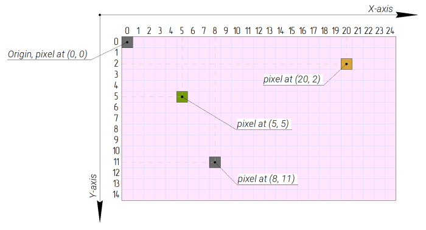

Pixel coordinates are integer values. In XOD, pixel coordinate values have the [Number](/docs/reference/data-types/#number-literals) type. Floating-point values are truncated down to integers. For example, a pixel specified as (5.89, 2.02) is displayed on the screen at (5, 2).

In addition to coordinates, each pixel has its color. In XOD the color of a pixel is set by the [Color](/docs/reference/data-types/#color-literals) type value stored as 24 bits, one for each component R, G, and B. This color type has a color depth named [True color](https://en.wikipedia.org/wiki/Color_depth#True_color_(24-bit)) and has a palette of 2²⁴ = 16,777,216 colors. However, not every display can handle so many color variations. For example, the [ST7735 display](/docs/guide/st7735-display/) operates the [High color](https://en.wikipedia.org/wiki/High_color) color depth with the palette of 65,536 colors, while the [SSD1306 display](/docs/guide/ssd1306-display/) is monochrome and operates only with black and white color. In XOD, the pixel color is automatically reduced to the acceptable resolution for a particular display.

## Canvas

The building process of any scene begins with the `canvas` node. It is the entry point and the first object in the tree of graphic elements of the scene.
Physically `canvas` defines a specific area on the screen that is subjected to the rendering process.

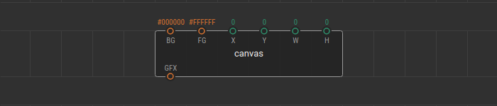

Сanvas has a rectangular shape. It is defined by the pivot point (`X`, `Y`), which is its upper-left vertex, width `W` , and height `H` in pixels. 
The pivot point of the canvas is a specific pixel on the matrix of a display and its coordinates are related to the display matrix coordinate system.

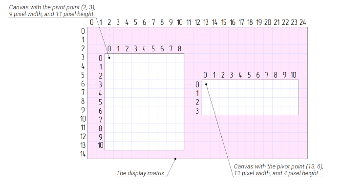

Canvas can take up the entire display matrix or be a part of it. The display matrix may contain several `canvas` at the same time.
When initialized, the canvas creates a new coordinate system within itself. This new system is used to position all child graphic elements in a tree of the scene.

Note
In XOD, the position of any graphic element is determined by its coordinates relative to the canvas and not the screen!

A value at the `BG` pin of the `canvas` node sets the background color for all pixels in the selected area of the screen. The `FG` pin value sets the foreground color of the scene. This color is the default for all child graphic elements located on the canvas.

## Scene as a tree

The image scene is a tree of various graphic elements (geometric objects, text, bitmap images, and icons) that reside on a `canvas`.

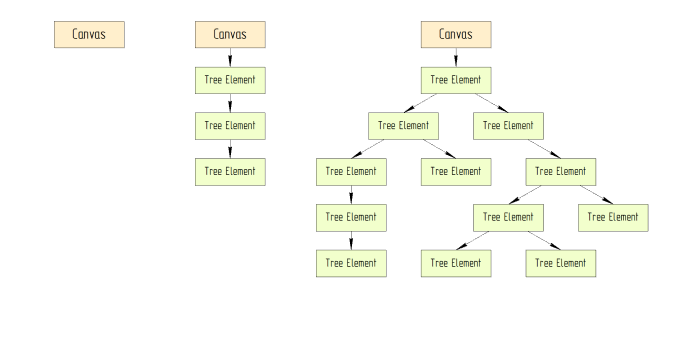

A tree may have no elements, be strictly linear, or expand and form new branches. The order in which the elements of the graphical tree are located determines the order in which these elements are displayed on the screen. Amongst themselves, tree elements link through the `GFX` node pins.

To show the image on the screen of the device, it should be rendered. For this, the `render` node is used. The rendering process is different for each specific display device so in XOD, each display library contains its own `render` node. 

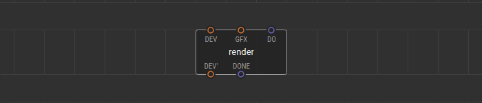

The `render` node is a kind of "end of the tree branch". On a `pulse` signal this node processes one branch of the graphic tree for a given `canvas` and displays the resulting image on the screen.

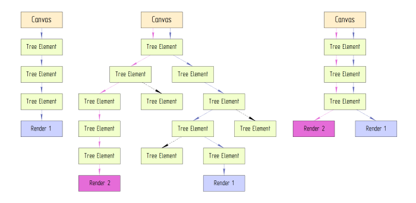

Each branch of the tree can be rendered independently of other branches. A single tree branch can be linked to multiple `render` nodes to be displayed on different devices.

## Graphic elements

Each graphic element has its node. Graphical elements in XOD are dynamic; i.e., they can change all their properties in real-time.

### Point

It is the most basic graphic element. Point is set on canvas by coordinates (`X`, `Y`).

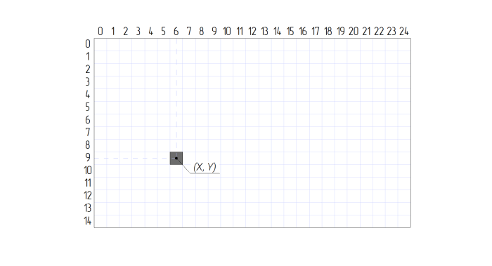

The `point` node describes a point with a thickness of 1 pixel and the default foreground color of the scene.
You can set any color for a point using the `point-colored` node.

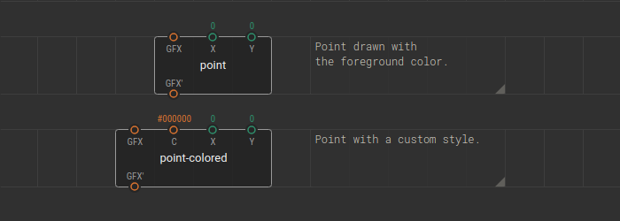

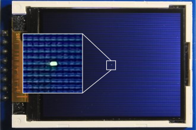

### Line

The line is set on canvas by two points, the start point (`X0`, `Y0`) and the endpoint (`X1`, `Y1`). Any point order is OK.

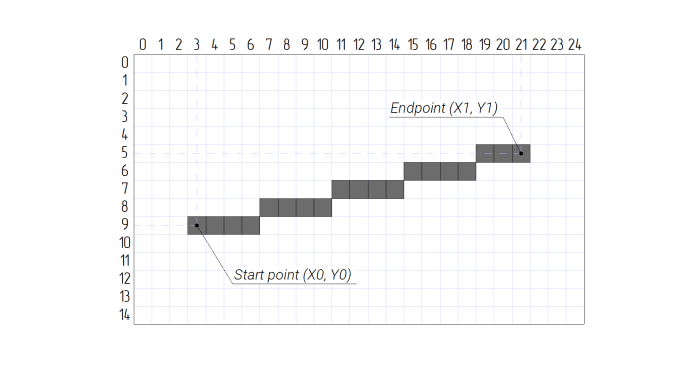

The `line` node describes a line with a thickness of 1 pixel and the default foreground color of the scene.
You can set any color for a line using the `line-colored` node.

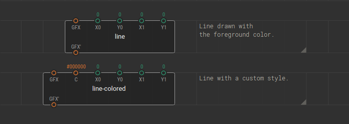

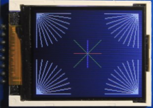

### Rectangle

The rectangle is set on canvas by a pivot point (`X`, `Y`), which is its upper-left vertex, width `W`, and height `H`.

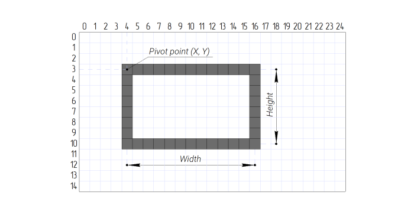

A rectangle can be filled with a solid color or represent an unfilled rectangle frame.
Filled and non-filled rectangles have different sets of nodes.

The `rect-outline` node describes a rectangle frame with a thickness of 1 pixel and the default foreground color of the scene.
You can set any color for a frame using the `rect-outline-colored` node.

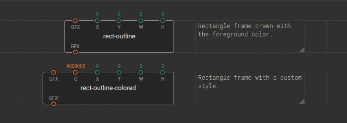

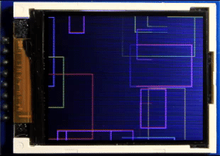

The `rect-solid` node describes a rectangle filled with a solid default foreground color of the scene.
You can fill a rectangle with any color using the `rect-solid-colored` node.

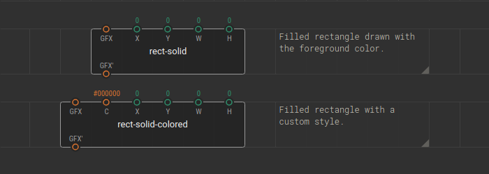

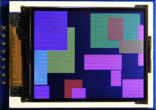

### Circle

The circle is set on canvas by a center point (`X`, `Y`), and radius `R`.

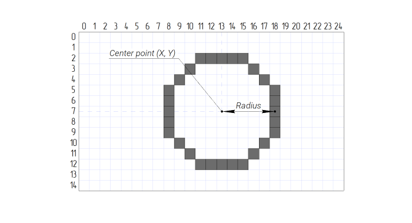

A circle can be filled with a solid color or represent an unfilled circle frame.
Filled and non-filled circles have different sets of nodes.

The `circle-outline` node describes a circle frame with a thickness of 1 pixel and the default foreground color of the scene.
You can set any color for a frame using the `circle-outline-colored` node.

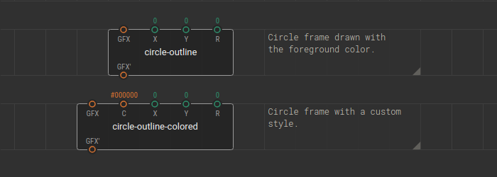

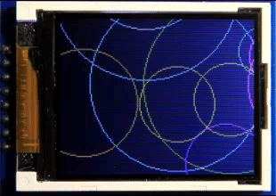

The `circle-solid` node describes a circle filled with a solid default foreground color of the scene.
You can fill a circle with any color using the `circle-solid-colored` node.

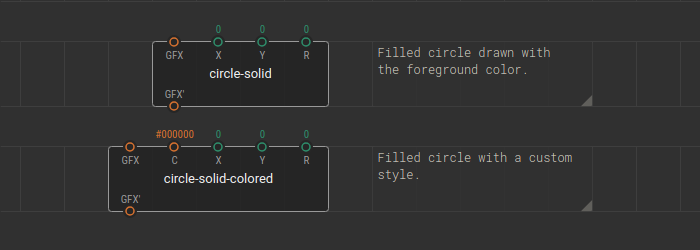

### Triangle

The triangle is set on canvas by three points (`X0`, `Y0`), (`X1`, `Y1`), and (`X2`, `Y2`). The order of points can be any.

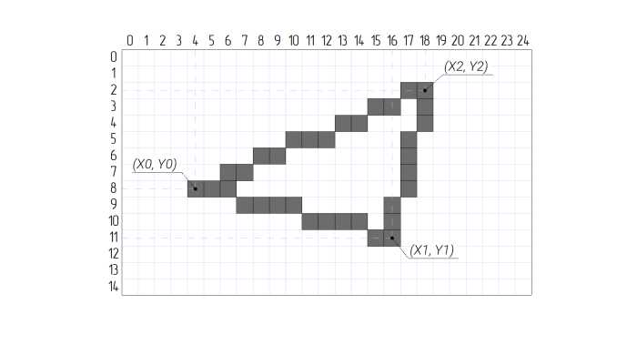

A triangle can be filled in with a solid color or represent an unfilled triangle frame.
Filled and non-filled triangles have different sets of nodes.

The `triangle-outline` node describes a triangle frame with a thickness of 1 pixel and the default foreground color of the scene.
You can set any color for a frame using the `triangle-outline-colored` node.

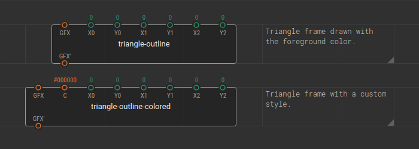

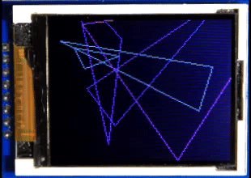

The `triangle-solid` node describes a triangle filled with a solid default foreground color of the scene.
You can fill a triangle with any color using the `triangle-solid-colored` node.

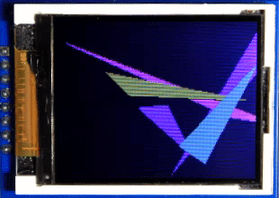

### Text

You can display various text strings on the screen. 

Currently, the only supported text font is one that is used in the firmware of sign-generating displays. This font has a dimension of 5x7 pixels.

The text string is set on canvas by the start point (`X`, `Y`), which is the upper-left vertex of the first character in a string.

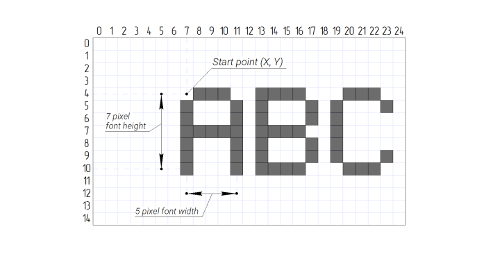

To define the text string the `text` and `text-colored` nodes are used.

The `text` node displays a [String](/docs/reference/data-types/#string-literals) specified at the `S` pin with the default foreground color of the scene.

Using the `text-colored` node you can set a string of any color.

Text can be scaled using the `SCL` pin.  A simple pixel-based magnification algorithm is used, so the value should be an integer greater or equal to 1. The resulting text is scaled N times, where N is the value specified at the `SCL` pin.

### Images

You can display bitmap images and icons on the display screen.

Read more in the [loading images](/docs/guide/graphics-images) article.

### Display libraries

XOD provides display device libraries to render graphics. For more information about working with a library of a specific display, see the article on this display's library.
Currently, there are libraries for the following displays devices:

- [`xod-dev/ssd1306-display`](/libs/xod-dev/ssd1306-display) library to work with [SSD1306 displays](/docs/guide/ssd1306-display/).
- [`xod-dev/st7735-display`](/libs/xod-dev/st7735-display) library to work with [ST7735 displays](/docs/guide/st7735-display/).

---

- Any scene begins with the `canvas` node.
- Any graphic element's position on the screen relates to the parent's `canvas` coordinate system.
- XOD graphics library provides nodes to draw points, lines, rectangles, triangles, circles, display texts, and images.
- A branch of a tree of graphic elements should end with a `render` node with a bound device to render it.
- Everything that is out of `canvas` bounds is not rendered and shown on the screen.
