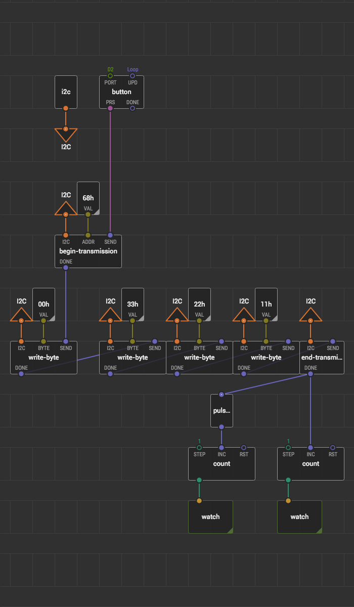
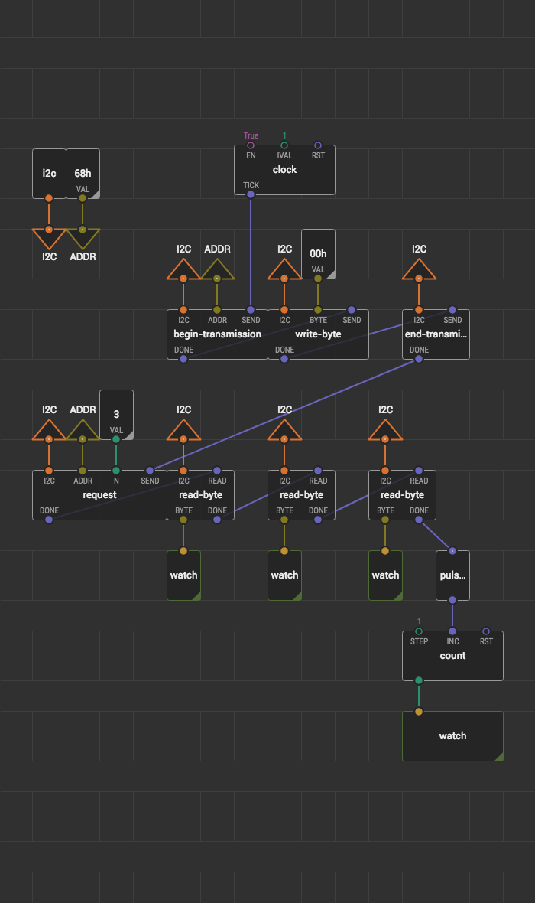

# I²C Communication Basics

Many sensors and modules talk to a host board using the [I²C bus](https://en.wikipedia.org/wiki/I%C2%B2C) also known as TWI (Two Wire Interface). This interface uses a single line (SDA) to transfer data serially and another line (SCL) to push clock pulses which define exchange rhythm.

XOD supports low-level I²C communication with nodes available in [`xod/i2c`](https://xod.io/libs/xod/i2c/).

It depends on a particular chip or module how a session of I²C communication should flow, but there are several common scenarios:

- Read several bytes (an I²C thermometer)
- Write several bytes and forget (an I²C controlled motor)
- Write bytes to define a data register of interest, then read bytes back (a multiaxis I²C IMU)

In this article let’s use a popular DS1307 real time clock module to demonstrate reading and writing. The module is already supported by [`xod-dev/ds-rtc`](https://xod.io/libs/xod-dev/ds-rtc/) but let’s consider we have no such library.

DS1307 supports I²C writing to set up the current time and register reading to fetch date and time parts (day, hours, minutes, etc.). So it covers all basic scenarios and should be sufficient to understand the topic.

## Creating `i2c` node

Most nodes of `xod/i2c` have an `I2C` input of type `xod/i2c/i2c` defining the bus they should operate upon. Your board can have more than one hardware I²C interfaces and a few yet more could be emulated in software (known as bit banging).

Currently, XOD supports only I²C communication on the hardware interface #0 with default settings. This interface pins are often marked simply as SDA and SCL on the development board. To set up the `i2c` value for use with other nodes, place a `xod/i2c/i2c` node onto your patch.

This step can be skipped actually. If you leave any `I2C` input pin without a value, the hardware interface #0 is implied.

Note

The concept of `i2c` value is described here because XOD will get support for non-default I2C buses in the future. If you use the default I²C, all this fuss is not required.

## Writing data

The typical pattern of writing a data packet is following:

- Use the `begin-transmission` node with the device address set to start writing
- Link several `write-byte` nodes in a chain to write the desired number of bytes
- Place the `end-transmission` node at the end of the chain to complete the writing session

Which bytes to send depends on a protocol of the specific module. Read its datasheet to understand the details. The same datasheet will tell you the device address.

In the case of DS1307, the address is `68h`, and page 8 of the [datasheet](https://datasheets.maximintegrated.com/en/ds/DS1307.pdf) describes the protocol:

The module expects:

- a single byte which tells a starting register address to write to;
- one or more bytes which contain the new time values for that register and subsequent registers

For our example, let’s ignore the date and focus on time. So, if we want to reset the current clock time to 11:22:33 on a button click, we should write `00h` as the starting register and then write `33h`, `22h`, and `11h`.

Note

You might wonder why are we using hexadecimal values to set decimal values. The reason is that this particular module reads and writes values in a so-called binary coded decimal format. We don’t encode or decode the values anyhow in this example to keep it focused.

Here’s the corresponding patch:

The links from `i2c` going to every action node can produce too much of visual noise. This issue can be solved by replacing all these repetitive links with a [bus](../buses/):

When doing IO, everything can go wrong at any stage: module might be disconnected or browned out by a power-hungry neighbor, the bus can be busy, etc. It is a good idea to handle errors somehow. For example, we can catch errors at the end of the pipeline with a `pulse-on-error` node, count errors, and output to a `watch` node:

If you’re creating a patch node to support a new piece of hardware, a good strategy might be to simply let the errors to pass down through the output terminals. That is, do nothing special. In this case, patches which use this node will have a chance to decide what to do in case of errors.

## Reading data

The common pattern of reading a data packet is following:

- Use the `request` node with the number of expected bytes (`N`) set
- Link N `read-byte` nodes in a chain

These two steps are enough for simple sensors, but in some cases, a prior sequence of steps is required to define _what_ do you want to read. For example, when reading DS1307, before the `request` node we should send the desired start register address. We want to read seconds, minutes, and hours: the start register is 00h. To set it we effectively repeat the same things as for [Writing data](#writing-data).

Here is a patch to read time from RTC every second and show it on `watch` nodes:

As when writing data, the right idea is to catch possible errors:

---

The I²C is a flexible and simple interface which can be handled entirely in XOD without resorting to C++. If you would like to support new I²C hardware or add new functions to an existing one, consult chip datasheet to understand the _protocol_ put over the I²C interface. Then you should be able to read and write bytes in the proper order to achieve the result.
