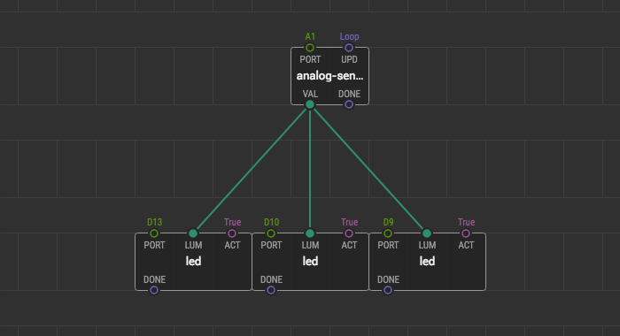

# Правила линков

Чтобы сделать программы в XOD предсказуемыми и понятными, существуют некоторые правила о том, 
как можно связывать между собой пины.

## Выходы и входы

Вам не разрешено связывать два входных пина, и вы не можете связать два выходных пина. 
Это не имеет большого смысла.

Линк всегда должен соединять выходной и входной пины.

Если вы хотите выводить значения на несколько адресатов, то просто создайте несколько линков из выходного пина.

Выход может иметь произвольное количество линков, но вход может содержать не более одного входящего линка.

## Соответствие типов

Если вход и выход имеют один и тот же [тип данных](../data-types/), они могут быть связаны как есть.

Тем не менее, если они имеют разные типы, они могут быть связаны только если тип вывода может быть 
[приведен](/docs/reference/data-types/#casting-rules) в тип ввода.

После того, как вы начнете линковать, будут подсвечены контакты, подходящие для другого конца линка.

## Цветовая кодировка

 Pulse / Импульсы 
 Boolean / Логические 
 Number / Числовые 
 String / Текстовые 
