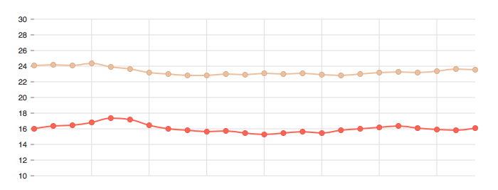
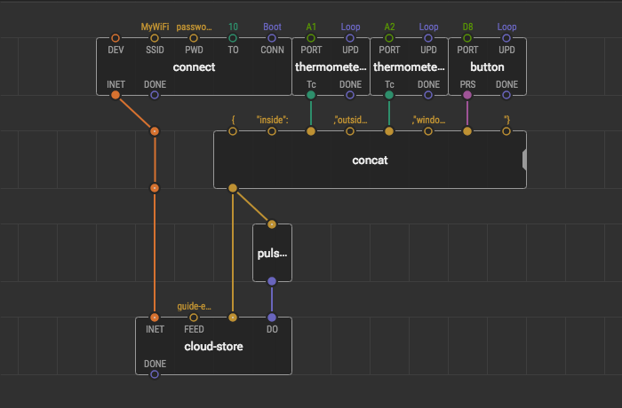

# Multiple Time Series

To follow the guide, you have to know [how to send data to XOD Cloud Feeds](../getting-started-with-feeds/).

The XOD Cloud Feeds service provides a feature to send bundled data so that it comes as an atomic portion with a single timestamp. It gives the option to see all the values on the same table and draw multiple time series on the same chart.

For example, you can track the temperature inside and outside of your house at the same time.

Also, that data may contain values of different types. Suppose you want to log temperature changes and whether the window is open at any given time. In this case, you can bundle these values with keys `inside`, `outside` and `window-opened` and then see them in a table like this:

<table class="ui celled table">
  <thead>
    <tr>
      <th>Date</th>
      <th>inside</th>
      <th>outside</th>
      <th>window-opened</th>
    </tr>
  </thead>
  <tbody>
    <tr>
      <td class="collapsing">2019-11-29 12:00:01</td>
      <td colspan="1" class="number">24.1</td>
      <td colspan="1" class="number">16.0</td>
      <td colspan="1" class="boolean">false</td>
    </tr>
    <tr>
      <td class="collapsing">2019-11-29 12:05:00</td>
      <td colspan="1" class="number">24.2</td>
      <td colspan="1" class="number">16.4</td>
      <td colspan="1" class="boolean">false</td>
    </tr>
    <tr>
      <td class="collapsing">2019-11-29 12:10:00</td>
      <td colspan="1" class="number">24.1</td>
      <td colspan="1" class="number">16.5</td>
      <td colspan="1" class="boolean">false</td>
    </tr>
    <tr>
      <td class="collapsing">2019-11-29 12:15:01</td>
      <td colspan="1" class="number">24.4</td>
      <td colspan="1" class="number">16.8</td>
      <td colspan="1" class="boolean">false</td>
    </tr>
    <tr>
      <td class="collapsing">2019-11-29 12:20:00</td>
      <td colspan="1" class="number">23.9</td>
      <td colspan="1" class="number">17.4</td>
      <td colspan="1" class="boolean">true</td>
    </tr>
    <tr>
      <td class="collapsing">2019-11-29 12:25:01</td>
      <td colspan="1" class="number">23.6</td>
      <td colspan="1" class="number">17.2</td>
      <td colspan="1" class="boolean">true</td>
    </tr>
    <tr>
      <td class="collapsing">2019-11-29 12:30:01</td>
      <td colspan="1" class="number">23.2</td>
      <td colspan="1" class="number">16.5</td>
      <td colspan="1" class="boolean">true</td>
    </tr>
    <tr>
      <td colspan="4">And so on...</td>
    </tr>
  </tbody>
</table>

To store the bundled data, use the same node, as usual, that is [`xod-cloud/messaging/cloud-store`](https://xod.io/libs/xod-cloud/messaging/cloud-store). What changes is that you have to send values in the so-called JSON format. If the string passed to `IN` contains a valid JSON, it would be parsed and stored as bundled data.

## JSON format

JSON is an open-standard format that uses a human-readable text to transmit data objects consisting of attribute-value pairs or arrays.

Here is an example of bundled data portion: `{"inside": 22.1, "outside": 16.4, "window-opened": true}`.

If you send an array instead of an object, you will get the same result as above, but the columns will have names 0, 1, and 2. Example: `[22.1, 16.5, true]`.

Note

A JSON format is picky about quotes, forgotten or excessive commas, and so on. So if you see a JSON-like string in your feed, it means there are some mistakes.

## Bundle data

Let's make a patch that bundles these values and sends it to the feed.

Note

If you want to reproduce this experiment but you don't have such sensors, you can replace their nodes with `tweak-number` and `tweak-boolean` nodes. Do not forget to upload with the selected "Debug after upload" option to interact with tweak nodes.

Pay attention to the `concat` node that we're using to format JSON. Here is a little cheat sheet:

- Wrap the whole bundle with a pair of curly or square brackets.
- Enquote each key.
- Do not forget `:` and `,`.
- Enquote strings and bytes. Because of the latter ones cast to a string.
- Do not enquote numbers and booleans.

Now you can upload the program and check out your feed. If you did everything right, you'd see the table like above.
