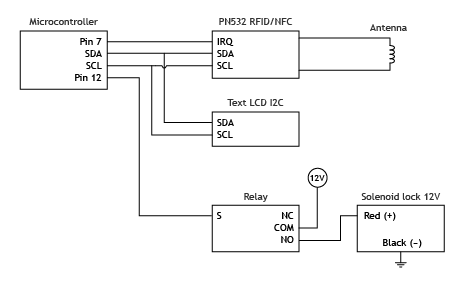
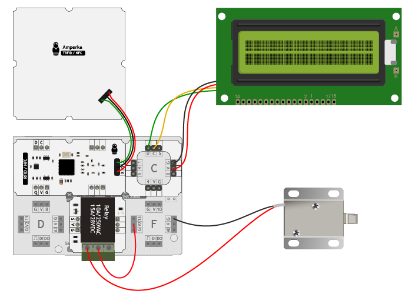
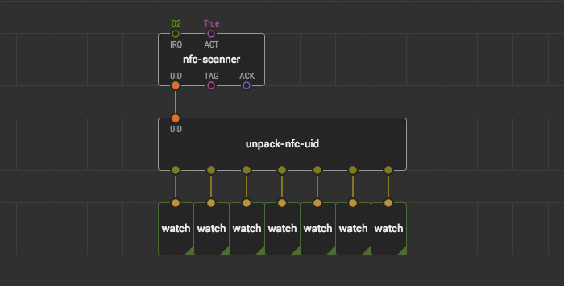
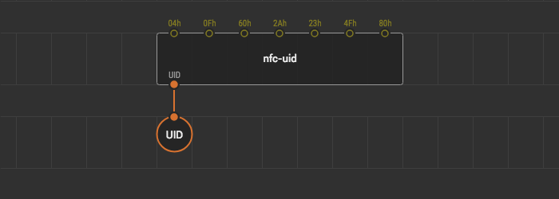
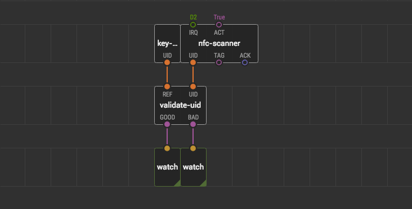
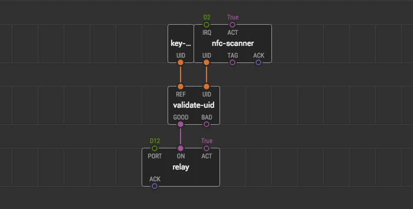
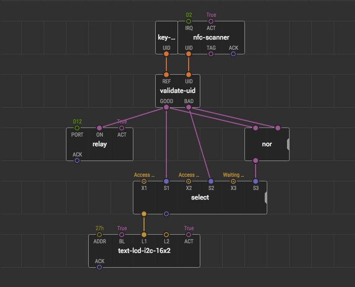
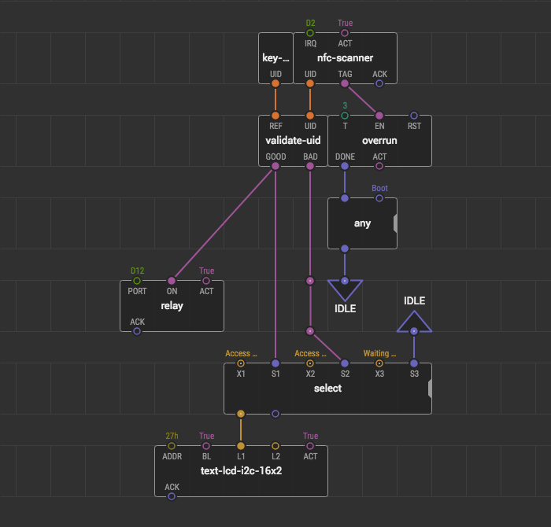
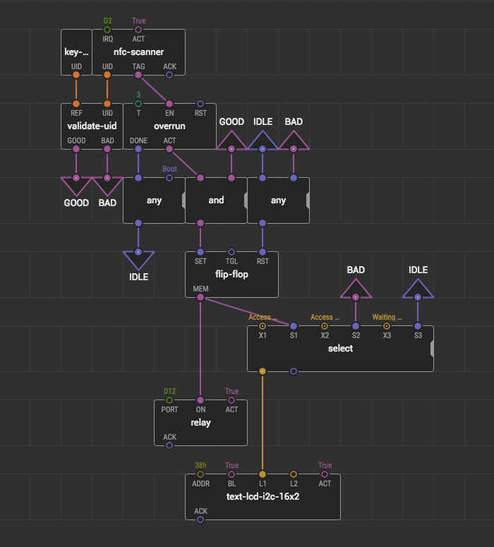
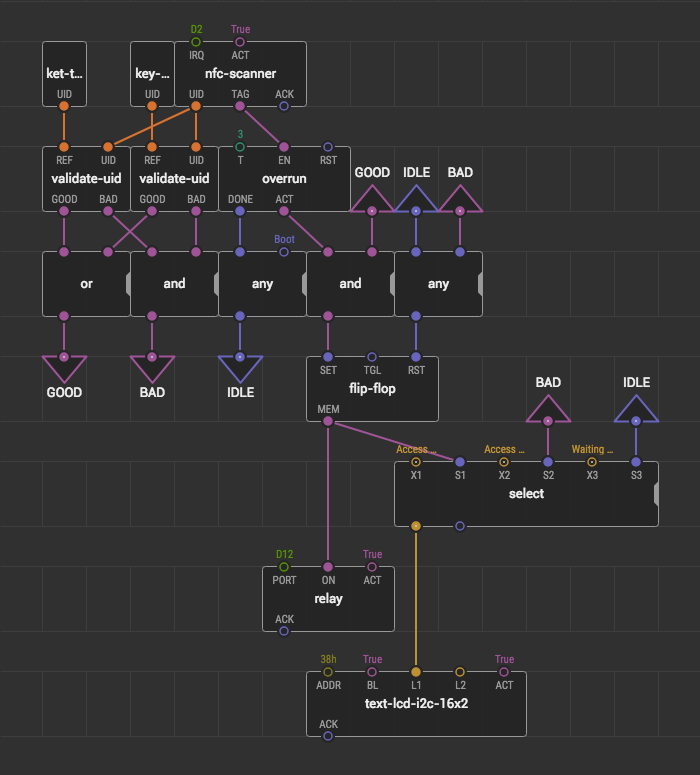

# NFC Smart Lock

<video src="./nfc-smart-lock-xod.mp4" type="video/mp4" poster="./nfc-smart-lock-xod.jpg" controls autoplay muted loop></video>

This example describes how to create a smart lock for your door, chest, or whatever. It opens up when a valid NFC tag is detected. It might be an RFID card or sticker.

To make the lock we need to read an NFC tag, compare its UID to the specified one, and turn on the relay to open the electromagnetic lock. Also, we'll add a text LCD to notify a user about the current state.

## Assembling device

Here is a circuit of the device:

You can build the device according to the schematics using modules from various vendors or even create own all-in-one PCB. One of the possible options is Troyka Module System by Amperka which makes wiring trivial:

- [Arduino Uno](https://amperka.com/products/arduino-uno)
- [Slot shield](https://amperka.com/products/arduino-troyka-slot-shield)
- [RFID/NFC Transmitter (Troyka Module)](https://amperka.com/products/troyka-rfid-nfc-1356)
- [Mini Relay (Troyka Module)](https://amperka.com/products/troyka-mini-relay)
- [Pin-up F/M Adapter (Troyka Module)](https://amperka.com/products/troyka-pin-up)
- [Text LCD 16×2 with I²C Interface](https://amperka.com/products/text-lcd-16x2-i2c)
- [Solenoid door lock](https://www.sparkfun.com/products/15324)

Here is a wiring scheme:

Note, that jumper on the slot shield joins `V2` with the `Vin` pin. So we power up the Arduino with the 12V and this voltage will be passed to the relay for the solenoid lock.

## Scanning NFC tag

We are going to use the [xod-dev/pn532-nfc](https://xod.io/libs/xod-dev/pn532-nfc/) library for NFC scanner interfacing. It provides nodes to read and write NFC tags using modules build around the popular PN532 chip, as well as nodes to compare and validate the tags.

First of all, let's implement scanning of NFC tag and retrieving of its UID. Fortunately, there is a [quick-start node](./working-with-hardware-nodes/#quick-start-nodes) `xod-dev/pn532-nfc/nfc-scanner` that scans for an NFC tag and retrieves its UID. Place it and bind the correct `IRQ` port: we chose `D7`.

To ensure it's working, place an `unpack-nfc-uid` node, link it with `nfc-scanner`, and place one `watch` node per output to see the values. Upload the program to the microcontroller with the debug mode turned on. Place an NFC tag next to the NFC reader module. You should see some bytes in the watch nodes.

## Validating NFC tag

OK, the NFC scanner works reading UIDs of NFC tags. Let's create a node which will represent the UID that will be considered a valid token for the device. Write down the bytes you have seen at the previous step to the paper and create a new patch named `key-token`. Place the `nfc-uid` node onto this patch node, bind the UID bytes, and output its result to the `output-nfc-uid` terminal.

Now we are going to compare a UID scanned by the module to the reference `key-token` we have made. For this, there is a `validate-uid` node in the `xod-dev/pn532-nfc` library. Switch back to the main patch and place `validate-uid`. For the `REF` input use the `key-token` node you’ve just created: place one onto the patch. Link another input with the scanner node. The `validate-uid` node outputs two booleans `GOOD` and `BAD` to express one of the possible states:

1. The token is valid: `GOOD` is true
2. The token is invalid: `BAD` is true
3. No token detected: both outputs are false

Upload the program with the debugger enabled, bring some tags to the scanner and see how `GOOD` and `BAD` react.

## Controlling relay

Let's make the lock open if we see the valid NFC tag. Place the [`xod/common-hardware/relay`](https://xod.io/libs/xod/common-hardware/relay/) node and link the `GOOD` pin to its `ON` pin. Do not forget to bind the correct port: we use `D12`.

Put the valid NFC tag on the scanner and ensure the lock opens.

## Notifying with text LCD

The smart lock is working already. But it's hard to recognize whether the lock does not open because something broke or the tag is invalid. Let's add a text LCD to show messages: "Access granted", "Access denied", or "Waiting for tag".

XOD has a standard library to work with text LCD displays with parallel or I²C interfacing: [`xod-dev/text-lcd`](https://xod.io/libs/xod-dev/text-lcd/).

Place one of quick-start nodes from the `xod-dev/text-lcd` library which fits your model of a text LCD: `text-lcd-i2c-16x2` or `text-lcd-parallel-16x2`. In this example we're using `text-lcd-i2c-16x2`.

To switch the messages, we place one more node: [`xod/core/select`](https://xod.io/libs/xod/core/select/). [Drag the handle on its edge](/docs/guide/variadics/) to get three pairs of inputs. Bind the text values to `X1`, `X2`, `X3` pins. These pins have a [generic type](/docs/guide/generics/), so do not forget to surround the string values with quotes.

Link the first output of the `select` node to the `L1` input pin of the text LCD node. The `select` node outputs one of the values from X𝑛 to its output on receiving a pulse on the pair S𝑛 pin. Let's link `GOOD` to `S1`, and `BAD` to `S2`.

For the last input, we have to be sure there is no tag detected, and it's neither `GOOD` nor `BAD`. Place a `nor` node, link its inputs to `GOOD` and `BAD` outputs, finally, link its output with the `S3` input pin.

## Implementing overrun

So far, so good. Now we have useful messages on the text LCD. But it's inconvenient that the lock opens only while the tag is touching the NFC reader. Let's keep it open for three more seconds after the user removed the tag. We’ll keep both "Access granted" or "Access denied" messages for the same delay as well.

It's time to make a simple state-machine with three states:

1. Idle — when device waits for the tag.
2. Granted — when valid token detected, it opens the lock and shows "Access granted" message.
3. Denied — when invalid token detected, it closes the lock and shows "Access denied" message.

The "Granted" and "Denied" states can be switched one to another at any moment. But the "Idle" state can be turned on only when the delay of the active state is over. It also is the default state when the device boots. Let's implement the states using the boolean logic and a special node for dealing with delays.

The `xod/core` standard library contains a useful node for such cases: [`overrun`](https://xod.io/libs/xod/core/orverrun/). It delays switching `EN` from true to false for the specified amount of time.

Let's enable overrun on any tag is detected. The node emits a pulse on the `DONE` output when overrun is over. First, we implement our state "Idle": place the `any` node, link it with the `DONE` output and bind the `Boot` value to the second input pin. This way the idle state will be activated on the boot or when the delay of overrun is over. Let's link it to the `S3` using a pair of bus nodes.

The `overrun` node outputs `true` to the `ACT` pin while the delay is in progress. For our case, this means we are still in "Granted" or "Denied" state. To check whether we are in the "Granted" state, use the `and` node with `GOOD` and `ACT` as inputs. It will output `true` only when the state machine is in the "Granted" state. That’s what we need. Once access is granted we should engage the relay and show the corresponding message on the display, and keep the system in this state. Use a `flip-flop` node for this. We’ll set the flip-flop to `true` once the access is granted. We should reset the flip-flop whenever the access is denied or we enter the idle state.

Well done! You did it.

## Multiple tokens

What if you want to grant access for the multiple tokens?

Create a few more patches like a `key-token`, validate each of them and combine all `GOOD` outputs using the `or` node and all `BAD` outputs using the `and` node.

## Ideas to improve

You've got a working smart NFC lock. You can improve it or make something different using the same modules or parts of the program. But we have some ideas to improve the same lock, which can help you get a deeper knowledge of programming in XOD:

1. Add an SD logger.
   So you can check out is there anybody tried to open the lock with invalid cards?
   Or maybe someone opened it up with the valid one?
   You'll need an SD-card module and the [`sd-log`](https://xod.io/libs/xod/common-hardware/sd-log/) node.
2. Add human-friendly date to the logs.
   You can get know the time when someone tried to open the lock.
   You'll need an RTC (Real-time clock) module and some nodes from the [`xod-dev/ds-rtc`](https://xod.io/libs/xod-dev/ds-rtc/) standard library.
