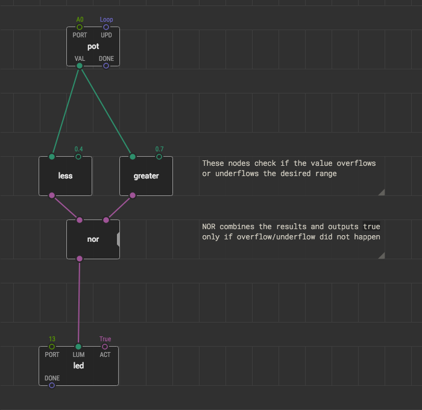
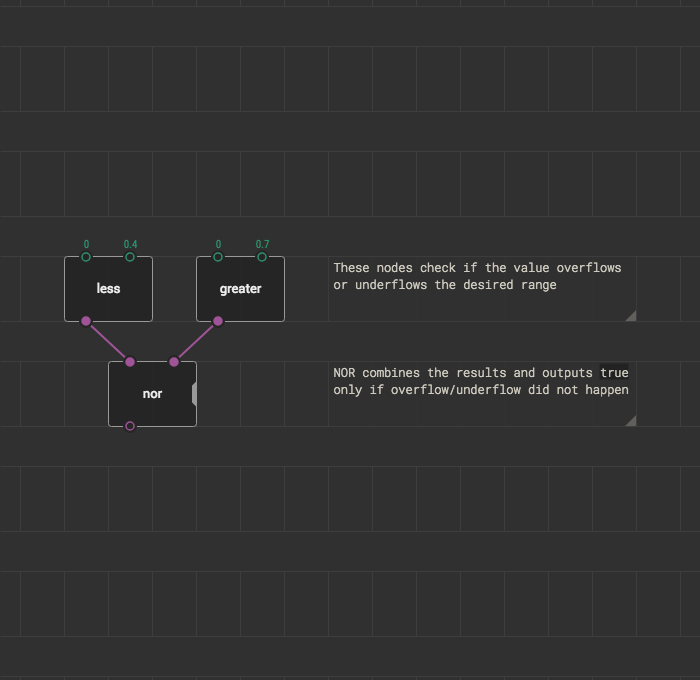
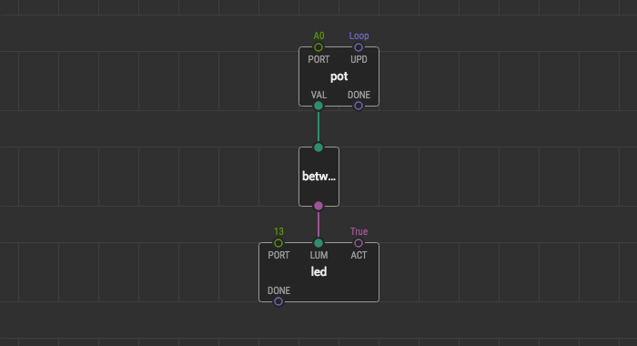
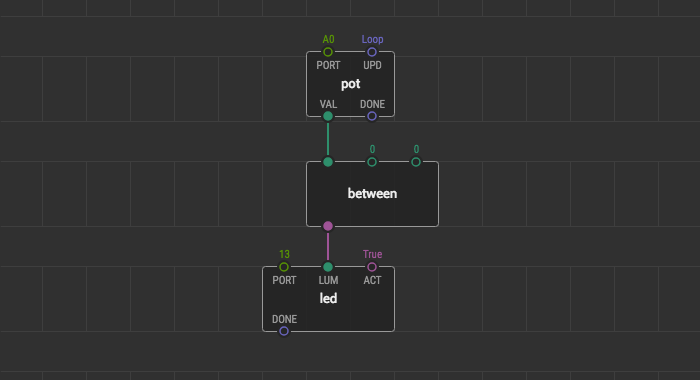
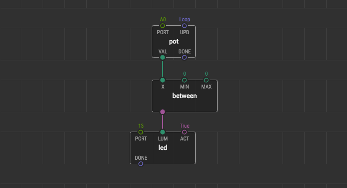

# Создание нод для XOD в XOD

Самый простой способ создания новой ноды в XOD состоит в создании новой ноды из существующих нод. Структура процесса:

1.  Создаем новый патч.
2.  Свяжите несколько существующих нод вместе, чтобы реализовать функцию.
3.  Добавьте входные и выходные ноды, чтобы можно было отрегулировать поведение ноды и использовать результаты.
4.  Готово! Используйте вновь созданный патч в качестве ноды для других патчей.

Из-за двойной структуры патчей, ноды, реализованные таким образом, называются _патч-нодами (patch nodes)_ в XOD. Это патчи и ноды одновременно.

Примечание:
Если вы знакомы с объектно-ориентированным программированием, подумайте о патчах как о классах и нодах в качестве их обьектов.

## Задание

Давайте создадим простую, но удобную ноду, `between` которая принимает числовое значение, минимальные / максимальные пределы и выводит, находится ли значение между пределами или нет. Т.е. она возвращается `true` тогда и только тогда, когда выполняется следующее:

_min ≤ значение ≤ max_

## Сделаем это

Начнем с реализации теста на одном патче. Создайте новый проект (File → New Project, or Ctrl+Shift+N), назовите его что-то вроде `my-utils`.

Мы будем использовать потенциометр в качестве источника данных и светодиод для наблюдения за результатом. Скажем, мы хотим проверить, попадает ли значение потенциометра между 0,4 и 0,7 и включать светодиод только в том случае, если тест пройден. Комбинация из [`xod/core/less`](/libs/xod/core/less/), [`xod/core/greater`](/libs/xod/core/greater/), и [`xod/core/nor`](/libs/xod/core/nor/) cделает это:

Загрузите программу, поверните ручку потенциометра, чтобы убедиться, что все работает так, как ожидалось.

## Создание нового патча

Мы готовы сделать повторную проверку “между”. Во-первых, вам нужно создать новый патч, который определит новую ноду. Нажмите “File → New Patch” или Ctrl+N, введите `between. Он также будет использоваться XOD для имени ноды.

Теперь переместите `less`, `greater`, `nor` ноды на `main` поле нового патча. Используйте вырезать / вставить (Ctrl+X/Ctrl+V), чтобы сделать это.

## Добавление терминалов

Теперь нам нужен способ, чтобы `between` нода могла получать и отправлять значения. В XOD патч-ноды взаимодействуют с внешним миром с использованием _терминальных нод_. Вы можете найти терминальные ноды в `xod/patch-nodes`, это `input-number`, `input-pulse`, `output-boolean` и т.д.

Нас интересует только `input-number` и `output-boolean`, поскольку мы принимаем произвольное число для сравнения и выводим значение true/false. Добавьте и соедините их, как и любой другой ноде. Примечание: терминалы отображаются в виде кругов, потому что они крайне важны.

## Используем это

Вернитесь к `main`. Перетащите ноду `between`. Привяжите её к `pot` и `led` так, что она действует в качестве посредника между ними.

Это все! Нода готова и работает. Загрузите измененную версию `main` патча на свою плату и убедитесь, что наша новая нода `between` действительно работает.

## Параметры экспонирования

Мы сравниваем с жестко закодированными пределами 0,4 и 0,7. Конечно, пользователь ноды хотел бы настроить предельные значения в зависимости от его задачи. Давайте сделаем это возможным. Это так же просто, как добавление еще двух входных терминалов.

Посмотрите на `main` патч сейчас. Вау! Теперь у `between` ноды есть два дополнительных пина.

Но какой из них чему соответствует? В нодах XOD их контакты отображаются в том же порядке, что и соответствующие терминалы расположеные вдоль оси X. Итак, здесь мы имеем значение, минимальный предел, максимальный предел.

## Добавление названий

В большинстве случаев рекомендуется четко указывать метки пинов, тогда никто их не будет путать. Пины получают свои метки от ярлыков своих конечных нод.

Откройте `between` патч, выберите входные терминалы один за другим и установите их названия через Inspector.

Примечание:
Обычно XOD использует названия пинов, которые похожи на метки ножек IC. 
Названия могут содержать не более четырех символов, и обычно они являются аббревиатурами. 
Ограничение позволяет размещать патчи довольно компактно.

Как назначить имена терминалов, отраженные в `main` патче? Посмотрим. Названия пинов стали намного яснее и понятнее.

Если это сделает вас счастливее, переместите `X` терминал между `MIN` и `MAX`и посмотрите, как изменяется порядок контактов на ноде.

## Вывод

Компоновка новых нод в XOD не имеет большого значения. Используйте её, чтобы сделать программы более понятными, обмениваться функциональными возможностями и повторно использовать свою собственную прошлую работу.

Приведенный пример довольно простой. Если вы хотите узнать больше, следуйте [инструкциям, чтобы сделать ноду аналогового датчика](../analog-sensor-node/).
