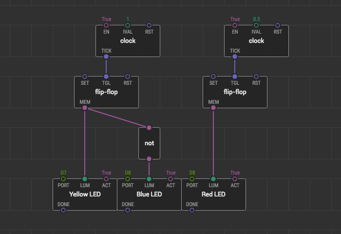
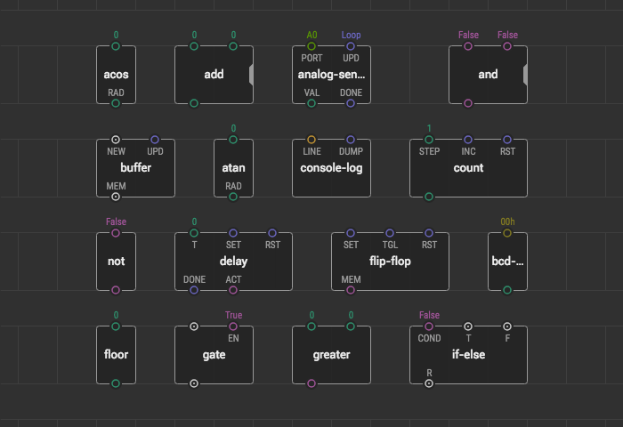

# Структура программы

Программа XOD очень похожа на электронную схему. 
Чтобы создать электронную схему, 
вы используете различные электронные компоненты и соединяете их с проводами. В 
программе XOD вы используете _ноды_ и соединяете их _линками_.

## Ноды

То, что делает нода, зависит от её типа. Так же, как в физическом мире есть микросхемы 
для управления двигателями, усиления аудиосигналов и хранения данных, в XOD доступно 
множество типов нод. Вы также можете легко создавать свои собственные ноды.

Некоторые ноды представляют собой физические устройства, такие как светодиоды или цифровые 
термометры. Другие используются для преобразования и фильтрации данных. 
Вот несколько примеров:

- [`thermometer-tmp36`](/libs/xod/common-hardware/thermometer-tmp36/)
- [`console-log`](/libs/xod/core/console-log/)
- [`add`](/libs/xod/core/add/)
- [`to-percent`](/libs/xod/core/to-percent/)

Вы размещаете ноды, которые вы выбрали для своей программы, в слоты, которые позже будут 
связаны линками.

## Пины, входы и выходы

Сами ноды являются некими черными ящиками. Они задают _пины_ для взаимодействия. 
Думайте о пинах, как о гнездах, портах, ножках IC и гнездах.

Пин может быть либо _входным_, либо _выходным_. После ввода нового значения на 
входной пин пересчитывается нода. В итоге она может обновить значения на выходных пинах 
или каким-то образом взаимодействовать с реальным миром, например, изменить 
скорость двигателя.

Некоторые ноды отправляют результат самостоятельно, как реакцию на какое-то внешнее событие. 
Например, нода [clock](/libs/xod/core/clock/) отправляет выходные значения с регулярными временным интервалом.

Пины изображаются как отверстия с короткими ярлыками. 
Входы расположены в верхней части ноды, а выходы находятся внизу.

## Линки и значения

Ноды взаимодейтсвуют друг с другом, передавая значения по _линкам_. 
Линк - это своего рода провод, который вы используете для подключения вывода одной ноды к входу другой ноды.

Значения в XOD очень похожи на электрические сигналы. Однако, в отличие от их электрических коллег, они могут 
нести не только необработанные значения напряжения, но и более понятные данные, такие как произвольные числа 
и текстовые строки. Подробнее о значениях читайте в статье [Типы данных](../data-types/) .

В аналоговых электронных схемах уровни напряжения постоянно и одновременно изменяются во всех точках. 
Нет такой вещи, как «этот чип подумал бы сначала, чем подумал другой чип». В цифровой электронике, однако, 
многие обновления сопровождаются дискретными импульсами, которые получают микроконтроллер и вызываются тактовыми сигналами.

Значения ведут себя очень точно в XOD. Они меняются и распространяются мгновенно. Эти обновления каскадных значений 
называются _транзакциями_. В XOD роли тактовых сигналов выступают _импульсы_ . В статье [Модель исполнения](../execution-model/) 
подробно описывается, как они работают.

Существует несколько правил, которые определяют, какие контакты могут быть связаны, а какие нет. 
Они достаточно интуитивно понятны, более детально читайте в [Правила линков](../linking-rules/).

## Патчи

Ноды, связанные вместе, образуют _патч_. Патчи - это как модули, документы или файлы 
в других системах программирования.

У вас будет один патч в простом проекте, и будет много патчей в сложном проекте.

Что делает интересным патч, так это то, что как только вы его создали, вы можете использовать его как новый 
тип ноды в других патчах! Это основная идея расширяемости XOD.

Вы используете специальные _терминальные ноды_ для обозначения входных и выходных пинов, когда патч используется как нода.

  
    Фото
    <a href="https://www.flickr.com/photos/26735065@N00/">cutwithflourish</a>.
  
  

  Примечание
    Возможно, вы слышали о модульных синтезаторах - они очень похожи на программы XOD. Ноды - это модули, линки - это 
    кабели CV с банановыми разъемами, а патчи - это стойка для модулей.
  

  

    
  

