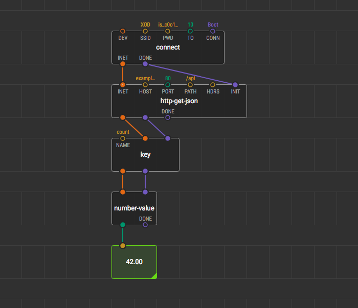

# Reading JSON Data

JSON (JavaScript Object Notation) is a very common data format used for the asynchronous client-server communication. It is easy for humans to read and write. It is easy for machines to parse and generate. In this article, you’ll learn how to fetch and extract desired parts of JSON data from HTTP API endpoints using XOD.

## JSON data types

JSON uses a few basic data types which allow describing arbitrary complex structures when nested. They are:

- Object: an unordered collection of name–value pairs where the names (also called keys) are strings. Objects are delimited with curly brackets and use commas to separate each pair, while within each pair the colon ':' character separates the key or name from its value.
- Array: an ordered list of zero or more values, each of which may be of any type. Arrays use square bracket notation with comma-separated elements.
- Number: a signed decimal number that may contain a fractional part and may use exponential E notation, but cannot include non-numbers such as NaN. The format makes no distinction between integer and floating-point.
- String: a sequence of zero or more characters. Strings are delimited with double-quotation marks and support a backslash escaping syntax.
- Boolean: either of the values `true` or `false`
- null: An empty value, using the word `null`


## Getting data

To easily fetch JSON documents from the internet, use [`xod/net/http-get-json`](/libs/xod/net/http-get-json/) node. It is very similar to [`xod/net/http-get`](/libs/xod/net/http-get/) described in [Fetching Data from Web API’s with HTTP GET requests](../http-get/), but instead of the byte-stream outputs a stream of parsed JSON *chunks*. Stream processing allows handling even very large responses that would not fit into the controller's memory.

If you want to process JSON from another source, use the low-level [`xod/json/parse-json`](/libs/xod/json/parse-json/) node instead.

## Traversing objects

Let's say you receive a response like this:

```json
{
  "count": 42,
  "last-updated": {
    "day": 3,
    "month": 9,
    "year": 2019
  }
}
```

Let's get the `count` value. Use the [`xod/json/key`](/libs/xod/json/key/) node to extract data corresponding to the `count` key, and then [`xod/json/number-value`](/libs/xod/json/number-value/) to extract the number from that data:



Several `key` nodes may be chained to extract data from nested objects:


## Traversing arrays

To access an element from an array, use the [`xod/json/nth`](/libs/xod/json/nth/) node. It works just like `key`, but instead of the key name, it accepts an item index.

```json
{
  "pets": [
    {
      "name": "Gary",
      "species": "snail",
      "age": 1,
      "has_a_shell": true
    },
    {
      "name": "Roger",
      "species": "turtle",
      "age": 23,
      "has_a_shell": true
    },
    {
      "name": "Jack",
      "species": "rabbit",
      "age": 2,
      "has_a_shell": false
    }
  ]
}
```


## Extracting values

To extract "primitive" data like numbers, booleans and strings use [`xod/json/number-value`](/libs/xod/json/number-value/), [`xod/json/boolean-value`](/libs/xod/json/boolean-value/) and [`xod/json/string-value`](/libs/xod/json/string-value/):


Make sure to specify estimated length of strings in each `string-value`'s `CAP` pin. `CAP` should be no less than expected string length. If it is too small, the string will be truncated. If it is too large, it consumes too much RAM.

## Summary

The [`xod/json`](/libs/xod/json/) library makes parsing JSON documents quite easy and efficient. The common scenario to consume a JSON document is:

- Feed JSON as a stream of bytes into `parse-json` node (or use `xod/net/http-get-json` if you want to get a JSON document from the internet).
- Use `key` and `nth` to "reach" for values in objects and arrays.
- Use `number-value`, `boolean-value` and `string-value` to extract the values of the respective data type.
