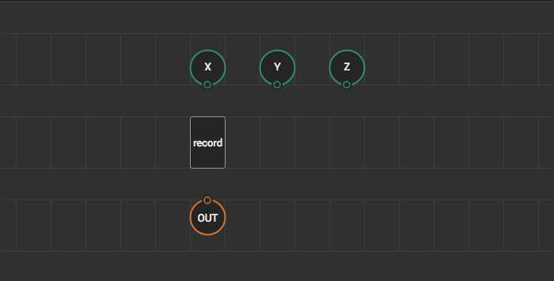
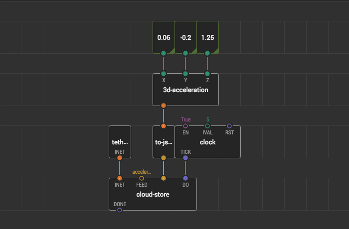
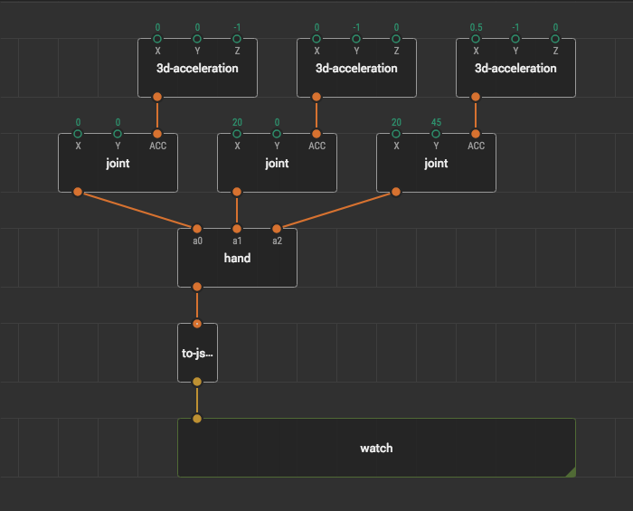

# Creating Records

A record is a collection of fields, possibly of different data types.

Many of the custom types in XOD are some data packed in the record. This way, you can quickly pass grouped values through a single terminal. It also allows you to create specializations for generic nodes and thereby implement polymorphism at the XOD language level.

To simplify the packing and unpacking process without coding a C++ implementation manually, XOD has a marker node `xod/patch-nodes/record`. When you place this node on the patch with some input terminals and `output-self` node, XOD automatically generates the code necessary to pack the multiple inputs into a single record. It also creates an unpack patch which can access the record field values.

## Pack the data

Grouping of values is useful when you need to pass a bunch of data in the several nodes without insane linking net all over your patches. This guide does not consider examples of such complex programs but gives some use cases of how to pack these data and use it where necessary.

Imagine we want to pack outputs from an accelerometer. It has three data values of type `Number`, which represent acceleration along X, Y, and Z axes. To do this, we are going to create a new record type:

1. Create a new patch and call it `3d-acceleration`.
2. Place three terminals `xod/patch-nodes/input-number` and give them labels: `X`, `Y`, `Z`.
3. Place the `xod/patch-nodes/record` marker.
4. Place the `xod/patch-nodes/output-self` terminal.



Note, the `record` marker automatically created a `@/unpack-3d-acceleration` patch, which you can use to get the plain values back out from the record.

As for any other [custom type](../custom-types/), you can also find out created `@/input-3d-acceleration` and `@/output-3d-acceleration` terminal patches in the project browser. So you can encapsulate some logic over your record inside a new patch. To do so, you need to create a new patch and place the `@/input-3d-acceleration` terminal and the `@/unpack-3d-acceleration` node and work with it as usual if you want to change some values in the record, place a new `@/3d-acceleration` node and link it with `@/output-3d-acceleration`.

## JSON serialization

Records can be serialized to JSON. JSON is a widespread data interchange format. Most cloud services can work with it. In this way, records make it easy to send data to various services, including [XOD Cloud Feeds](../getting-started-with-feeds/) and especially [multiple time series](../multiple-time-series/).

The [`xod/json`](https://xod.io/libs/xod/json) standard library has an abstract [`to-json`](https://xod.io/libs/xod/json/to-json) node and specializations for the primitive types. However, when you created a valid record patch, it also automatically creates a specialization for the record, and you can find it in your project with the name `@/to-json(3d-acceleration)`. This patch is a composition of the nodes, and you can open the patch and check out how it works inside. In short, it contains the unpack node, `to-json` node for each field of the record, and concatenate it into a valid JSON using pin labels as keys in a JSON object.



## Custom types and nesting

Records can contain any custom types, including other records, without any limitation on the nesting level. It also makes it possible to send complex data structures in JSON format.




However, most of the custom types have no `to-json` specializations, so you'll get a compilation error if you try to serialize a record, which contains, for example, an `i2c` type. But, if you really need to serialize some custom type you can create `to-json` [specialization](../generics/#specializations) manually. It should output a JSON-serialized string.

## Creating a simple device custom type

Some nodes representing hardware devices using a custom type may be defined using the same record mechanism instead of implementing them in C++.

For example, the standard library [`xod-dev/ds-rtc`](https://xod.io/libs/xod-dev/ds-rtc) requires an I2C bus and address of the device. These values pack in the records without any problems. This library uses a record to pass the bus object along with address as a single type, check out how it works.

## C++ representation

A record is laid out as a `struct` with fields of input terminals. Each field has the same type as the terminal and uses its label as the name, prefixed with `field_`. For example, if you set the label of a terminal to `X` it will be `field_X` in the `struct`.

The C++ implementation of the `@/3d-acceleration` record patch:

```cpp
node {
    meta {
        struct Type {
            typeof_X field_X;
            typeof_Y field_Y;
            typeof_Z field_Z;
        };
    }

    void evaluate(Context ctx) {
        Type record;

        record.field_X = getValue<input_X>(ctx);
        record.field_Y = getValue<input_Y>(ctx);
        record.field_Z = getValue<input_Z>(ctx);

        emitValue<output_OUT>(ctx, record);
    }
}
```

In case you left terminal labels empty, it will be labeled, as it does with terminals: `field_IN1`, `field_IN2`, and so on for the multiple unlabeled terminals. For the single one unlabeled terminal, it will be just `field_IN`.

<div class="ui segment note">
<span class="ui ribbon label">Note</span>
Records are passed to the outputs by value, not by reference. So a record is an immutable data type. If you want to change some record values, you have to create a new instance of the record with new values.
</div>

The C++ implementation for the `@/unpack-3d-acceleration` patch:

```cpp
node {
    void evaluate(Context ctx) {
        auto record = getValue<output_IN>(ctx);

        emitValue<output_X>(ctx, record.field_X);
        emitValue<output_Y>(ctx, record.field_Y);
        emitValue<output_Z>(ctx, record.field_Z);
    }
}
```

If you want to create your own C++ implementation for some purposes with records on inputs, you can get the record and access its fields the same way as in the implementation of the unpack record patch above.

--

1. To make a record type, you need to place the `record` marker node, the `output-self` node, and some input terminals.
2. It automatically creates an unpack patch and `to-json` specialization.
3. Records can contain any types, including other records.
4. Custom types without `to-json` specialization won't let you serialize the entire record. However, you can create a missing specialization.
5. Records make it easy to send JSON serialized data to the feeds or other web services.
6. You can work with the records in your own C++ implemented patch as with a regular C++ `struct`.
