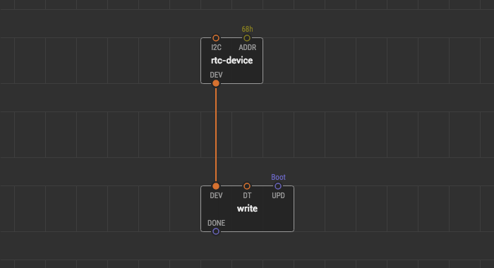
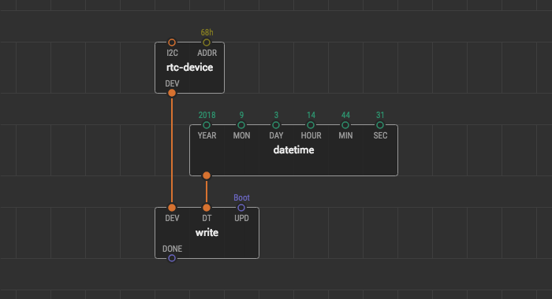
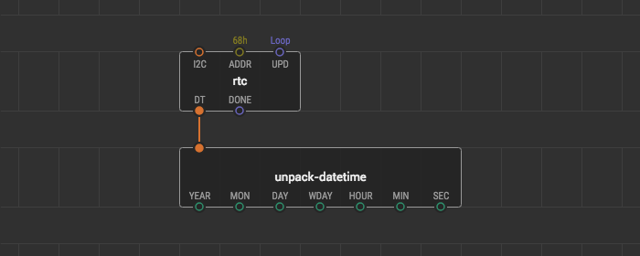
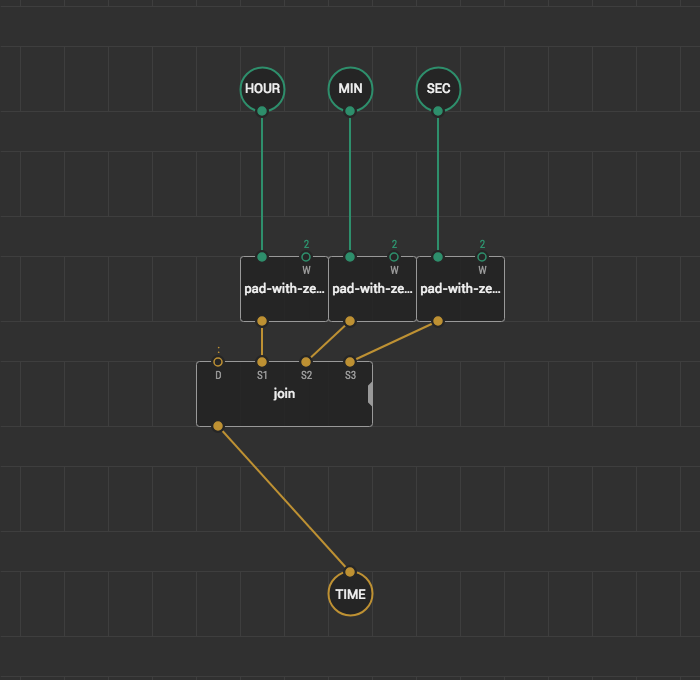
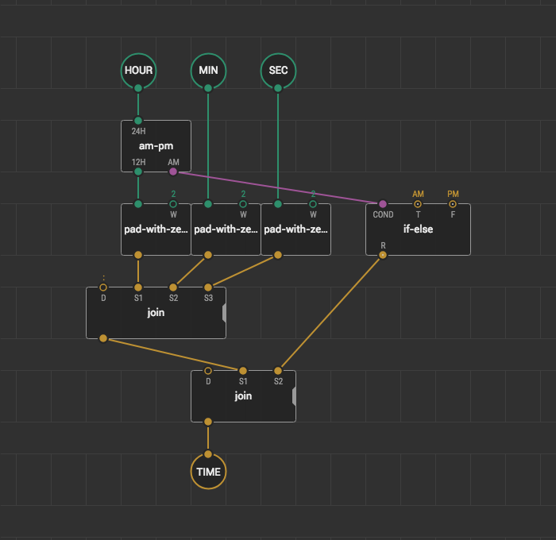

# Digital Clock Example — Working with RTC Modules

This example describes how to use the
[`datetime`](https://xod.io/libs/xod/datetime/) and
[`ds-rtc`](https://xod.io/libs/xod-dev/ds-rtc/) libraries, format date and time
values, and work with real-time clock (RTC) modules for Arduino. Upon the
completion of this guide, you will learn how to create a simple digital clock
based on a DS1307 I2C RTC module and I2C LCD display.

## Required hardware

- Arduino Uno board
- I2C RTC breakout board based on the DS1307 microchip
- I2C LCD 16x2 display
- A battery to power the RTC module
- Breadboard
- Hook-up wires

Note

You can use a DS3231 or DS1302 breakout board instead of DS1307 because they are
interchangeable.

## Circuit

- Both the I2C display and the real-time clock board communicate via I2C. To
  ease the connection, you can create the I2C bus on the breadboard by wiring
  the `SDL` and `SDA` I2C pins from the Arduino board to the contact lines on
  the breadboard. The display and RTC have different I2C addresses, they do not
  interfere with each other, so you can connect them to the same I2C bus.
- Connect the `GND` and `5V` pins from the Arduino board to the corresponding
  rails on the breadboard.
- Plug the I2C display. Wire its `SDA` and `SDL` with the I2C bus on the
  breadboard. Wire its `GND` and `Vo` pins with the `GND` line on the
  breadboard. Wire `Vcc` pin with the `5V` line on the breadboard.
- Plug the I2C RTC breakout board. Wire its `SDA` and `SDL` with the I2C bus on
  the breadboard. Wire its `V` and `GND` pins with the corresponding lines on
  the breadboard.
- Power the RTC board with the battery to keep running even when the external
  power source is disconnected.

Note

If you are using another model of the I2C display or RTC module, look at their
pinout and datasheet to connect them correctly.

## Programming steps

For this example, the programming process consists of two steps:

- Making a program to write the current datetime to the memory of the RTC
  module.
- Making a program to read the current datetime from the RTC module and display
  it on the screen.

## Writing datetime

Create a new patch `set-current-time`. We’ll use it only once to write the
current time to the memory of RTC module so that it has a proper base point.

- Put an [`rtc-device`](https://xod.io/libs/xod-dev/ds-rtc/rtc-device/) node
  from the `xod-dev/ds-rtc` library onto the patch. This node _describes_ an RTC
  breakout board which communicates via I2C. By default, the I2C device address
  of the RTC at the `ADDR` pin is `68h` which is correct for the most DS1307
  modules. The `DEV` pin of the node outputs the `rtc-device` value which
  contains everything to operate the device.
- Add a [`write`](https://xod.io/libs/xod-dev/ds-rtc/write/) node from the
  `xod-dev/ds-rtc` library onto the patch. This node’s function is to write time
  and date to the permanent memory of the RTC board. The `DT` pin inputs a
  `datetime` type value to be written. The `UPD` pin triggers a new write. The
  `DONE` output pin notifies writing complete.
- Link the `DEV` pin of the `write` node with the `DEV` pin of the `rtc-device`
  node.
- The `On boot` value at the `UPD` pin means that we write the `datetime` once
  after the boot of the device.

The `write` node requires the date and time values having a `datetime` type. The
[`datetime`](https://xod.io/libs/xod/datetime/datetime/) node is used to pack
year, month, day, and hours, minutes, seconds into a `datetime` type value.

- Put the [`datetime`](https://xod.io/libs/xod/datetime/datetime/) node onto the
  patch.
- Link the output pin of the `datetime` node with the `DT` pin of the `write`
  node.
- Fill the `YEAR`, `MON`, `DAY`, `HOUR`, `MIN`, and `SEC` pins with values. Each
  pin contains a description of what form this values should be.

For example, we set the current date. Now it is the 17-th of September of the
2018 year, and the time is 14 hours 44 minutes and about 31 seconds. To set this
date and time values to the RTC, we fill the `datetime` pins with values.

- The `2018` year value to the `YEAR` pin.
- `9` number of the September month to the `MON` pin.
- `17` number of the day of the month to the `DAY` pin.
- `14` number of the hours to the `HOUR` pin.
- `44` number of the minutes to the `MIN` pin.
- `31` number of the seconds to the `SEC` pin.

The patch to set up the real-time clock is completed. Let’s quickly load it into
the Arduino board, to make the difference between the real and written time be
only a few seconds.

Once the board is flashed the RTC module will get the correct current time value
which automatically ticks and not get lost as long as the module is powered by
either its battery or the device itself. However, note that the time gets
re-written on every boot to that exact value we have set. So, if you will reset
your board after an hour, it will overwrite the correct time with the
now-obsolete hour-lagging value. To protect from this effect it is a good idea
to remove the uploaded time setting program. Upload an empty patch right after
`set-current-time` to clear.

We won’t need the `set-current-time` patch anymore.

## Reading datetime

Create a new patch and name it `digital-clock`. This is the patch for our
digital clock. Strictly speaking, we are going to create a new program. So we
need to put an RTC node again. To fetch the data, a node which is named simply
[`rtc`](https://xod.io/libs/xod-dev/ds-rtc/rtc/) might be used. Then we unpack
the obtained values for further work.

- Add the [`rtc`](https://xod.io/libs/xod-dev/ds-rtc/rtc/) node onto the patch.
  This node represents an RTC clock. A pulse at the `UPD` pin triggers a new
  reading of a `datetime` type value. The `DONE` output pin fires on successful
  read. By default, the I2C device address at the `ADDR` pin is `68h`.
- For the continuous reading of date and time set the `UPD` pin value to
  `Continuous`.
- Add the [`unpack-datetime`](https://xod.io/libs/xod/datetime/unpack-datetime/)
  node onto the patch and link it with the `rtc` node. The `unpack-datetime`
  node destructs the `datetime` type value and outputs `Number` values of the
  date and time for subsequent processing or formatting.

Look at descriptions of output pins of the `unpack-datetime` node to figure out
the ranges and formats of the output values.

Note

If the real-time clock takes a small place in your extensive project, and a
controller is very loaded, the `Continuous` pulses on time readings can lead to
various unexpected read failures. To solve this problem limit the pulse
frequency. For example, you can link the `UPD` pin with the
[`clock`](https://xod.io/libs/xod/core/clock/) node and set the `IVAL` value to
`1` second. By this, you adjust the real-time clock updates to 1 Hz.

### Date and time formats

Let's put this patch aside for a while. Imagine that no time has passed since we
written values to the RTC. Thus, if we look at output pins of the
`unpack-datetime` node, the values of date and time are the same format that we
entered.

- `2018` number value at the `YEAR` pin.
- `9` number value at the `MON` pin.
- `17` number value at the `DAY` pin.
- `14` number value at the `HOUR` pin.
- `44` number value at the `MIN` pin
- `31` number value at the `SEC` pin.

Besides, the `unpack-datetime` node calculates the weekday and outputs it
through the `WD` pin in the range from `1` to `7`. Now, we need to format this
numbers to a proper view and add punctuation before showing them at the display
screen.

Different conventions exist all around the world for the date and time
representation, both written and spoken. Differences can exist in:

- The calendar that is used.
- The order in which the year, month and day are presented.
- How weeks are identified.
- Whether written months are identified by name or by number.
- Whether the 24-hour clock, 12-hour clock is used.
- The punctuation used to separate elements in all-numeric dates and times.

Some time formats are standardized though. For example, you can read about
[ISO 8601](https://en.wikipedia.org/wiki/ISO_8601) or
[Unix time](https://en.wikipedia.org/wiki/Unix_time) formats. You can check out
the `xod/datetime` library for the
[`format-timestamp`](https://xod.io/libs/xod/datetime/format-timestamp/) node.
It formats datetime for use in spreadsheet computer programms. In this example,
let's format date and time as they are shown on the digital clock in the classic
American style. Here is the picture of the digital clock we want to make.

Let’s create three additional patch nodes which format our date and time values.

### Formatting date

We start the formatting process from the date. Create a patch for the first new
patch node and name it `format-date`. We want this node to get numbers for a
year, month, and day and output them as a single string. Also, we want
`format-date` to separate the date values with the `/` character.

- Add three `input-number` nodes onto the patch and name them `YEAR`, `MON`, and
  `DAY`.
- Add the `output-string` node onto the patch and name it `DATE`.
- Add the [`format-number`](https://xod.io/libs/xod/core/format-number/) node
  and link it with the `YEAR` node. The year values that comes to the `YEAR` pin
  are of Number type. The Number type values are floating point, and the incoming
  year value looks like `2018.00`. We use the `format-number` node to get rid of
  those zeroes. If you put the `0` value to the `DIG` pin string value of the
  year becomes `2018`.
- Add two [`pad-with-zeroes`](https://xod.io/libs/xod/core/pad-with-zeroes/)
  nodes from the `xod/core` onto the patch. Link their input pins with `MON` and
  `DAY`. The `pad-with-zeroes` node transforms a
  [Number](/docs/guide/data-types/#number-type) value into
  [String](/docs/guide/data-types/#string-type) adding zeroes before the value.
  The number of added zeroes depends on the width of the string. The width value
  is set at the `W` input pin. This node is very useful for this guide. The
  month and day value fields on our display have 2 digit capacity. If we show
  the `12/22/2018` date on the screen, it is ok. However, if we show, for
  example the 3rd of September directly without adding zeroes below the month
  and day, the text on the screen looks will be `3/9/2018`. Thus cuts the width
  of the date by two digits, and the total width of the line on the display
  screen. The `pad-with-zeroes` solves this problem. We put the `2` width value
  to the `W` pin on both nodes, so the 3rd of September looks like `03/09/2018`.
  By this, the total width of the line with the date will always be static.
- Add the [`join`](https://xod.io/libs/xod/core/join) node onto the patch. With
  the `join` we can separate day, month and year by a character of our choice.
  As we want to separate date values with `/`, we link the `/` string constant
  with the `D` delimiter pin. With `join` we can also set the order of the year,
  month, and day representation. As we want the `MON` value to be first, `DAY`
  to be second, and `YEAR` to be third, we make proper links between `join`
  input pins and other nodes. After this link the `join` output to the `DATE`
  output-string node.

### Formatting weekday

The `unpack-datetime` node outputs the number of the weekday depending on the
date. To show weekday names instead of numbers we need a node. Create a patch
for this node and name it `format-weekday`.

- Add the `input-number` node for the input weekday number onto the patch. Name
  it `IN`.
- Add the `output-string` node for the string name of the weekday onto the patch
  and name it `OUT`.
- Decide how you name the weekdays for your clock. We name them `Mon`, `Tue`,
  `Wed`, `Thu`, `Fri`, `Sat`, `Sun` and create constant nodes for them.
- Add the [`nth-input`](https://xod.io/libs/xod/core/nth-input/) node onto the
  patch. The `format-weekday` node outputs the number of weekdays in the range
  from `1` to `7`. So, the Monday number is `1`, and the Sunday number is `7`.
  The `nth-input` node is great for this example, it outputs the selected value
  from `X` pins based on the `IDX` index value. Let the input node `IN` be the
  index.
- Link the `IN` input-node to the `IDX` pin.
- Link the weekday nodes to the corresponding `X` pins of the `nth-input` node.

### Formatting time

Ok, we created nodes that format date and weekday. Time is left to format.
Create a patch for the new node and name it `format-time`. This node will take
hours, minutes and seconds from the `unpack-datetime` node and format them as we
desire.

- Add three `input-number` node for the time and name them `HOUR`, `MIN`, and
  `SEC`.
- Add the `output-string` node for the formatted time in a string form.
- Put three `pad-with-zeroes` nodes onto the patch and link them with `HOUR`,
  `MIN`, and `SEC` nodes. To display hours, minutes, and seconds in a two-digit
  format, put the`2`value to the`W`pins as we do it in the`format-date` node.
- To separate the time values with a colon use the `join` node. Put the `:`
  delimiter into the `D` pin of the `join` node. Also, you can use the `join` to
  set the order in which the time is displayed. Make proper links between the
  `pad-with-zeroes` outputs and the `join` inputs.

For the American style clock, we decide to use the 12-hour format instead of
24-hour. For the part of the day, we show the `AM` and `PM` words on the display
screen.

- Insert the [`am-pm`](https://xod.io/libs/xod/datetime/am-pm/) node between the
  `HOUR` input node and the `pad-with-zeroes` node. The `am-pm` changes the hour
  format from 24 to 12. The `AM` pin is `true` if it is “before midday” or
  `false` if it is not.
- Add the `if-else` node onto the patch and set the `AM` string value for `T`,
  and `PM` string value for `F`. Link the `COND` pin with the `AM` output of the
  `am-pm` node.
- Separate the time from the `PM` and `AM` labels with a single space. For this,
  put another `join` node onto the patch. Put the spacer character to its
  delimiter `D` pin.
- Link the last `join` with the nodes above and the output node `TIME` to finish
  the `format-time` patch.

### Combining the formats

Format nodes are ready, so let’s put them onto the `rtc-example-read` patch.

- Put the `format-date`, `format-weekday`, and `format-time` nodes, that you’ve
  just created. Link their inputs to the `unpack-datetime` outputs.

### Displaying on the screen

When the date, time, and weekday are formatted we can show them on the I2C
display screen. Let’s show the date and the weekday at the first line of the I2C
display, and time at the second line.

- For the I2C 16x2 display, put the
  [`text-lcd-i2c-16x2`](https://xod.io/libs/xod-dev/text-lcd/text-lcd-i2c-16x2/)
  node onto the patch.
- The screen of the display in this example has 16x2 digits capacity. We align
  both display lines to the center to make the clock looks better. For this, we
  put two [`concat`](https://xod.io/libs/core/concat/) nodes for each line.
  There we added two spaces to indent the text from the edge of the screen and
  one space to separate the day of the week from the date.
- Link the second `concat` node of the date and time with the `L1` pin of the
  `text-lcd-16x2-i2c` node. The second `concat` node with the `L2` pin.

## Result

Upload the `rtc-example-read` patch to your Arduino board and look what the
digital clock you get.

<video controls autoplay muted loop>
    <source src="./result.mp4" type="video/mp4">
</video>

If you encounter any problems trying to repeat the guide,
[download the prepared project](./digital-clock.xodball) and open it in the IDE.

## Conclusion

We created a digital clock device using `xod/datetime` and `xod/ds-rtc`
libraries. Try to make your own clock with different styles and timestamp
formats.

If you want to practice, find other usages of these libraries. For example,
connect a real-time clock to an [SD card](/docs/guide/sd-log-example/), log
timestamp values using the `format-timestamp` node, and have a look how it is
easy to process timestamps with the computer applications.
