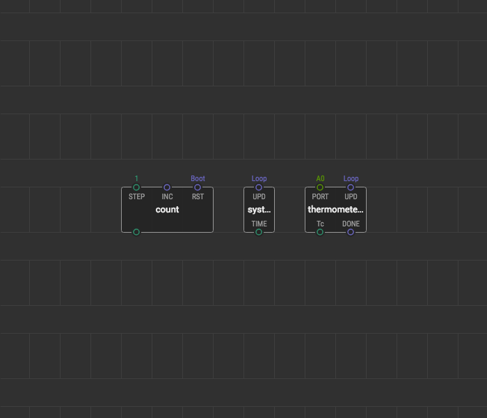
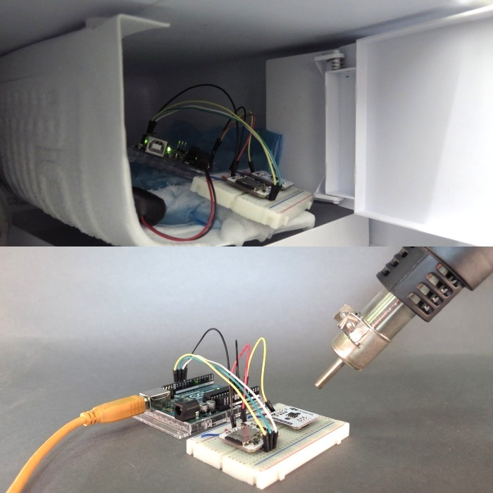
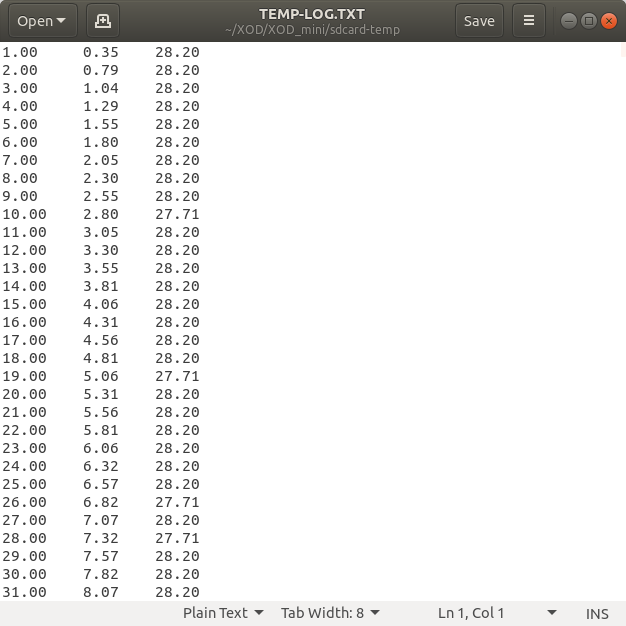

# Temperature Log Example


This example describes how to store sensor data and process it on the computer.
We are going to read environment temperature and save the values on a microSD
card. After this we will connect the microSD card to the computer and analyze
the obtained temperature values.

## Required hardware

- Arduino Uno board
- TMP36 analog temperature sensor
- microSD breakout board
- Formatted microSD card
- Breadboard
- Hook-up wires

## Circuit


- The analog thermometer is connected to the `A0` analog port on the Arduino
  board.
- The microSD breakout boards usually use an SPI interface to communicate.
  Arduino Uno provides SPI on pins `11`, `12`, and `13`. The `CS` pin can be
  connected to an arbitrary digital pin. We chose `10`.

<div class="ui segment note">
<span class="ui ribbon label">Note</span>
If you are using another board model look at its pinout to connect to the SPI bus correctly.
</div>

## Programming

Create a new project in XOD and name it something like `temparature-log`.

### Source data

- As we use the TMP36 based thermometer we add a
  [`thermometer-tmp36`](https://xod.io/libs/xod/common-hardware/thermometer-tmp36/)
  to the patch. This thermometer should be connected to an analog Arduino port.
  We connected our sensor to `A0`, so set the `PORT` pin value to `A0`.
- Next, we want to bind the temperature to a timestamp when it was read. For
  this place a [`system-time`](https://xod.io/libs/xod/core/system-time) node.
  This node outputs time in seconds passed since the program start.
- If we want to update the data continuously we'd better number each new record.
  The [`count`](https://xod.io/libs/xod/core/count) node will do it for us.
  Place it onto the patch and set the `STEP` value to 1.

By now we have three data sources on the patch.



### Limit frequency

We need to set a frequency of readings to limit the data volume and to give some
time for the microSD board to flush the file after each record. The easiest way
to do this is to use a `clock` node. Place it onto the patch and link with all
three data sources.


The `IVAL` pin is responsible for the pulse generation frequency and, as a
consequence, for extracting a new set of data. We decided to receive and record
data 4 times per second, so we set `IVAL` value to 0.25 (=¼).

### Format data

We predict lots of data. For easier processing it is a good idea to format it as
a table. Each row may represent a single record: the record number, record
timestamp, and a temperature value read at that moment. To combine all data
values and store them as a single string, use the `join` node. Place `join` onto
the patch and link it with all data sources.


The `D` pin of the `join` node is used to delimit the values. With this pin you
can set the a character or string you want to delimit the values.

There are numerous text-based formats for storing and exchanging data. The
examples of such formats are CSV
([Comma-Separated Values](https://en.wikipedia.org/wiki/Comma-separated_values))
or TSV
([Tab-separated values](https://en.wikipedia.org/wiki/Tab-separated_values)).
These text formats are used to store tabular data and to exchange it between
different computer programs. Notably, spreadsheet applications such as Google
Spreadsheets, Microsoft Excel, LibreOffice Calc can easily import such files.
Look at a CSV file example which defines track durations for a music album:

```
No.,Title,Length
1,Hells Bells,5:12
2,Shoot to Thrill,5:17
3,What Do You Do for Money Honey,3:35
4,Givin’ the Dog a Bone,3:31
5,Let Me Put My Love into You,4:15
6,Back in Black,4:15
7,You Shook Me All Night Long,3:30
8,Have a Drink on Me,3:58
9,Shake a Leg,4:05
10,Rock And Roll Ain’t Noise Pollution,4:15
```

So, let’s use the TSV text-format for storing. To delimit the values with tabs
place the `\t` character into the `D` pin of the `join` node. The backslash-t is
a special escape-sequence to denote the `TAB` character because it can’t be
easily printed and displayed in IDE.

### Store data

XOD provides an `sd-log` node to append text lines to the tail of the specified
file stored on an SD card. Add the `sd-log` node onto the patch and set up its
inputs:

- Link its `LINE` pin with the `join` output.
- The `CS` pin is used to set up the number of the chip select pin of the SPI
  interface on the Arduino board. In this example it is `D10`.
- The `FILE` pin points to a particular file on the microSD card. Let’s name our
  data file `temp-log.txt`.
- The `W` pin triggers a new write. Connect it with the `DONE` pin of the
  thermometer. With this link the `sd-log` makes a new record only when a new
  temperature value appears.

Here is the resulting program patch.


## Measure temperature

Upload the program to your board and optionally power it through a battery. You
may connect and disconnect the device from the power source as many times as you
wish. On every boot the log will be continued, so the data from previous
sessions won’t be lost.

The ambient temperature changes slowly. To test the logger we force faster
changes: we cool the thermometer in a fridge and heat it with a dryer.



When enough data is collected, take off the microSD card.

## Analyze data

Open the `temp-log.txt` file on your computer to see what is inside.



As you see, we’ve got a table with three columns and many rows. One row is for a
single sample. The first column stores the record number (just ignore the `00`
fraction part), the second column is the time value in seconds, and the last one
is the actual temperature in Celsius. You may use various applications to
analyze the data. For our example, let’s use Google Spreadsheets.

You can move data values to the spreadsheet in different ways:

- Select all the data from the `temp-log.txt` file by pressing CTRL+A in your
  text editor. Copy what you’ve selected by pressing CTRL+C. Create a new Google
  Spreadsheet document, select the first cell in the table and press CTRL+V.
- Create a new Google Spreadsheet document. Hit `File -> Import.. -> Upload`.
  Select the `temp-log.txt` file from the microSD card or drag-and-drop it into
  the field. Select the `Tab` separator type and import the data.


Once you input the data, you can visualize it.

- Create a blank chart by hitting `Insert -> Chart`.
- Choose the `Chart type`. We chose the `Smooth line chart`.
- Edit the `X-AXIS` and choose the time column as data.
- Edit the `SERIES` and choose the temperature column as data.
- Hit `CUSTOMIZE -> Chart & axis title`.
- Input the titles for the vertical and horizontal axes. We named them
  `Temperature, C` and `Time`.
- Set the minimum and maximum bounds for the vertical and horizontal axes. We
  set the `(10,90)` bound for the `Temperature, C` axis and `(0,3000)` for the
  `Time` axis.
- You can change the color of the line by hitting `Series` and choosing the
  color.


On the graph, you can clearly see the temperature change after our manipulations
with the thermometer.

If you have got problems trying to repeat the guide,
[download the prepared project](./sdcard-temp-prepared.xodball) and open it in
the IDE.

## Conclusion

With the microSD card, you can store a significant amount of data that can not
be stored in the memory of the controller. You can use any other sensor or even
several different sensors to log and observe a physical process of your choice.

To improve a logger and get notifications about occurred errors, use
[`has-error`](https://xod.io/libs/xod/core/has-error/) node linked between
the `DONE` output and the `LUM` input pin of the
[`led`](https://xod.io/libs/xod/common-hardware/led/) node.
