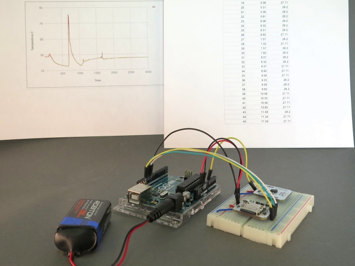
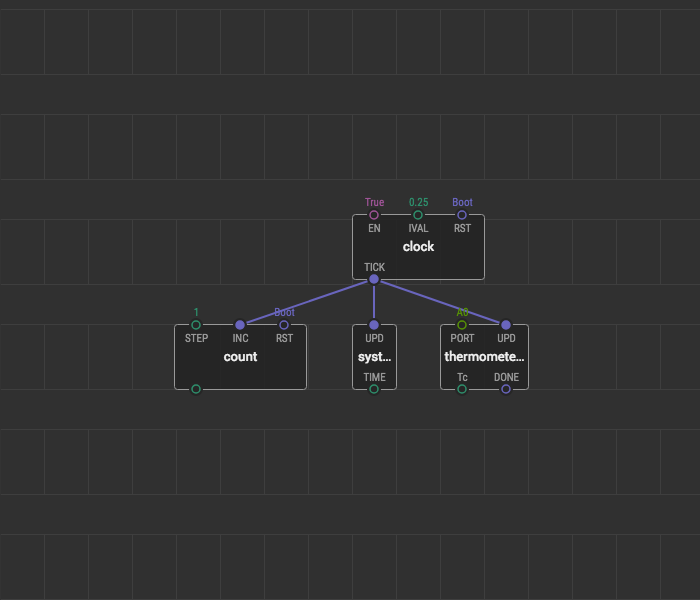
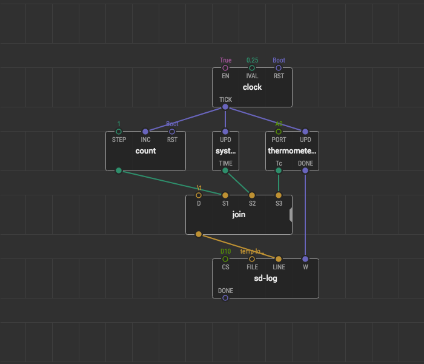
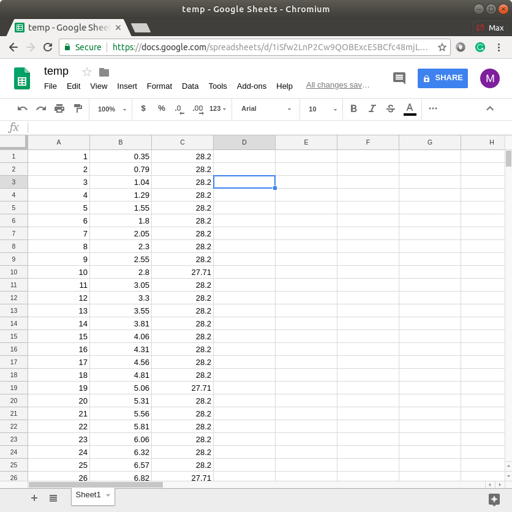

# Пример температурного логгера



В этом примере описывается, как хранить данные датчика и обрабатывать их на компьютере. 
Мы будем считывать температуру окружающей среды и сохранять значения на microSD карте. 
После этого мы подключим карту microSD к компьютеру и проанализируем полученные значения температуры.

## Требуемое оборудование

- Arduino Uno плата
- TMP36 аналоговый температурный датчик
- microSD плата расширения
- Формитированная microSD карта
- Плата макетирования
- Соединительные провода

## Схема


- Аналоговый термометр подключен к `A0` аналоговому порту платы Arduino.
- Платы microSD обычно используют интерфейс SPI для связи. 
  Arduino Uno обеспечивает SPI на пинах `11`, `12`, и `13`. `CS` пин может быть 
  подключен к произвольному цифровому пину. Мы выбрали `10`.

<div class="ui segment note">
<span class="ui ribbon label">Примечание.</span>
Если вы используете другую модель платы, посмотрите на ее распиновку и техническое описание, чтобы правильно подключиться к шине SPI.
</div>

## Программирование

Создайте новый проект в XOD и назовите его как-нибудь, вроде `temparature-log`.

### Источник данных

- Так как мы используем термометр на основе TMP36, мы добавляем  [`thermometer-tmp36`](https://xod.io/libs/xod/common-hardware/thermometer-tmp36/) к патчу. 
  Этот термометр должен быть подключен к аналоговому порту Arduino. Мы подключили наш датчик к `A0`, 
  поэтому установите значение пина `PORT` на `A0`.
- Затем мы хотим привязать температуру к отметке времени, когда она была считана. Для этого используем [`system-time`](https://xod.io/libs/xod/core/system-time) ноду. 
  Эта нода отображает время в секундах, прошедшее с момента запуска программы.
Если мы хотим непрерывно обновлять данные, нам лучше нумеровать каждую новую запись. 
[`count`](https://xod.io/libs/xod/core/count) нода будет делать это для нас. Поместите её на патч и установите `STEP` значение на 1.

Сейчас у нас есть три источника данных на патче.


### Ограничение частоты обработки данных

Нам нужно установить частоту обработки данных, чтобы ограничить объем считываемых данных и дать некоторое время, 
чтобы плата microSD очистилась после каждой записи. Самый простой способ сделать это - использовать `clock` ноду. 
Поместите её на патч и соедините со всеми тремя источниками данных.



`IVAL` пин отвечает за частоту генерации импульсов, и, как следствие, для получения нового объема данных. 
Мы решили получать и записывать данные 4 раза в секунду, поэтому мы установили `IVAL` значение 0.25 (=¼).

### Формат данных

Мы прогнозируем получение большого колличества данных. Для упрощения обработки рекомендуется отформатировать их как таблицу. 
Каждая строка будет представлять собой одну запись: номер записи, отметку времени записи и значение температуры, 
считанное в этот момент. Чтобы объединить все значения данных и сохранить их, как одну строку, используйте `join` ноду. 
Поместите ноду `join` на патч и соедините её со всеми источниками данных.


`D` пин ноды `join` используется для разделения значений. 
С помощью этого пина вы можете установить символ или строку, которые вы хотите разграничить.

Существует множество текстовых форматов для хранения и обмена данными. Примерами таких форматов являются 
CSV ([Comma-Separated Values](https://en.wikipedia.org/wiki/Comma-separated_values)) или TSV (([Tab-separated values](https://en.wikipedia.org/wiki/Tab-separated_values))). Эти текстовые форматы 
используются для хранения табличных данных и обмена ими между различными компьютерными программами. 
В частности, приложения для работы с электронными таблицами, такие как Google
Spreadsheets, Microsoft Excel, LibreOffice Calc, могут легко импортировать такие файлы. Посмотрите пример файла CSV, который определяет длительность треков для музыкального альбома:

```
No.,Title,Length
1,Hells Bells,5:12
2,Shoot to Thrill,5:17
3,What Do You Do for Money Honey,3:35
4,Givin’ the Dog a Bone,3:31
5,Let Me Put My Love into You,4:15
6,Back in Black,4:15
7,You Shook Me All Night Long,3:30
8,Have a Drink on Me,3:58
9,Shake a Leg,4:05
10,Rock And Roll Ain’t Noise Pollution,4:15
```

Итак, давайте использовать текстовый формат TSV для хранения. Чтобы разграничить значения с вкладками, 
поместите `\t` символ в `D` пин ноды `join`. `\t` представляет собой специальную последовательность 
для обозначения `TAB` символа, поскольку ее нельзя легко распечатать и отобразить в среде IDE.

### Хранение данных

В XOD существует нода `sd-log` для добавления текстовых строк в конец указанного файла, хранящегося на SD-карте. 
Добавьте ноду `sd-log` в патч и настройте её входы:

- Свяжите входной пин `LINE` с выходным пином ноды `join`.
- `CS` пин используется для указания порта SPI
  интерфейса на Arduino плате. В этом примере это `D10`.
- `FILE` пин указывает название файла на карте MicroSD. Назовем наш файл данных `temp-log.txt`.
- `W` пин запускает новую запись. Соедините его с `DONE` пином термометра. С помощью этого линка в `sd-log` создается новая запись только при появлении нового значения температуры.
  
  Вот результирующий программный патч.



## Измерение температуры

Загрузите программу на свою плату и, при необходимости, запитайте ее с помощью батареи. Вы можете соединять и отсоединять устройство от 
источника питания столько раз, сколько хотите. При каждой загрузке журнал будет продолжен, и данные предыдущих 
сеансов не будут потеряны.

Температура окружающей среды изменяется медленно. 
Чтобы проверить логгер, мы форсируем изменения: 
мы охладим термометр в холодильнике и нагреваем его с помощью фена.


Когда будет собрано достаточно данных, вытащите карту microSD.

## Анализ данных

Откройте `temp-log.txt` файл на своем компьютере, чтобы узнать, что получилось.


Как видите, у нас есть таблица с тремя столбцами и множеством строк. Одна строка для одного образца. 
В первом столбце хранится номер записи (просто игнорируйте `00` части), второй столбец - это 
значение времени в секундах, а последнее - фактическая температура в градусах Цельсия. 
Вы можете использовать различные приложения для анализа данных. В нашем эксперименте мы будет использовать Google Spreadsheets.

Вы можете перемещать значения данных в электронную таблицу по-разному:

- Выберите все данные из `temp-log.txt` файла, нажав CTRL+A в текстовом редакторе. Скопируйте то, что вы выбрали, 
  нажав CTRL+C. Создайте новый документ Google Spreadsheet, выберите первую ячейку в таблице и нажмите CTRL+V.
- Создайте новый документ Google Spreadsheet. Нажмите `File -> Import.. -> Upload`. Выберите `temp-log.txt` файл с карты 
  microSD или перетащите его в поле. Выберите `Tab` тип разделителя и импортируйте данные.



После ввода данных вы можете визуализировать их.

- Создайте пустой график, нажав `Insert -> Chart`.
- Выберите `Chart type`. Мы выбрали `Smooth line chart`.
- Отредактируйте `X-AXIS` и выберите столбец времени в качестве данных.
- Отредактируйте `SERIES` и выберите столбец температуры в качестве данных.
- нажмите `CUSTOMIZE -> Chart & axis title`.
- Введите заголовки для вертикальной и горизонтальной осей. Мы назвали их
  `Temperature, C` и `Time`.
- Установите минимальную и максимальную границы для вертикальной и горизонтальной осей. Устанавливаем 
`(10,90)` значение для `Temperature, C` оси и `(0,3000)` для оси `Time` .
- Вы можете изменить цвет линии, нажав `Series` и выбрав цвет.


На графике вы можете четко видеть изменение температуры после наших манипуляций с термометром.

Если у вас возникли проблемы с попыткой повторить эксперимент,
[загрузите готовый проект](./sdcard-temp-prepared.xodball) и откройте его в среде IDE.

## Вывод

С картой microSD вы можете сохранять значительные объемы данных, которые иначе не могут быть сохранены в памяти контроллера. 
Вы можете использовать любой другой датчик или даже несколько разных датчиков для регистрации и наблюдения за 
физическими процессами по вашему выбору.

Чтобы улучшить отображение работы устройства, используйте [`led`](https://xod.io/libs/xod/common-hardware/led/) и
[`delay`](https://xod.io/libs/xod/core/delay) ноды связанные с `ERR` и `DONE` пинами чтобы ваше устройство четко 
показывало поступление записей без каких либо проблем или возникновение ошибки ( 
из-за сбоя / нехватки места / плохой SD-карты или неправильного соединения).
