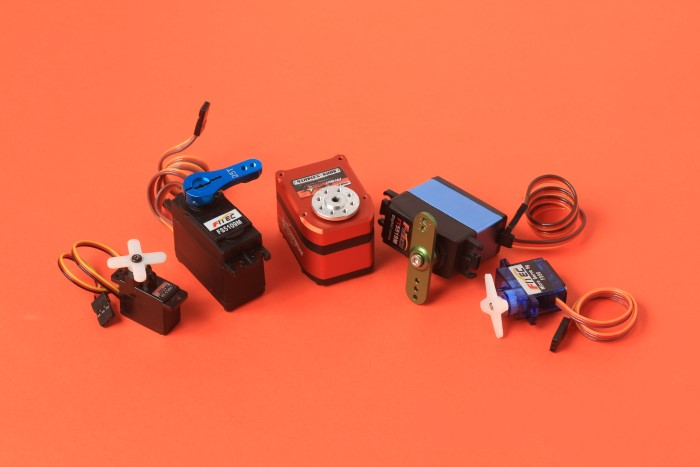
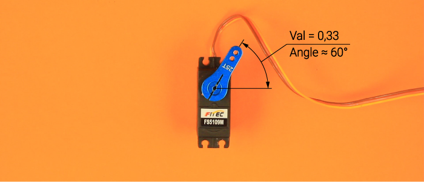
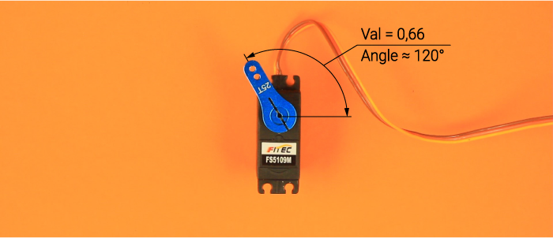
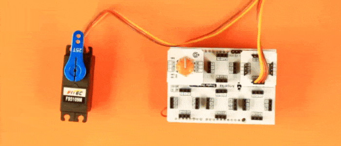
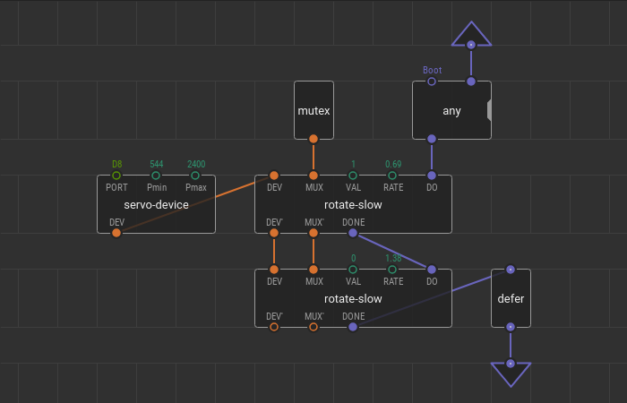
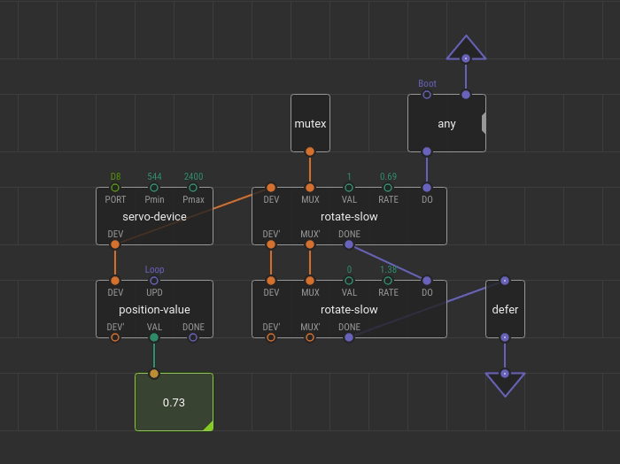

# Working with Servo Motors

A servo is a special electromechanical device that uses error-sensing negative feedback to correct the action of a mechanism. Servos can be pneumatic, hydraulic and even piezo, but the most common are electric motorized servos or servo motors.

Servo motors are servos with an output rotating shaft. The main purpose of a servo motor is to maintain the output shaft at a given angle or at a certain rotation speed. In general, a servo motor consists of three components: a motor, a position or angle sensor, and a control electronic board. These components vary widely depending on the application type and the required accuracy. A motor can have a gearbox, be DC or AC or even stepper. The angular positioning can be performed by inexpensive potentiometers or high-precision industrial rotary encoders. The control board can perform only basic servo functions or be intelligent and provide detailed feedback containing torque, motor temperature, and other data.

In the DIY-world, the most popular are so-called "hobby" or "RC" servos due to their affordability, reliability, and simplicity of control by microcontrollers. Inside, they have a DC geared motor with a potentiometer positioning the shaft. These servos are controlled by [pulse-duration modulation](https://en.wikipedia.org/wiki/Pulse-width_modulation) (PDM) signals. The electronics translate the width of a pulse into the shaft position. When the control board receives a move command, the motor rotates until the potentiometer reaches the value corresponding to the commanded position.

There is a special [`xod-dev/servo`](/libs/xod-dev/servo) library of nodes to work with such servos in XOD.

## Quick start node

To start working with a servo motor the library provides the [`servo`](/libs/xod-dev/servo/servo/) quickstart node.

This node contains all necessary settings that are suitable for almost any hobby RC servo. It is enough to wire a servo to a microcontroller board through any port. The number of this port should be set at the `PORT` input value of the `servo` node.

The value at the `VAL` pin represents the target position for the servo shaft to rotate. This pin expects values in the range from `0` to `1`. The `0` value corresponds to the extreme position of the servo shaft in one direction whereas the `1` value corresponds to the opposite direction. For most hobby servo motors made for robots the maximum rotation angle equals 180°. So, at the `0` value on the `VAL` pin, the node rotates the servo shaft to the position 0°, and at the `1` value to the position 180°.

The `true` [boolean](/docs/reference/data-types/#boolean-literals) type value at the `ACT` input makes the `servo` node reacting to incoming `VAL` changes. If the `ACT` value is `false` the servo shaft is hold at the last received position value.

## Quick start examples

For the `servo` node the shaft position value can be set in different ways.

You can set it to a constant using the [`constant-number`](/libs/xod/core/constant-number/) node.

In this case the servo shaft angle is fixed during the entire operation of the program.

A shaft position value can be entered directly into the value field of the `VAL` input pin.

Here, the servo horn is also held at the specified angle.

You can use the [`tweak-number`](/libs/xod/debug/tweak-number/) node together with the [debug mode](/docs/guide/debugging/) and manually set every new position value for the shaft.

The value for a servo can be obtained from other nodes. For example, from the [`pot`](/libs/xod/common-hardware/pot/) node operating a potentiometer. Connect a potentiometer to a microcontroller and link the output pin of the `pot` node with the input pin of the `servo` node.

Turn the pot knob to see the servo shaft move.

## Advanced servo device initialization

If you have a non-standard servo motor or you want to precisely configure your servo use the [`servo-device`](/libs/xod-dev/servo/servo-device/) node.

Hobby RC servo motors can have different rotation angles: from 0 to 120 degrees, 0 to 180, 0 to 270, etc. The extreme servo positions correspond to PDM pulses of a certain width. The pulse width value can lie in the range from 544 to 2400 microseconds, from 500 to 2500, from 1000 to 2000, or other. Most often the maximum and minimum pulse width length values are mentioned in the datasheet of a servos manufacturer.

The `servo-device` node constructs and outputs a `servo-device` object of a [custom type](/guide/data-types/#custom-types) containing the maximum and minimum pulse length you specify. The lowest pulse width value is set at the `Pmin` pin and the upper at the `Pmax` pin. In XOD extreme pulse width values are set to `544` and `2400` microseconds by default. By changing these pin values you can define a `servo-device` that fits your particular servo motor. Also, they can narrow or extend the operation range if it is permissible by servo design.

## Advanced servo rotate

To execute the rotation of the `servo-device`, use the [`rotate`](/libs/xod-dev/servo/rotate/) node. Link its `DEV` pin with the `servo-device` node and set the desired angle value at the `VAL` pin.

An input [pulse](/docs/guide/data-types/#pulse-type) signal at the `DO` pin triggers a rotation command. If the command is acknowledged by the servo device, the movement starts and a pulse signal comes at the `ACK` output pin. When using the `rotate` node the servo moves at the maximum possible rotation speed.

## Rate and sequence of rotation

You can adjust the rotation speed of your servo motor with the [`rotate-slow`](/libs/xod-dev/servo/rotate-slow/) node. Put the desired angle value into the `VAL` pin and the required rotation speed rate into `RATE`.

When you use the `rotate` node, a command for the servo to rotate to the desired angle is generated just once. Unlike it, the `rotate-slow` node generates the rotation commands repeatedly and continuously with varying angles until the desired `VAL` value is reached. The `RATE` value defines the amount of `VAL` change per second for the rotation commands.

To achieve correctness the `RATE` value should be lower than the maximum servo rotation speed. The maximum speed can be found in the servo manufacturer's datasheet.

For example, the FEETECH FS90 Micro Servo datasheet states that it rotates 60 degrees in approximately 0.12 seconds. This means that the full rotation from 0 to 180 such servo performs in `0.36` seconds. Dividing 1 second by 0.36 you can get the highest `RATE` of this servo: `2.77`. In some cases, the maximum `RATE` value can be obtained empirically or by trial and error.

The `MUX` pin of the `rotate-slow` node has the [`mutex`](/libs/xod/mutex/mutex/) type. The mutex describes a mutually exclusive resource. It is used to avoid conflicts between nodes controlling long-running rotation processes. In the `rotate-slow`, the mutex is used to protect the running rotation process from the insertion of external commands generated by other rotation nodes.

Let's make a patch that rotates the servo from 0° to 180° with `RATE` set to a quarter of the maximum rotation speed and then in the opposite direction with `RATE` set to the half of the maximum speed.

Add a couple of [`rotate-slow`](/libs/xod-dev/servo/rotate-slow/) nodes onto the patch. The first node rotates the shaft to 180 degrees. Link it with the [`servo-device`](/libs/xod-dev/servo/servo-device/) node and set the `VAL` to `1` corresponding to 180 degrees. To set the quarter of the maximum rotation speed, divide the maximum speed value 2.77 by 4 and put the resulting `0.69` value to the `RATE` pin.

Link the second `rotate-slow` node to the `DEV` bus. The node rotates the shaft backward just after the first rotation is done so link its input `DO` pin with the output `DONE` pin of the previous node to make the sequence. The `VAL` value set to `0` corresponds to 0° and the `RATE` value set to `1.38` corresponds to the half of the maximum servo speed.

Here two nodes are involved in the rotation of the servo. To make them do not interfere with each other, add a [`mutex`](/libs/xod/mutex/mutex/) node and link the `MUX` buses.

The last step is to loop the program using the [`defer`](/libs/xod/core/defer/) and [`any`](/libs/xod/core/any/) nodes. Let's flash the patch and look at the result.

## Current position

You can find out what position the servo shaft is expected to be at a particular moment. For this there is the [`position-value`](/libs/xod-dev/servo/position-value/) node. Use it to obtain the current servo angle from the `servo-device`.

Let's extend the previous example with the `position-value` node.

Add it onto the patch and link it with the `DEV` bus. The `UPD` pin sets the update frequency for the current `VAL` angle. You can monitor the current servo angle continuosly using the [`watch`](/libs/xod/debug/watch/) node together with the [debug mode](/docs/guide/debugging/). Upload the improved patch.

---

Make your robot or project move with servo motors and the [`xod-dev/servo`](/libs/xod-dev/servo) library. Use the quickstart [`xod-dev/servo`](/libs/xod-dev/servo) to solve simple tasks or advanced servo development nodes to create complex rotation algorithms.
