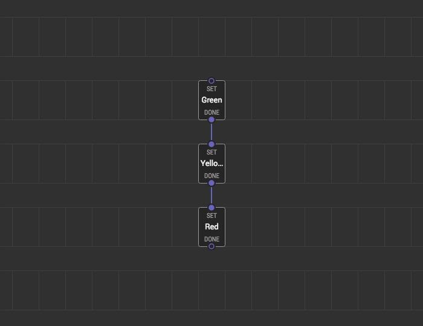
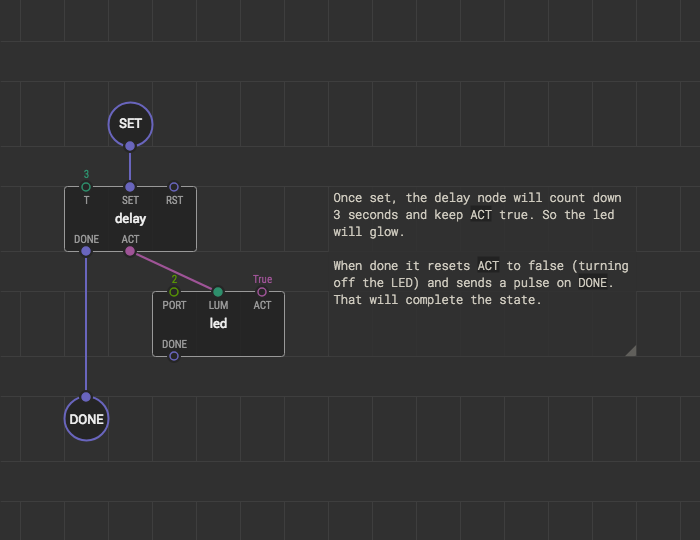
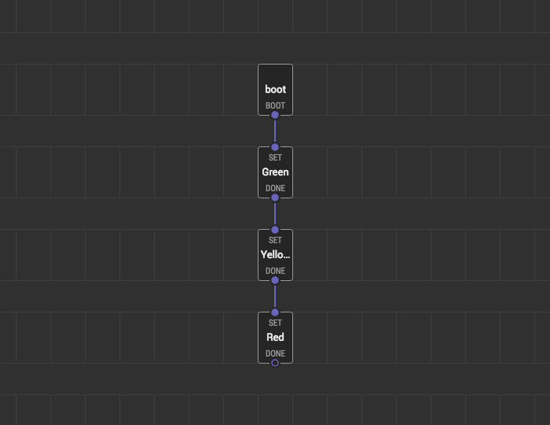
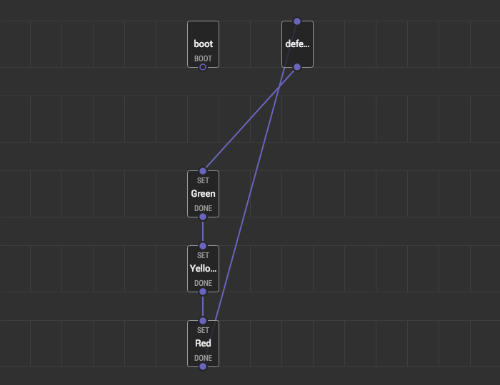
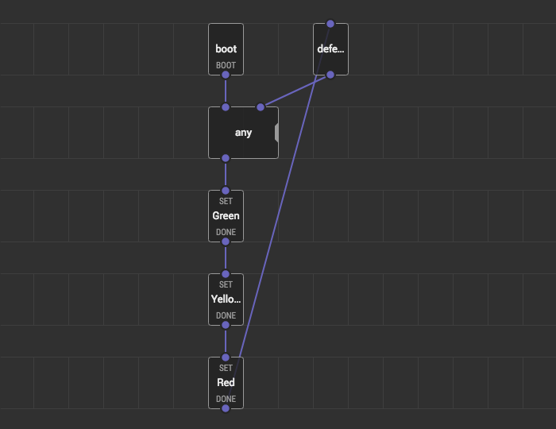

# Простой пример светофора

Светофор - хороший пример устройства, которое выполняет свою работу последовательно. 
В простейшей форме светофор имеет три состояния:

1.  Зеленый - иди
2.  Желтый - остановись, если сможешь
3.  Красный - стой!

Каждое состояние активно в течение некоторого временного интервала, и когда все заканчивается, 
то начинается с начала и повторяется снова и снова.

Давайте сделаем модель устройства светофора с несколькими электронными частями и XOD.

## Схема

## Обзор структуры программы

Создайте новый проект в XOD и назовите его что-то вроде этого `my-traffic-light`. 
Теперь у вас есть программа с одним патчем `main`. Что дальше?

У нас есть законченый концепт, который мы собираемся реализовать. 
Есть несколько способов это сделать. Рассмотрим один из них. 
Основная идея состоит в том, чтобы иметь одну патч-ноду для каждого состояния и 
соединительный (общий) патч, который будет связывать все ноды патча вместе. 

В нашем случае:

- `state-green`
- `state-yellow`
- `state-red`
- `main` — соединительный патч

Мы планируем (а) создать наброски для всех патчей с состояниями (state), (б) создать основной патч,
и (с) после этого завершить патчи с состояниями (state). Вы можете делать все наоборот, если
для Вас это имеет больше смысла.

У нас уже есть `main`, поэтому создайте патчи состояний. 
Нажмите “File → New Patch” (или Ctrl + N) и введите новое имя патча. Повторите три раза.

Примечание:
Хотя именование патчей состояния с помощью префикса <code>state-</code> не обязательно, 
но это будет неплохой идеей и упростит понимание. 

Теперь нам нужен механизм, позволяющий патч-нодам общаться друг с другом. 
Общая идия заключается в том, чтобы добавить импульсный вход на патчах состояний, 
чтобы начать это состояние, и добавить импульсные выходы, чтобы уведомить о завершении состояния.

Добавьте пару `xod/patch-nodes/input-pulse` и `xod/patch-nodes/output-pulse` каждого патча состояния:

Теперь каждое из наших состояний имеет вход и выход. Мы можем подключить их в цепочке, 
так что, когда одно состояние завершает работу, оно дает контроль над следующим состоянием. 
Давайте сделаем это на `main`:

Мы дали более короткие названия нашим нодам: “Green,” “Yellow,” и “Red”, чтобы текст мог соответствовать ширине.

Приятно, не так ли? Вы видите, как устройство должно работать графически.

## Выполнение патчей состояния

Хорошо, у нас есть базовый скелет с патчем состояния (state), давайте наполним его. 
Перед тем, как это сделать, Вы ответите на несколько вопросов.

- Что нужно сделать в state?
- Когда он должен выйти?
- Что он должен делать прямо перед выходом?

В нашем случае, когда мы входим в состояние (state), он должен включить соответствующий светодиод. 
Затем он должен подождать несколько секунд, выключить светодиод и выйти. Довольно просто. 
Сделайте это для `state-green`:

Установите соответствующие значения для [`led`](/libs/xod/common-hardware/led/)’ порта (порт 2) и 
`T` [`delay`](/libs/xod/core/delay/) (3 секунды отлично подходит для эксперимента).

Мы сделали зеленый. А как же желтый и красный? Просто скопируйте патч `state-yellow` и `state-red`. 
Не забудьте ввести `PORT` и `T` значения. Используйте копировать / вставить, чтобы сделать это быстро.

Примечание
Умный xoder увидит шаблон и избежит дублирования, создав патч-ноду со всей логикой, вставленной внутри. 
И он будет прав, но ради краткости урока мы сделали иначе.

## Выполнение последовательности

Мы почти закончили. Осталось только запустить выполнение. Посмотрите еще `main`:

Хотя состояния правильно привязаны, ничего не привязано к включению в первоначальное состояние (т.е.`state-green`). 
Мы хотим, чтобы наш светофор начинал работу сразу, когда устройство включено. 
Таким образом, импульс от [`boot`](/libs/xod/core/boot/) ноды является лучшим выбором:

Наконец, загрузите программу на свою плату и посмотрите, как она себя ведёт.

Ого, это работает! Почти. Как только красное состояние завершается, светофор ничего не делает. 
Давайте исправим это

## Создание цикла

Устройство приостанавливается после последнего состояния, потому что ничто не возвращает его обратно в первоначальное состояние. 
Мы могли бы связать последний `DONE` импульс состояния с первым `SET` импульсом состояния, чтобы завершить цикл, но, к сожалению, 
XOD не позволяет этого сделать.

XOD запрещает циклы в графике программы, чтобы избежать возможных взаимоблокировок. 
В нашем конкретном сценарии невозможны взаимоблокировки, потому что мы используем `delay` ноды, 
но XOD пока недостаточно умен, чтобы понять это.

К счастью, так называемые “defer nodes” (отложенные ноды) здесь помогают нам. Они могут сломать любой цикл и сказать XOD: 
“Эй, я тот момент, когда ты можешь перевести дух, если настал тупик”.

Примечание
Вы можете спросить, почему XOD не добавляет отложенную ноду на каждую ссылку. Это возможно, но при этом будет возникать 
больше проблем, чем решений. Во-первых, <a href="../execution-model/">исполняемая модель</a> будет разбита, чтобы транзакции перестали быть атомарными. 
Во-вторых, каждая отложенная нода должна хранить несколько байтов данных, которые потребляют драгоценное ОЗУ. 
Чтобы избежать проблем, вы вынуждены размещать их вручную.

Мы имеем дело с импульсами, поэтому мы будем использовать [`defer-pulse`](/libs/xod/core/defer-pulse/) ноды для разрыва цикла.

Упс. Входному пину `state-green` ноды не разрешено иметь линки из `boot`и `defer-pulse` одновременно.
Но мы можем легко решить это, добавив ноду [`any`](/libs/xod/core/any/):

Ура! Отлично сработано. Загрузите программу и посмотрите, как она работает. 
Поиграйтесь со значениями тайм-аута, попробуйте запустить последовательность из другого состояния, 
добавьте еще три светодиода, чтобы сформировать дополнительный светофор. Повеселись!

## Результат

<video controls autoplay muted loop>
    <source src="./result.mp4" type="video/mp4">
</video>

Если у вас возникли проблемы с попыткой повторить руководство, [загрузите готовый проект](./traffic-light-simple.xodball) и откройте его в среде IDE.

## Вывод

Выполнение вещей последовательно в XOD может показаться трудным с первого взгляда. 
Да, это немного сложнее, чем на традиционных императивных языках, 
но не так сложно, если вы запомните шаблон:

1.  Поймите последовательности состояний
2.  Для каждого состояния создайте патч-ноду
3.  На каждом патче состояния используйте импульсные входы и выходы для входа и выхода из состояния
4.  Создайте соединительный патч, который соединяет все состояния вместе
5.  Определите входной импульс для первого состояния
