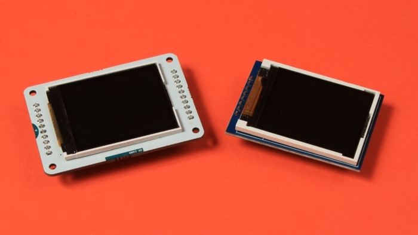
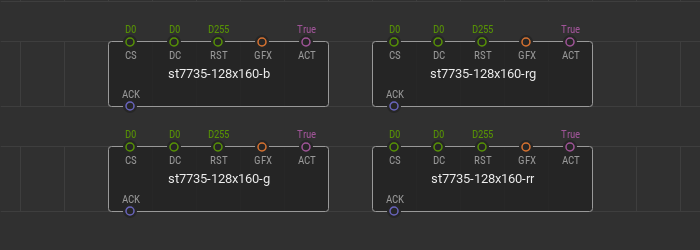
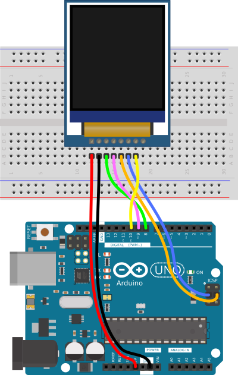
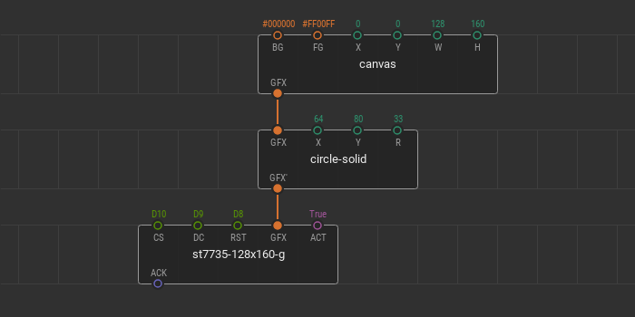
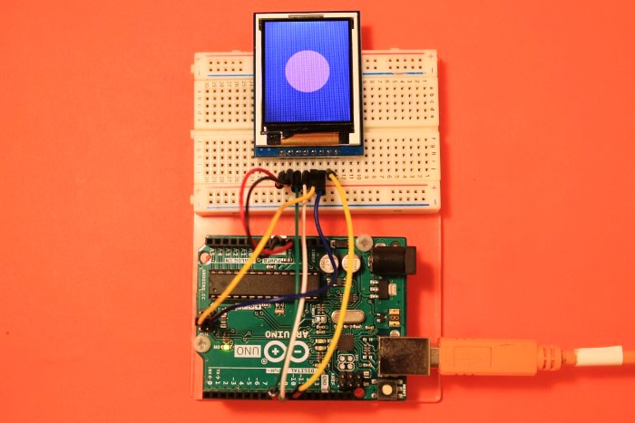
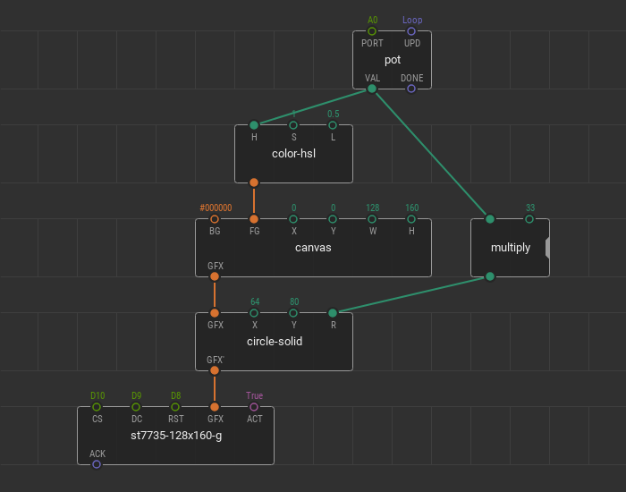
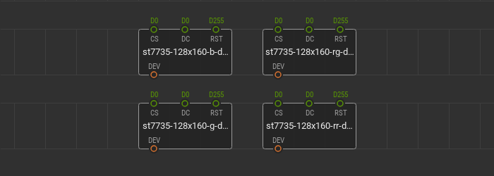
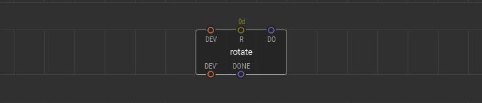
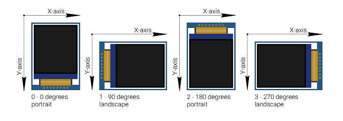
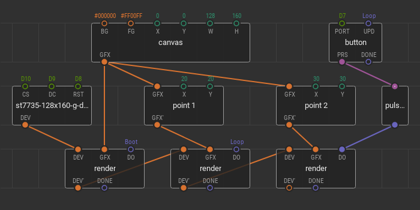

# ST7735 displays

The ST7735 display is a TFT LCD that is controlled by the ST7735/ST7735S/ST7735B micro-chip driver, which acts as a bridge between the display matrix and the microcontroller. These colorful displays are cheap, easy to connect and control. Therefore, they spread widely in the Arduino world and their popularity gave rise to many breakout board variations.

The displays breakout boards belong to the ST7735 family can have the following parameters:

- Display resolution:
  - 0.96" (80x160 pixels);
  - 1.44" (128x128 pixels);
  - 1.8" (128x160 pixels);
- Display colors (Color mode):
  - 16-bit "High color", 65,536 colors;
  - 18-bit, 262,144 colors; 
- Interfaces:
  - SPI interface (software of hardware);
  - Parallel MCU interface (8-bit, 9-bit, 16-bit & 18-bit);

To work with the ST7735 family displays XOD provides the [`xod-dev/st7735-display`](/libs/xod-dev/st7735-display) library.

Note
At the moment, the library allows to work only with displays with a resolution of 128x160 pixels, 16-bit color depth, and connected via hardware SPI bus.

## Quick start nodes

ST7735 breakout boards can differ from each other and require different initialization methods. Therefore, the `xod-dev/st7735-display` library contains 4 quickstart nodes at once - [`st7735-128x160-b`](/libs/xod-dev/st7735-display/st7735-128x160-b), [`st7735-128x160-g`](/libs/xod-dev/st7735-display/st7735-128x160-g), [`st7735-128x160-rg`](/libs/xod-dev/st7735-display/st7735-128x160-rg), and [`st7735-128x160-rr`](/libs/xod-dev/st7735-display/st7735-128x160-rr). Each of these nodes works with a display of a certain type conventionally named "B", "G", "RG", and "RR". To find out which type your specific display belongs to, try each of these nodes until it works.

Wire your display to the microcontroller via hardware SPI bus and fill in the `CS`, `DC`, `RST` pin values according to the microcontroller ports. The `CS` is the "Chip Select" microcontroller port of the SPI interface. `DC` is the "Data/Command" microcontroller port responsible for sending data and commands to the display driver.

The `RST` pin is the "Reset" microcontroller port the display is connected to. This port is responsible for the display reset which can be required during device initialization. Not all ST7735 breakout boards have this pin. If your ST7735 breakout board has this pin, be sure to link it with a microcontroller and set the appropriate port value at the `RST` pin. If your breakout board does not have an `RST` pin, then leave the `D255` default value untouched.

The `GFX` input pin of the `graphics` type specifies the graphics to render and display on the device screen. The `GFX` awaits a branch of the tree of graphical elements created using the [graphics library](/docs/guide/graphics-library). The [boolean](/docs/reference/data-types/#boolean-literals/) value at the `ACT` pin is responsible for the display screen update due to change of the incoming graphics at the `GFX` pin.

## Quick start example

Here is a simple example of using quickstart nodes. For example, We use an ST7735 128x160 SPI display of a "G" type. Connect it to a microcontroller according to the wiring scheme.

Use the hardware SPI bus. Connect the display's `CS` pin to the `D10` controller port, and the `DC` pin to the `D9` port. The breakout board of the display used in this example has an `RST` pin, so it should be wired. The `RST` pin is connected to the `D8` port.

Let's display a pink filled circle in the center of the screen.

Put the quickstart node `st7735-128x160-g` onto the patch and fill in ports values `CS`, `DC`, and `RST` according to the wiring scheme. Using the [XOD graphics library](/docs/guide/graphics-library), create a new `canvas` with the size of a display screen. The width `W` of the `canvas` is `128` and the height `H` is `160`. The background color `BG` is set to black (`#000000`) and the foreground color `FG` to pink (`#FF00FF`).

To add the filled circle to the scene, place the `circle-solid` node onto the patch. To make this node be a part of the graphic tree, link its `GFX` pin with the `GFX` pin of the `canvas`. Set the circle coordinates for the center of the screen, `64` for `X`, and `80` for `Y`. The radius `R` can be random, for example, `33`.

The scene is ready. Connect the `GFX` output pin of the `circle-solid` node to the `GFX` pin of the quickstart node. Take a look at what the patch should be.

Upload this patch and see what is displayed on the screen of the device.

You can change all parameters of the graphic nodes in a real-time. For example, you can change the position of the circle or the background color of the canvas using tweaks. Add two [`tweak-number`](/libs/xod/debug/tweak-number) nodes for the `X` and `Y` circle coordinates. Add the [`tweak-color`](/libs/xod/debug/tweak-color) node for the `BG` pin. Flash the patch in debug mode and manage colors and coordinates.

<video controls autoplay muted loop>
    <source src="./quickstart-example-with-tweaks.mp4" type="video/mp4">
</video>

The parameters of graphic nodes can be changed using other nodes. For example, you can change the color of the circle and its size using a potentiometer. Remove tweak nodes from the patch. Place new nodes `pot`, `multiply`, and `color-hsl` node from the `xod/color` library. Connect the potentiometer to the `A0` Arduino port.

With the combination of `pot` and `multiply`, the `R` radius of the circle changes from `0` to `33` pixels. With the combination of `pot` and `color-hsl`, the `H` hue of the `FG` foreground color of the canvas changes from `0` to `1`. Upload the patch and manage the graphics changes.

<video controls autoplay muted loop>
    <source src="./quickstart-example-with-nodes.mp4" type="video/mp4">
</video>

## Advanced LCD device initialization

If the quickstart nodes doesn’t suit your task try to operate some developer nodes from the `xod-dev/st7735-display` library. Initializie your display using the device nodes from the library - [`st7735-128x160-b-device`](/libs/xod-dev/st7735-display/st7735-128x160-b-device), [`st7735-128x160-g-device`](/libs/xod-dev/st7735-display/st7735-128x160-g-device), [`st7735-128x160-rg-device`](/libs/xod-dev/st7735-display/st7735-128x160-rg-device), and [`st7735-128x160-rr-device`](/libs/xod-dev/st7735-display/st7735-128x160-rr-device).

As the quickstart nodes, these device nodes init a display of a particular type conventionally named "B", "G", "RG", and "RR". If you don't know the exact type of display you have, determine it by sampling different device nodes. With one of them, your display starts working, and you get the type.

## Rotate the screen

You can change the screen position and the origin of the [display coordinate system](/docs/guide/graphics-library/#coordinate-system-and-units) with the [`rotate`](/libs/xod-dev/st7735-display/rotate) node. 

The `rotate` node allows you to rotate the display screen to one of four positions: 0 degrees portrait, 90 degrees landscape, 180 degrees portrait, and 270 degrees landscape. A value at the `P` pin sets the angle to rotate the screen and can be one of four values `0d`, `1d`, `2d`, `3d`. These values correspond to the particular display positions.

A `pulse` type signal at the `DO` pin triggers a new screen rotation and the coordinate system change. The pulse at the `DONE` output pin signals that the rotation is complete. The `rotate` can be used in run-time and at any step of the program. It is possible to use several `rotate` nodes.

## Render the scene

The `render` node is your main tool to display [graphic scenes](/docs/guide/graphics-library/#scene-as-a-tree). The `render` processes a single branch of the graphic tree created using the [graphics library](/docs/guide/graphics-library), renders it, and displays at the device. 

A graphic tree branch to render links to the input `GFX` pin. A pulse signal at the `DO` pin is a trigger to process the graphic scene and display it. If the scene is rendered, a pulse comes to the `DONE` output pin. 

Use multiple `render` nodes simultaneously. Processing various branches of the graphic tree at a different time, you can show dynamic graphic scenes at the screen.

Here is the example of a three `render` nodes use. The tree of graphic elements consists of a `canvas` and two `point` on it. The device node and three nodes `render` are linked together in a daisy chain. All `render` nodes have different triggering algorithms at their `DO` pins.

The first `render` is on `boot`; it fills the display screen with a specified `canvas` only once — after powering the device.
The second `render` is responsible for `point 1` on the canvas. Its trigger is set to `loop`. It means that any changes in the `point 1` position are immediately shown on the screen.
The third `render` is responsible for displaying the `point 2` and its trigger is linked to the `button`. Here you can also change the `point 2` position, but the changes are displayed only after the button click.
