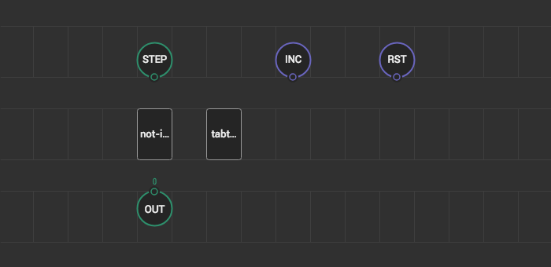
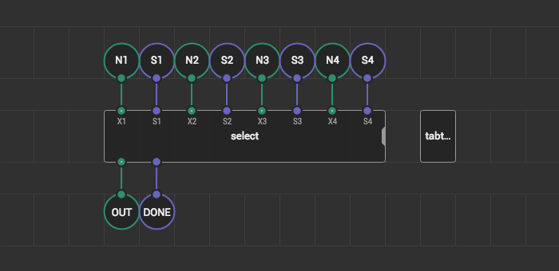

# Testing Patches

Writing tests for the code is a good practice in any programming language. It allows to write and debug code quickly with covering many possible cases ranging from the most common to edge cases. Moreover, code covered by tests can be modified without worrying to break something in other places where it is used.

Also, tests serve as excellent documentation of what is expected at outputs with specific parameters at inputs.

In XOD node testing implemented as tabular tests (tabtests for short). A test suite looks like a table. The first row contains pin labels of a tested node. All the next rows are test cases: a row is one test case and one [transaction](/docs/guide/execution-model/) of the XOD program. In cells, you put input values and their expected outputs for the given pins.

Here’s how a typical tabtest looks like:

<table class="ui table compact">
  <thead>
    <tr>
      <th>IN</th>
      <th>OUT</th>
    </tr>
  </thead>
  <tbody>
    <tr>
      <td>"Hello"</td>
      <td>5</td>
    </tr>
    <tr>
      <td>""</td>
      <td>0</td>
    </tr>
    <tr>
      <td>"86"</td>
      <td>2</td>
    </tr>
  </tbody>
</table>

<div class="ui segment">
<span class="ui ribbon label">Input values and expected outputs</span>

Input values and expected outputs defined by tabtest literals, which generally is the same as literals in Inspector, but have some special literals.
See the full list of tabtest literals in the [reference](/docs/reference/tabtests/).

</div>

When you run tests, they either pass or fail with an error describing the difference between actual and expected outputs.


## Primitive types

Nodes with such primitive types as strings, numbers, and booleans are simplest to test. Let's imagine that there is no `to-percent` node in the XOD standard library, and we implement it by ourselves.


It's a node that converts some number into a string with the percent character concatenated. However, what's in the output if it takes a `NaN` on the input, or `-Inf`?

First of all, place a new marker node: `xod/patch-nodes/tabtest`. Now double-click the `tabtest` node. An embedded tabtest editor opens up which looks like a table. Let's write test cases:

<table class="ui table compact">
  <thead>
    <tr>
      <th>NUM</th>
      <th>PERC</th>
    </tr>
  </thead>
  <tbody>
    <tr>
      <td>0</td>
      <td>"0%"</td>
    </tr>
    <tr>
      <td>1</td>
      <td>"100%"</td>
    </tr>
    <tr>
      <td>25.5</td>
      <td>"255%"</td>
    </tr>
    <tr>
      <td colspan="2">// Test rounding</td>
    </tr>
    <tr>
      <td>0.735</td>
      <td>"74%"</td>
    </tr>
    <tr>
      <td>0.734</td>
      <td>"73%"</td>
    </tr>
    <tr>
      <td colspan="2">// Negative values</td>
    </tr>
    <tr>
      <td>-0.6</td>
      <td>"-60%"</td>
    </tr>
    <tr>
      <td colspan="2">// Special values</td>
    </tr>
    <tr>
      <td>NaN</td>
      <td>"NaN%"</td>
    </tr>
    <tr>
      <td>Inf</td>
      <td>"Inf%"</td>
    </tr>
    <tr>
      <td>-Inf</td>
      <td>"-Inf%"</td>
    </tr>
    <tr>
      <td>9999999999999</td>
      <td>"OVF%"</td>
    </tr>
  </tbody>
</table>

<div class="ui segment">
<span class="ui ribbon label">Note</span>

If you save the project as a multi-file project, you can find out `patch.test.tsv` file in the directory of your patch. So you can write it manually if you like. Pay attention that columns are separated by tabs (`\t`).

</div>

All right, we just wrote the tests. It's time to run them.

Press the "Run tests" button in the panel above and wait for a little. It can take a few seconds because these tests are transpiling to the C++ code, then compile in the cloud, and then execute. You can watch for the progress in the Deployment pane below: you'll see a progress bar. Expand the pane to see more details.

Tests failed! Let's inspect details in the "Tests" tab in deployment pane. Here are the lines that are important to us:

```
    ./to-percent.catch.inl:21: FAILED:
      REQUIRE( probe_PERC.state.lastValue == xod::XStringCString("255%") )
    with expansion:
      "2550%" == "255%"
```

It tells us that we get value `"2550%"` in the output instead of expected `"255%"`. Oh, it looks like we make a mistake in the test case. Let's fix it and rerun tests.

Now you see a green notification message about passed tests. Congratulations!

<div class="ui segment">
<span class="ui ribbon label">Note</span>

You can write tabtests for the nodes with C++ implementation in the same way, just place `xod/patch-nodes/tabtest` marker node and fill the table.

</div>


## State keeping

We just tested a pure node. That is a node which depends only on its input values when producing output. But how to deal with impure nodes, like `count`, which also depend on the internal state and past?



All right, we did not tighten the nuts so that we can test these nodes too, but we have to keep it in mind when we are writing tests for them. Each subsequence test case does not reset the state of the previous test case, so if you send a pulse to the `INC` pin of the `count` node twice, it outputs `2` in the second case. If you want to start over — add a new test case and send `pulse` to the `RST` pin.

<table class="ui table compact">
  <thead>
    <tr>
      <th>STEP</th>
      <th>INC</th>
      <th>RST</th>
      <th>OUT</th>
    </tr>
  </thead>
  <tbody>
    <tr>
      <td>1</td>
      <td>no-pulse</td>
      <td>no-pulse</td>
      <td>0</td>
    </tr>
    <tr>
      <td>1</td>
      <td>pulse</td>
      <td>no-pulse</td>
      <td>1</td>
    </tr>
    <tr>
      <td>1</td>
      <td>pulse</td>
      <td>no-pulse</td>
      <td>2</td>
    </tr>
    <tr>
      <td>1</td>
      <td>no-pulse</td>
      <td>pulse</td>
      <td>0</td>
    </tr>
    <tr>
      <td colspan="4">// And so on...</td>
    </tr>
  </tbody>
</table>

<div class="ui segment">
<span class="ui ribbon label">Note</span>

Do not forget to test edge cases like pulses in both pulse pins `INC` and `RST`, inject `NaN` or `Inf` as steps in counter and so on. It helps to catch bugs, make the behavior of the node more obvious, and provide better documentation.

</div>


## Time flow

Some impure nodes are dependent on the time flow. For example, `fade` and `delay`. To test them we can mock the time.

Make a column with the magic name `__time(ms)` and specify timestamps in milliseconds in this column. Such way you can travel through time.

However, also you have to know three things:

- A timestamp should be a non-negative integer.
- Nodes that use `isTimedout` function inside or contain nodes like `xod/core/delay`, `xod/core/clock`, are marked as timed out only at the next millisecond. For example, if we set a delay for 500 ms, it pulses `DONE` on the 501 ms.
- When you do not use this special column, the framework automatically increments the time value by one millisecond before running each test case. It is necessary to correctly support `defer` nodes. However, when you use the `__time(ms)` column you have to update it manually. So if you want to test something with at the same time point at each row, you probably do not need this column at all.

You can checkout tabtests in these nodes to understand how it looks and works: `xod/core/delay`, `xod/core/clock`, `xod/core/fade`, `xod/core/system-time`. For example, here a part of tabtest for `xod/core/delta-time`:

<table class="ui table compact">
  <thead>
    <tr>
      <th>__time(ms)</th>
      <th>UPD</th>
      <th>RST</th>
      <th>OUT</th>
    </tr>
  </thead>
  <tbody>
    <tr>
      <td>0</td>
      <td>pulse</td>
      <td>no-pulse</td>
      <td>0</td>
    </tr>
    <tr>
      <td>1000</td>
      <td>pulse</td>
      <td>no-pulse</td>
      <td>1</td>
    </tr>
    <tr>
      <td>3000</td>
      <td>pulse</td>
      <td>no-pulse</td>
      <td>2</td>
    </tr>
    <tr>
      <td>3600</td>
      <td>pulse</td>
      <td>no-pulse</td>
      <td>0.6~</td>
    </tr>
    <tr>
      <td>4000</td>
      <td>no-pulse</td>
      <td>pulse</td>
      <td>0</td>
    </tr>
    <tr>
      <td>6000</td>
      <td>pulse</td>
      <td>no-pulse</td>
      <td>2</td>
    </tr>
    <tr>
      <td colspan="4">// And so on...</td>
    </tr>
  </tbody>
</table>

<div class="ui segment">
<span class="ui ribbon label">Note</span>

We recommend placing `__time(ms)` column at first place to keep it clear and see what time is it. However, you can place it in any place of the table.

</div>


## Variadics, generics, custom types

To test nodes with variadics, generics or custom types do the following:

1. Create a special patch with a name describing the test and put your node(s) to cover with test inside
2. [Place terminals](/docs/guide/nodes-for-xod-in-xod/#add-terminals) with primitive types
3. Place `xod/patch-nodes/tabtest`
4. Write tests

For example, you can make

- `test-select-4-number`, which tests selecting one of the four numbers by pulses,
- `test-add-vectors`, which makes two custom types `vector` from primitive input-numbers, then add one to another and then unfold it back to primitives.

Let's look at the first example in more detail.



And some test cases:

<table class="ui table compact">
  <thead>
    <tr>
      <th>N1</th>
      <th>S1</th>
      <th>N2</th>
      <th>S2</th>
      <th>N3</th>
      <th>S3</th>
      <th>N4</th>
      <th>S4</th>
      <th>OUT</th>
      <th>DONE</th>
    </tr>
  </thead>
  <tbody>
    <tr>
      <td>1</td>
      <td>no-pulse</td>
      <td>2</td>
      <td>no-pulse</td>
      <td>3</td>
      <td>no-pulse</td>
      <td>4</td>
      <td>no-pulse</td>
      <td>4</td>
      <td>no-pulse</td>
    </tr>
    <tr>
      <td>1</td>
      <td>pulse</td>
      <td>2</td>
      <td>no-pulse</td>
      <td>3</td>
      <td>no-pulse</td>
      <td>4</td>
      <td>no-pulse</td>
      <td>1</td>
      <td>pulse</td>
    </tr>
    <tr>
      <td>1</td>
      <td>no-pulse</td>
      <td>2</td>
      <td>pulse</td>
      <td>3</td>
      <td>no-pulse</td>
      <td>4</td>
      <td>no-pulse</td>
      <td>2</td>
      <td>pulse</td>
    </tr>
    <tr>
      <td>1</td>
      <td>no-pulse</td>
      <td>2</td>
      <td>no-pulse</td>
      <td>3</td>
      <td>pulse</td>
      <td>4</td>
      <td>no-pulse</td>
      <td>3</td>
      <td>pulse</td>
    </tr>
    <tr>
      <td>1</td>
      <td>no-pulse</td>
      <td>2</td>
      <td>no-pulse</td>
      <td>3</td>
      <td>no-pulse</td>
      <td>4</td>
      <td>pulse</td>
      <td>4</td>
      <td>pulse</td>
    </tr>
    <tr>
      <td>1</td>
      <td>no-pulse</td>
      <td>2</td>
      <td>no-pulse</td>
      <td>3</td>
      <td>no-pulse</td>
      <td>4</td>
      <td>no-pulse</td>
      <td>4</td>
      <td>no-pulse</td>
    </tr>
  </tbody>
</table>

---

Now you know how to write and run tests. It will help you to write more stable programs.

Moreover, this is the time to tell you about test-driven development (known as [TDD](https://en.wikipedia.org/wiki/Test-driven_development)). It's a development process when a developer writes tests before writing code. It brings productivity, quality, and confidence to the development process. Also, when you write test cases, some things can become evident for you, like "it should be two small nodes instead of the huge one" or "oh, it can return invalid values and how I should deal with it?"

Also, it is a lot faster to run tests than upload code to the board after each change and test all possible cases manually.

So we recommend using TDD when you're making some nodes that are not about hardware. Detach all the logic from the hardware to test it quickly especially as XOD does not allow to test the nodes working with hardware. For this reason, for tabtest not provided literals for pins of the port type.

Let's summarize:

1. Tests help to make a stable program.
2. Tests serve as proper documentation.
3. Tests help you improve the program without worrying to break things.
4. Test-driven development is possible in XOD IDE.
5. Development becomes faster and more stable with tests.
