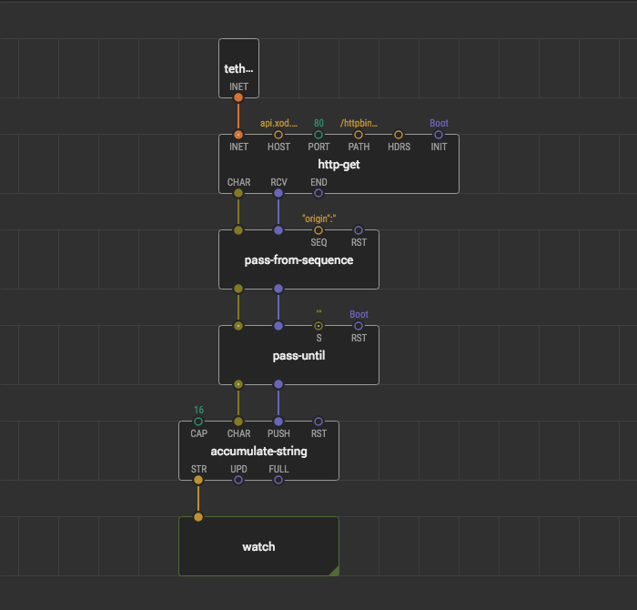
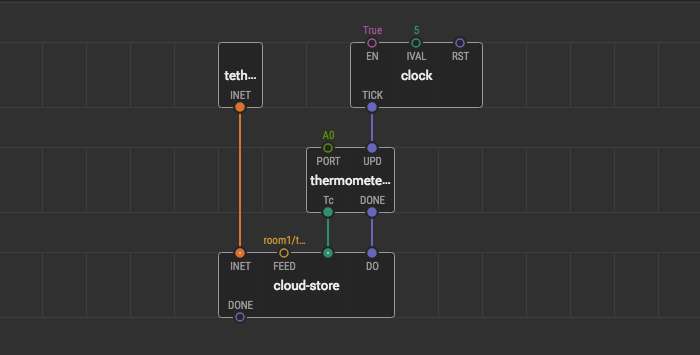
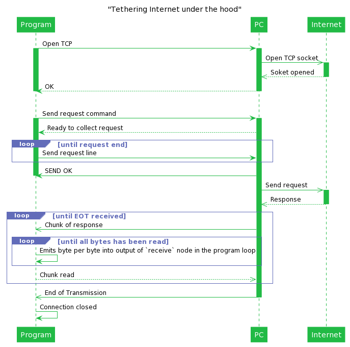
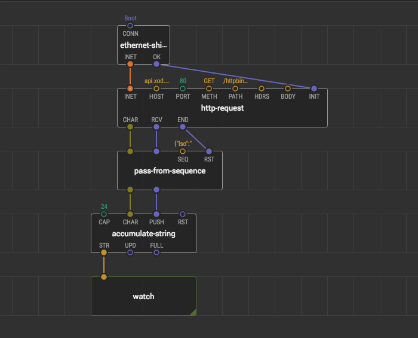

# Sharing Internet from PC

There is a large class of tasks, called Internet-Of-Things when the hardware needs an Internet connection to send or receive data from some server. For example, log the temperature and moisture for smart greenhouses, getting the current time, weather, work with [XOD Cloud](/docs/guide/getting-started-with-feeds/) or other APIs, and so on.

Some microcontrollers can access the internet on their own, like [ESP8266](/docs/guide/esp8266-connect/), or with connected modules or shields, like [W5500 ethernet shield](https://xod.io/libs/xod-dev/w5500/) or [ESP8266 in AT-modem mode](https://xod.io/libs/xod-dev/esp8266/). But if you have a microcontroller without internet support or no microcontroller at all, XOD has a solution for you: use the [`xod/debug/tethering-inet`](https://xod.io/libs/xod/debug/tethering-inet/) node to provide the internet from your PC to your microcontroller via UART or use it in the simulation.

Note

The internet tethering feature uses low-level internet communication which is supported by OS but not available to the web-browser. So it only works in the desktop version of the XOD IDE.

## Fetching data from the internet

To present the benefits of the internet tethering, we are going to take an example from the [guide of HTTP GET request](/docs/guide/http-get/) and modify it a little bit:

- Replace the internet provider node with the `xod/debug/tethering-inet` node.
- Replace the text LCD node with a [`xod/debug/watch`](https://xod.io/libs/xod/debug/watch/), to get rid of any hardware in the program.

Try uploading this program in debug node or run its simulation. Wait for a little bit and you get your remote IP address in the watch node. The program works the same as in the example on your Arduino Uno (which does not have internet connectivity features at all), it works the same in the simulation.

## Sending data to internet

Sending data to the internet works the same as getting data, but usually, it uses POST or PUT methods of an HTTP request. We took an example from the guide about XOD Cloud Feeds and modify it a little bit by replacing the `connect` node with `tethering-inet`.

Note

This example gets values from a thermometer but if you have no thermometer or microcontroller at all, you can replace it with [`xod/debug/tweak-number`](https://xod.io/libs/xod/debug/tweak-number/) and change this value manually.

If you have signed in and ran the program, you'll see temperature values in your feed.

## How it works under the hood

The program communicates with the PC via the serial interface or virtual serial interface in case of simulation. The communication protocol is based on [ESP8266 AT commands](https://www.espressif.com/sites/default/files/documentation/4a-esp8266_at_instruction_set_en.pdf) but uses fewer commands. For example, it does not provide a feature to switch between WiFi access points, because the PC should already have an established internet connection, which might be supplied by the ethernet cable.

Here is a sequence diagram, which illustrates a process of sending a request and receiving the response from the HTTP server:

The solid filled rectangles on the “Program” lifeline indicate that the process is synchronous, so it blocks the execution of the rest of the program. Meanwhile, the filled rectangles on the “PC” lifeline just group processes because the code on PC has its event loop. So you can still interact with the XOD IDE while PC transmitting some data either to the Internet or program. To emphasize this, the diagram uses two types of arrows: with the bold end to indicate synchronous messages and with thin ones for non-blocking messages. Dashed arrows indicate that these messages are responses for the previous.

- To open TCP socket, the program sends a command to the PC and waits for the response: `OK` or `ERR`. After that, the program loop is not blocked.
- Then the program sends a request command and waits for the response: `>`. Then it sends a request line by line. When all request was sent or response `SEND OK` received the program loop is not blocked anymore.
- When the PC gets a response from the HTTP server, it splits the response by chunks, places them in a queue, and send the first one.
- When the program receives a chunk, it reads byte per byte and outputs it to the program loop. The program loop is not blocked, and each byte might be processed in the program.
- When the whole chunk has been read, the program notifies the PC with the `ACK` command.
- Then the PC takes the next chunk from the queue and sends it.
- The previous two actions repeating until the program receives an `EOT` command from the PC. It indicates that the response is end and connection is closed.

## Production

After you wrote and test the program with the `tethering-inet` node, you might want to use your device without a connected PC. It’s time to replace `tethering-inet` with the suitable node for module or microcontroller, which you have at your hands.

And it will keep working, without PC at all.

---

1. For debugging and developing the program with some interactions with the internet, you can share the internet from your PC to your program by using the `xod/debug/tethering-inet` node.
2. It works in the simulation without any microcontroller and modules at all.
3. This node is not for production and operating only with a PC running XOD IDE. Replace it with a suitable hardware internet provider node when your program is ready for production.
