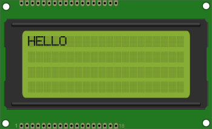
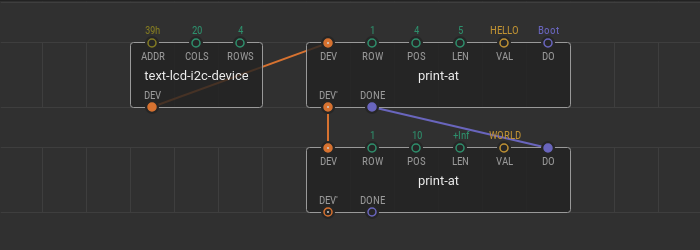
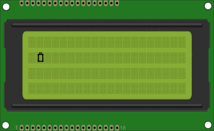

# Working with Text Displays

Text LCD displays are among the simplest. They are popular for their ease of operation and programming thanks to the [HD44780 LCD controller](https://en.wikipedia.org/wiki/Hitachi_HD44780_LCD_controller) and their analogs with the built-in set of characters including [ASCII](https://en.wikipedia.org/wiki/ASCII) characters. Text displays consist of a matrix of dots combined into rows and columns. Formats of rows and columns are standardized by manufacturers and can be 8x1, 8x2, 10x1, 10x2, 16x1, 16x2, 16x4, 20x1, 20x2, 20x4, 24x1, 24x2. Each LCD controller is capable of operating up to 80 characters so the text LCD display with the 20x4 format is the largest. There are even larger text LCD displays such as 40x4 using several LCD controllers but they are too rare.

Initially, text LCD displays communicate with microcontrollers such as Arduino using [parallel 4 or 8-bit interfaces](https://en.wikipedia.org/wiki/Parallel_communication). Some manufacturers add shift registers and port expanders to the display, making it possible to control via [I2C](https://en.wikipedia.org/wiki/I²C) or [SPI](https://en.wikipedia.org/wiki/Serial_Peripheral_Interface) bus. It is done for connecting convenience and reducing the number of mounting wires.

In XOD there is a special [`xod-dev/text-lcd`](/libs/xod-dev/text-lcd) library of nodes to work with text LCD displays.

## Quick start nodes

The library provides quick start nodes for the text LCD displays with the most popular formats:

- [`text-lcd-i2c-16x2`](/libs/xod-dev/text-lcd/text-lcd-i2c-16x2) - for a display with 2 rows, 16 columns, and I2C interface; 
- [`text-lcd-i2c-20x4`](/libs/xod-dev/text-lcd/text-lcd-i2c-20x4) - for a display with 4 rows, 20 columns, and I2C interface; 
- [`text-lcd-parallel-16x2`](/libs/xod-dev/text-lcd/text-lcd-parallel-16x2) - for a display with 2 rows, 16 columns, and 4-bit parallel interface; 
- [`text-lcd-parallel-20x4`](/libs/xod-dev/text-lcd/text-lcd-parallel-20x4) - for a display with 4 rows, 20 columns, and 4-bit parallel interface.

These nodes contain everything you need to start working with displays. You only have to connect your display to the microcontroller and set up proper connection parameters.

If the display communicates via an I2C bus the input parameter is the device address. Put the I2C address value of the [byte](/docs/reference/data-types/#byte-literals) type to the `ADDR` pin field.

If the display is controlled using a parallel interface fill in the pin values `RS`, `EN`, `D4`, `D5`, `D6`, `D7` according to the microcontroller ports through which the display is connected.

The `L` input pins of the [string](/docs/guide/data-types/#string-type/) type have indexes from `1` to `4` and correspond to the lines on your text display. The [boolean](/docs/reference/data-types/#boolean-literals/) value at the `ACT` pin is responsible for updating the display screen if the incoming string values change. Versions controlled by the I2C bus have an additional `BL` pin which turns on and off the display backlight.

## Quick start examples

Here is a simple example of using quick start nodes. For the example we use a 16x2 format display controlled by I2C. Connect the display to the microcontroller. Create an empty patch and put the [`text-lcd-i2c-16x2`](/libs/xod-dev/text-lcd/text-lcd-i2c-16x2/) quick start node onto it. The LCD screen from this example has the `38` I2C address so we put the `38h` value to the `ADDR` pin.

Let's print the "HELLO" word on the first line of the text display. Add a [`constant-string`](/libs/xod/core/constant-string/) node onto the patch, fill it with the `"HELLO"` string value, and then link it with the `L1` input pin of the quickstart node denoting the first line of the display.

Upload the patch to see how the word appears on the display screen.

A text can be entered directly into a value field of the input pin. To demonstrate it, let's print the "WORLD" word on the second line of the display. Put the `"WORLD"` string value into the `L2` pin of the [`text-lcd-i2c-16x2`](/libs/xod-dev/text-lcd/text-lcd-i2c-16x2/) quick start node.
 

Flash the patch and look how the new word appears.

Try a more dynamic example. Let's display the system time, it is the time that has passed since the start of the program. To obtain the time value use the [`system-time`](/libs/xod/core/system-time/) node from the [`core`](/libs/xod/core/) library.

Remove the `"WORLD"` value from the `L2` pin of the quickstart node and change the text inside of the constant string node to `"Time: "`. In XOD you can add different strings together or combine a string with a value of another data type using [`concat`](/libs/xod/core/concat/) or [`join`](/libs/xod/core/join/) nodes. Put the `concat` node onto the patch to unite the static `"Time: "` text with a value received from the [`system-time`](/libs/xod/core/system-time/) node. To display the combined string on the first line of the display link the output pin of the `concat` node with the `L1` pin of the quickstart node.

Upload the resulting patch and take a look at how fast time passes on the display screen.

## Advanced text LCD device initialization

If the quickstart node doesn't suit your task or the display is of a non-common format try to operate some developer nodes from the library [`xod-dev/text-lcd`](/libs/xod-dev/text-lcd/) library.

Define the display you want to use to start working with it in XOD. Find out how your display communicates and place the appropriate `device` node from the [`xod-dev/text-lcd`](/libs/xod-dev/text-lcd/) library. These nodes construct and output an `lcd-device` [custom type](/docs/guide/data-types/#custom-types/) value which is necessary for further work.

Use the [`text-lcd-parallel-device`](/libs/xod-dev/text-lcd/text-lcd-parallel-device/) node if the display is controlled using a parallel interface. This node allows the display connection only through a 4-bit parallel interface. Here enter the pin values `RS`, `EN`, `D4`, `D5`, `D6`, `D7`. These values correspond to the microcontroller ports through which the display is connected. 

Use the [`text-lcd-i2c-device`](/libs/xod-dev/text-lcd/text-lcd-i2c-device/) node if the display communicates via an I2C bus. For this node, the input parameter is the device address. Enter the I2C address of your display to the `ADDR` pin value.

Find out what format your display has. Fill in the `COLS` and `ROWS` pin values according to your format. 

## Advanced text print

When the device is initialized, you can display text on it. To output text, use the [`print-at`](/libs/xod-dev/text-lcd/print-at/) node. It fits any type of LCD device because it is [generic](/docs/guide/data-types/#generic-types/).

The input values of the `print-at` nodes determine what text to display and where it should be on the display screen. Text to display is set at the `VAL` pin value. The `ROW` and `POS` field values set the cell coordinates on the display for the first character. That's the place where your text begins. The `LEN` pin value sets the number of character cells for the text to reserve. The text can’t go beyond the boundaries you specify. It is useful, for example, when the length of your text changes during the program or you want to organize free space between several text parts. Printing is performed when the `DO` pin receives a pulse.

## Advanced text print example

Let's print something using the `device` and `print-at` nodes. In this example, the 20x4 I2C controlled text LCD display is used.

At first, let's make a patch to print the `"HELLO"` text. Put the [`text-lcd-i2c-device`](/lib/xod-dev/text-lcd/text-lcd-i2c-device/) node onto the patch and fill it with parameters. According to the format of the display, the number of columns is `20` and the number of rows is `4`. The I2C address of the used display is `0x39` so put the `39h` byte to the `ADDR` pin. Add the `print-at` node and link it with the `device` node. Put the `HELLO` to the `VAL` input pin.

Set the `DO` pin value to `Boot`. Thus, the text appears on the display once and immediately after loading of the controller.

Flash the patch look at the result.

Now let's move out the `HELLO` text to some other place on the screen. Set the beginning of the text to row 2 and column 5. The numbering of rows and columns starts with `0` so put the `1` into the `ROW` field and `4` into the `POS` field. 

Upload the patch and look at the changes.

Let's add another text and write the `"WORLD"` after the `"HELLO"`.

Add one more `print-at` node and link with the LCD device bus. Put the `"WORLD"` word into the `VAL` field. The new text is on the same line as the previous one so set the `ROW` value to 1. The `POS` value now should be calculated. The “HELLO” word begins from the cell with index `4` and occupies `5` cells. By adding one empty cell for space and the “HELLO” word length to the previous text position you can get the `POS` for the new text: it is `10`. Link the input `DO` pin of the new node with output `DONE` pin of the previous to execute printing sequentially.

Also, it is necessary to change the `LEN` value for the “HELLO” text. It is equal to `+Inf` which means that the “HELLO” text reserves all the free space in the line after itself. Set it to `5` to reserve only the required number of cells for a given word.

If you flash the patch the new text appears.

 

## Special characters

Text displays contain a table of images for each character in their memory. These tables are used to generate letters, numbers and other symbols. Almost always a full list of all available characters can be found in the manufacturer's datasheet. To display a specific symbol, it is necessary to transfer its hexadecimal number from the sign generator table.   Use the `\x##` sequence to embed the character code in the string.

For example, the display that is used for this example contains five symbols which can indicate a battery capacity level. Hexadecimal codes for these symbols are `9B`,`9C`,`9D`,`9E`, and `9F`.
Let's try to display these symbols on the 3rd line of the display. Let's change the previous example patch. Leave one `print-at` node and set up new printing coordinates. Put the `2` value into the  `ROW` pin and let the `POS` be `7`. Then, put the `"\x9B\x9C\x9D\x9E\x9F"` sequence of the character codes into the `VAL` pin..

Upload the patch and look at what happened.

With such symbols, you can create funny effects, like battery charging animation.

---

Make your project or device more attractive and informative with a text display. Get started with quickstart nodes from the [`xod-dev/text-lcd`](/libs/xod-dev/text-lcd/) library. Combine strings using [`concat`](/libs/xod/core/concat/). For non-standard cases, dive deeper into the library. Use a `device` node together with various action nodes, such as [`set-backlight`](/libs/xod-dev/text-lcd/set-backlight/) and [`clear`](/libs/xod-dev/text-lcd/clear/).