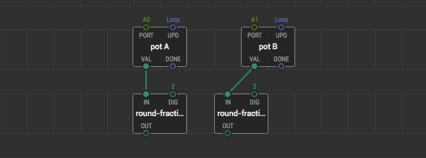
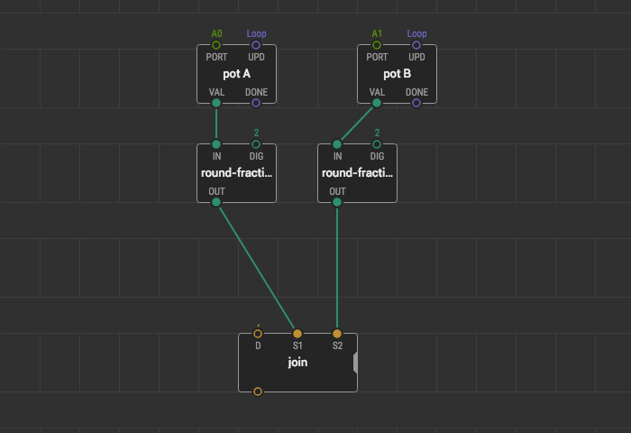
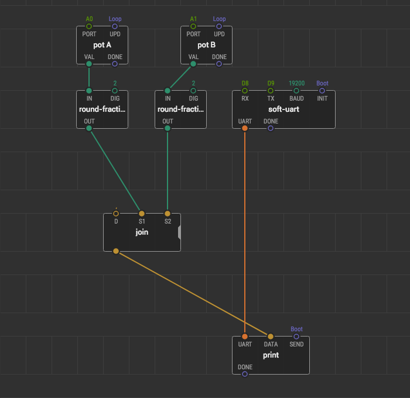
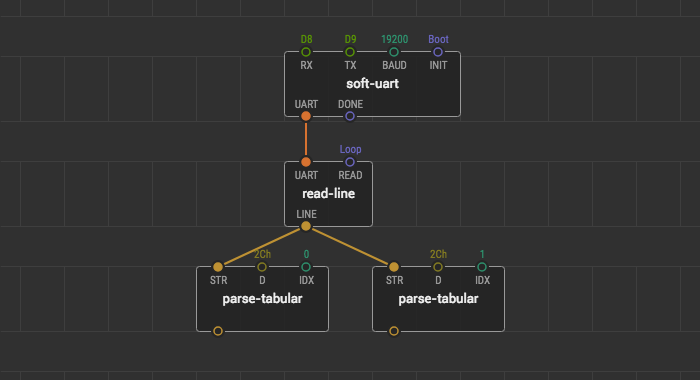
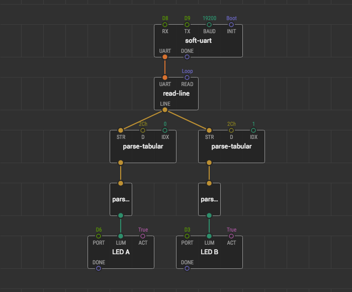

# Controlling LEDs via UART — Exchanging Text-based Data Between Two Boards

This example describes how to exchange data between two Arduino boards.

For the data source, we will use two potentiometers connected to the first
Arduino board. We will serialize the data into formatted text lines and send
them via UART to the second Arduino board. The second Arduino Board will control
the brightness of two LEDs using the obtained data.

## Required hardware

- 2 × Arduino Uno board
- 2 × LED
- 2 × 220 Ω resistor
- 2 × 10 kΩ potentiometer
- 2 breadboards
- hook-up wires

## Circuits

### Sender board

The first step is to make the circuit for the Arduino board which sends data.
Connect two potentiometers to the `A0` and `A1` analog ports on the Arduino
board.

### Receiver board

The second step is to make the circuit for the Arduino board which receives
data. Connect two LED through the 220 ohm resistors to the `D4` and `D6` digital
ports on the Arduino board.

Note

To control the brightness, both LEDs should be connected to ports which support
[PWM](https://en.wikipedia.org/wiki/Pulse-width_modulation).

### Link Arduino boards

The third step is to create a UART connection between the Arduino boards. All
Arduino boards have at least one UART interface also known as _hardware_ serial
or just “serial”.

To communicate the serial interface uses two pins named `TX` and `RX`. `TX` and
`RX` are abbreviations for Transmit and Receive, respectively.

For example, Arduino Uno has one serial interface on digital pins `D0` (`RX`)
and `D1` (`TX`). On Uno, this port is also used to communicate with the computer
via USB. In turn, Arduino Mega has three additional UART interfaces:

- `Serial1` on pins `D19` (`RX`) and `D18` (`TX`)
- `Serial2` on pins `D17` (`RX`) and `D16` (`TX`)
- `Serial3` on pins `D15` (`RX`) and `D14` (`TX`)

If the hardware serial interfaces are insufficient, a UART interface can be
simulated on any Arduino digital pins programmatically. The technique is known
as bit-banging and such interface is called _software_ serial

In this tutorial, the Arduino Uno boards which have only one UART interface It’s
busy because we use it to load the firmware and communicate with the computer.
So, let’s create a new software serial.

Define digital pins `TX` and `RX` on both Arduino boards. Let the `D8` Arduino
pin be `RX` and the `D9` Arduino pin be `TX`.

To link two devices with a UART bus, the `TX` pin of the first device should be
connected to the `RX` pin of the second device, while the `TX` pin of the second
device should be connected to the `RX` pin of the first. This can be done
physically by overlapping the wires.

Link the `D9` pin on the first Arduino board with the `D8` pin on the second
Arduino and `D9` pin on the second Arduino board with the `D8` pin on the first
board.

All signals require a reference voltage. The `GND` is what provides this
reference for single-ended signals such as those used by a UART. Therefore the
grounds on both boards should be joined.

Link the `GND` pin on the first Arduino board with the `GND` pin on the second
board.

## Programming

Create a new project in XOD and name it something like `uart-led-control`. We
will create two XOD patches — one for each board. Create a new patch for the
potentiometers connected board and name it `pots`.

Note

For this project, some nodes are contained in a library
[`gabbapeople/uart-led-control`](https://xod.io/libs/gabbapeople/uart-led-control/).
Be sure to [add it into your workspace](/docs/guide/using-libraries/). The nodes
from this library will be included in the XOD standard library soon

### Get values

Let's gather the values from the potentiometers and prepare them for the later
serialization.

- Add two [`pot`](https://xod.io/libs/xod/common-hardware/pot/) nodes onto the
  patch. They correspond to a couple of potentiometers on the breadboard. To
  avoid confusion, label them differently. For example, `pot A` and `pot B`.
- Set the `PORT` pins of the `pot` nodes. As we connected them to `A0` and `A1`,
  we set the `PORT` pin values to `A0` and `A1`.
- A `pot` node outputs the signal values in the range from `0` to `1`. A
  potentiometer is an analog electronic component. Even if you don’t touch the
  potentiometer knob, the `pot` output value can continuously change for example
  from `0.855` to `0.856` and back. To get rid of these minor changes let’s
  round the potentiometers outputs to two decimal places after the dot.
- Add two `round-fraction` nodes onto the patch and link them with `pot` nodes.
  To set two decimal places after the dot, place the `2` value to the `DIG` pin.

### Assemble data

In this guide, we use the
[CSV](https://en.wikipedia.org/wiki/Comma-separated_values) (Comma-separated
values) text-based format to form string lines with the data we transmit. Each
line is a [String](/docs/guide/data-types/#string-type) of two signal values
from potentiometers separated by a comma.

Here is an example of the string: `0.25,0.95`.

To combine all data values to a single string, use the
[`join`](https://xod.io/libs/xod/core/join/) node.

- Place `join` onto the patch.
- Set the delimiter value at the `D` pin to `,`.
- Link the `join` node with both `round-fraction` nodes.

### Send data

Let’s define the software serial interface in the `pots` program and describe
how the data is transferred.

- To set up the software serial interface put the
  [`soft-uart`](https://xod.io/libs/xod/uart/soft-uart/) node from the
  `xod/uart` library onto the patch. Set the `RX` and `TX` pin values. We put
  the `D8` value to the `RX` pin and the `D9` value to the `TX`.
- The `BAUD` pin sets the data rate in bits per second (baud) for serial
  communication. These baud values are standardized. For the software serial
  interface, the maximum baud value is `115200`. Note that the higher the baud
  value, the greater the chance that a data may get lost or broken during the
  transmission. We set the `BAUD` value to `19200`.
- Add the [`print`](https://xod.io/libs/xod/uart/print/) node from the
  `xod/uart` library into the patch. This node transforms a string value from
  the `DATA` pin into a single line by adding two bytes with a carriage return
  `\r` and line feed `\n` byte literals. After this `print` sends the line via
  UART each time the pulse signal comes on its `SEND` pin.
- Link the `DATA` pin with the `join` node.
- Link the `UART` pin of the `print` node with the `soft-uart` node.

Here is an example of the line to be sent: `0.25,0.95\r\n`.

### Limit frequency

The last step for the `pots` patch is to limit the sending frequency. We will
send a new line only when any of the potentiometer values changes.

Also we are going to use a `throttle` node to slow down the pulse frequency.
During the turn, a potentiometer generates lots of new values and the pulse rate
is high. It is desirable to limit the pulse frequency so that each line has time
to be sent in integrity.

- Add two [`pulse-on-change`](https://xod.io/libs/xod/core/pulse-on-change/)
  nodes onto the patch and link them with the `round-fraction` nodes.
- Put the [`any`](https://xod.io/libs/xod/core/any/) node onto the patch and
  link its inputs with the `pulse-on-change` nodes. Now, the `any` and
  `pulse-on change` nodes will generate a pulse if the potentiometer value is
  changed.
- Add the `throttle` node onto the patch and place it between `any` and `print`
  nodes. `throttle` passes a pulse through no more than once every `T` seconds.
  To slow down the frequency we place the `0.05` seconds value to the `T` pin.

The patch for the first Arduino board is done. Upload, use a terminal emulator
to observe the result. Let’s make the next patch.

### Receive data

The program for the Arduino board with LEDs starts with receiving data from
UART. Create a new patch for the LEDs connected board and name it `leds`.

- To set up the software serial interface put the
  [`soft-uart`](https://xod.io/libs/xod/uart/soft-uart/) node from the
  `xod/uart` library onto the patch. Set `RX` and `TX` pin values. We put the
  `D8` value to the `RX` pin and the `D9` value to the `TX`.
- Arduino boards must communicate at the same speed. The `BAUD` pin value is the
  same as on the previous patch. Put the `19200` value to the `BAUD` pin.
- Add the `read-line` onto the patch. This node listens to the UART interface
  for the stream of bytes. If it is available, the `read-line` node searches the
  `\n` byte literal in it and dumps all the characters before the `\n` to a
  single line. It also cuts the `\r` byte literal from the output. The `READ`
  pin triggers a new read of a line.
- Link the `UART` pin of the `read-line` node with the `soft-uart` node and set
  the `READ` value to `Continuously`.

### Parse data

When a line is received it has to be parsed. We will use the `parse-tabular`
node to parse the serialized CSV line back into two numbers.

- Add two `parse-tabular` nodes onto the patch. One node per an LED. The
  `parse-tabular` node is inverse to `join`. It splits a string `STR` into
  tokens using `D` as a delimiter and outputs the token at index `IDX`. The
  `IDX` numbering starts at `0`. For example, for the line `ABCD,1234,EFGH` with
  the `,` delimiter, the part with the `0` number is `ABCD`, the part with the
  `1` number is `1234`, and the part with the `2` number is `EFGH`.
- Link the `STR` pins of the `parse-tabular` nodes with the `LINE` pin of the
  `read-line` node.
- Set the delimiter at the `D` pins. Specify it as a character in single
  quotation marks.
- Set the `IDX` value of the first `parse-tabular` node to `0` to read the
  `Pot A` value.
- Set the `IDX` value of the second `parse-tabular` node to `1` to read the
  `Pot B` value.

### Control LEDs

To complete the `leds` patch, it remains to send the line parts to the LEDs.

- Put two `parse-number` nodes from the `uart-example` library to the patch and
  link them with the `parse-tabular` nodes. The `parse-number` node converts
  values from the [String](/docs/guide/data-types/#string-type) type to
  [Number](/docs/guide/data-types/#number-type).
- Add to [`led`](https://xod.io/libs/xod/common-hardware/led/) nodes for each
  potentiometer. You can name them `LED A` and `LED B` as the potentiometers. As
  we connect LEDs to the `D3` and `D6` pins on the Arduino board, we put `D3`
  and `D6` values to the `PORT` pins of the `led` nodes.
- Link the `parse-number` outputs with the `LUM` pins of the `led` nodes.

Both patches are done, you can upload them to their boards.

## Result

<video controls autoplay muted loop>
    <source src="./result.mp4" type="video/mp4">
</video>

If you have got problems trying to repeat the guide,
[download the prepared project](./uart-led-control.xodball) and open it in the
IDE.
