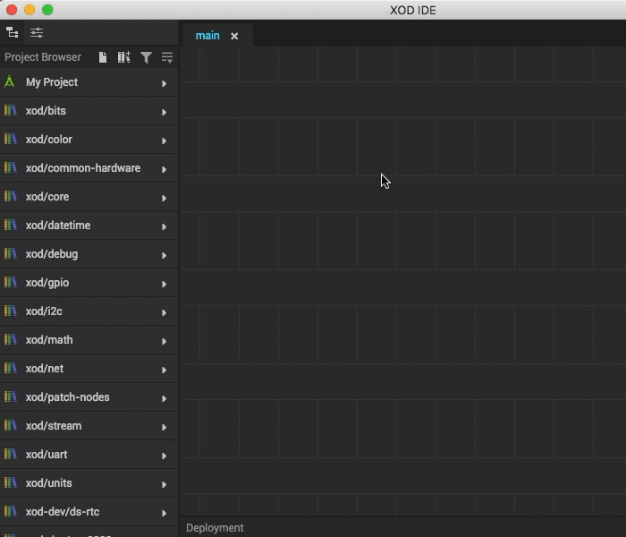

# Использование библиотек

XOD включает диспетчер пакетов как важную часть его экосистемы. Менеджер пакетов хранит _библиотеки_ в облаке, которые представляют собой сборники готовых к использованию нод для взаимодействия с оборудованием, выполнения вычислений, построения логики и т.д.

Любой может создавать и опубликовать библиотеку. Вы можете [создавать и обмениваться библиотекми](../creating-libraries/). Перед этим проверьте, что уже сделано. Скорее всего, кто-то уже реализовал ноду, которую вы ищете. Используйте [library explorer](/libs/) на сайте XOD или выполните поиск на [форуме](https://forum.xod.io).

## Установка библиотек

Каждая библиотека имеет полное имя в формате `owner-name/lib-name`, где `owner-name` имя Xoderа, который опубликовал, а `lib-name`- название библиотеки.

В XOD IDE нажмите “File → Add Library” и введите полное имя библиотеки, чтобы установить её в рабочее пространство. Вы увидите новую запись в панели браузера проекта с вращающимся колесом. Через несколько секунд вы увидите сообщение об успешной установке.

Это оно! Вы готовы использовать ноды из недавно установленной библиотеки.

Заметка

Есть библиотеки которые называются “xod”: `xod/bits`, `xod/units`, и так далее. Они являются стандартными библиотеками, и автоматически устанавливаются вместе с XOD. Вместе они образуют _стандартную библиотеку_ XOD .

## Обновление и понижение библиотек

Каждая библиотека имеет номер версии, привязанный к моменту публикации. Например, конкретная библиотека `bob/cool-lib` может быть опубликована `bob` несколько раз, т.е. имеет несколько версий. Это способ для авторов библиотек добавлять обновления, улучшения и исправления в свои библиотеки.

XOD использует так называемое соглашение “[semver](https://semver.org/)”: номера версий состоят из трех частей, разделенных точками. Например, 2.4.1.

При добавлении библиотеки, вы можете выбрать определенную версию для установки путем добавления `@` знака и указать нужную версии: `bob/cool-lib@2.4.1`. Установка версии, которая отличается от уже установленной версии, переопределит локальную библиотеку. Это способ обновления и понижения.

Чтобы держать всё под контролем, XOD не поддерживает несколько расположенных бок о бок копий одной и той же библиотеки.

Существует специальный тег версии, `latest`, который соответствует самой последней версии данной библиотеки. Когда вы нажимаете “File → Add Library” и вводите просто `bob/cool-lib`, он имеет тот же эффект, что и ввод `bob/cool-lib@latest`.

Поэтому вы можете снова добавить уже установленную библиотеку, `latest`, чтобы обновить ее до последней версии, если новые выпуски библиотек были сделаны после того, как вы ее впервые установили.

Библиотека, опубликованная с определенной версией, никогда не изменится. Удаление и переопределение версии в облаке запрещено. Итак, если вы использовали ноду из какой-либо библиотеки, вы можете быть уверены, что найдете её там в любой момент в будущем.

## Удаление библиотек

Браузерная версия XOD IDE не хранит установленные библиотеки во время запуска. Каждый раз, когда вы перезагружаете вкладку с XOD IDE, исчезают все сторонние библиотеки. Автоматически устанавливаются только библиотеки, от которых зависит открытый проект. Итак, чтобы удалить библиотеку из IDE в браузере, перезагрузите среду IDE.

Версия для настольных компьютеров отличается. Когда вы добавляете библиотеку, ее копия хранится локально в месте `<workspace>/__lib__`, где `<workspace>` это текущий путь рабочего пространства XOD (по умолчанию `<user-home-directory>/xod`). Все библиотеки из этого каталога отображаются в браузере проекта при запуске IDE. Чтобы удалить библиотеку:

1.  закройте IDE;
2.  удалите соответствующий подкаталог библиотеки с помощью вашего файловвого менеджера;
3.  запустите IDE.

Если вы случайно удалили библиотеку, от которой зависит ваш проект, библиотека будет автоматически установлена при открытии проекта для исправления проблемы.
