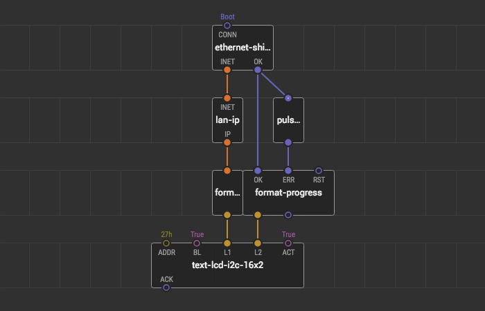

# Быстрая настройка W5500 Ethernet Shield для Internet и LAN

Ethernet Shield построенная на чипе Ethernet W5500, является популярной 
платой расширения в мире Arduino, и предоставляет вашему устройству проводное 
подключение к локальной сети или интернету. Плата также известна как “Ethernet Shield 2.”

Его физическое подключение тривиально:

1.  Разместите Ethernet Shield на вашей плате Arduino
2.  С помощью кабеля RJ-45 подключите его к маршрутизатору, который обеспечивает доступ в Интернет 

Программирование требует некоторых усилий.

Когда вы подключаете ПК к маршрутизатору с помощью кабеля, в большинстве случаев 
он автоматически связывается с локальной сетью (LAN), и вы готовы к просмотру. 
Вам не нужно ничего делать, потому что ваша операционная система (ОС), работающая под 
управлением Windows, MacOS или Linux выполняет все шаги, необходимые 
для входа в ЛВС. Микроконтроллеры не имеют ОС, поэтому вы сами несете ответственность 
за установление соединения.

К счастью, в XOD есть ноды для Ethernet Shield to которые упрощают работу.
Специфические для него ноды находятся в [`xod-dev/w5500`](https://xod.io/libs/xod-dev/w5500/) 
библиотеке а ноды с аппаратной нейтралью находятся в [`xod/net`](https://xod.io/libs/xod/net/).

## Ethernet Shield нода

В простейшем случае, когда у вас есть плата Ethernet Shield, и это единственное DIY-устройство 
в вашей локальной сети, достаточно разместить один [`xod-dev/w5500/ethernet-shield`](https://xod.io/libs/xod-dev/w5500/ethernet-shield/) на своем патче.

У ноды есть `CONN` импульс, который инициирует процесс соединения. Убедитесь, что `CONN` соединена `On Boot`
так, чтобы shield пытался подключиться к маршрутизатору при запуске программы.

Нода имеет пины `INET`, которая передаёт результат подключения к Интернету ,а 
также `OK` и `ERR` импульсы , которые сигнализируют на успехе или неудаче.

Когда `enthernet-shield` получает импульс на `CONN`, он начинает согласовывать сетевые 
параметры с маршрутизатором и автоматически устанавливает IP-адрес устройства, 
адрес шлюза, маску сети и IP-адрес DNS-сервера. При успешном соединении нода 
испускает импульс `OK` и устанавливает `INET` значение, ожидаемое другими узлами, 
предназначенными для сетевой связи.

Самый простой способ проверить, работает ли ссылка, - вывести собственный локальный 
IP-адрес. [`xod-dev/w5500/lan-ip`](https://xod.io/libs/xod-dev/w5500/lan-ip/) может извлекать IP-адрес из `INET` объекта и 
[`xod/net/format-ip`](https://xod.io/libs/xod/net/format-ip/) способен форматировать IP как удобочитаемую строку, такую как “192.168.1.101”. 
Вы можете использовать ЖК-дисплей или ноду watch, чтобы увидеть результат:

Для демонстрационных целей мы также используем `format-progress` ноду, которая выводит 
строку “...”, “OK” или “ERR” во вторую строку дисплея, показывающую ход соединения.

Загрузите патч на свою плату. В обычной сети он покажет:

- “0.0.0.0” / “...” менее чем за секунду
- то-то вроде “192.168.1.101” / “OK”

## Примечания

Остерегайтесь, описанный здесь быстрый способ имеет некоторые недостатки:

- Он назначает локально введенный жестко закодированный MAC-адрес «02: 00: 00: 78: 6F: 64» 
  к устройству, которое должно быть уникальным в сети. Вы должны изменить его, если у вас есть 
  несколько устройств или назначить адрес из коммерческого пула, если устройство предназначено для продажи.
- Он всегда использует DHCP для получения параметров сети, которые могут быть не настроены на 
  маршрутизаторе и даже если настроены должным образом потребляемые драгоценные ресурсы микроконтроллера, 
  в сравнении со статической конфигурацией.

Если с базовым соединением все в порядке, вы можете начать сетевое общение. Например, [fetch some data from the web with HTTP GET](../http-get/). 
Или вы можете сделать ваше соединение более надежным, используя [unique MAC and static IP setup](../w5500-advanced/).
