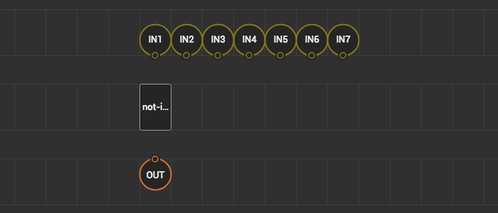
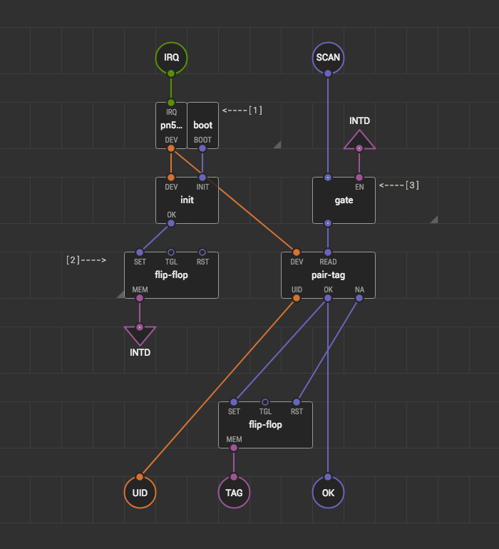

# Wrapping Class-based Arduino Libraries

Many libraries already have been written for Arduino and they can be included
into XOD to use the full power of the existing ecosystem.

To understand this guide, you have to know how to write
[C++ code in XOD](../nodes-for-xod-in-cpp/) and how to work with
[custom types](../custom-types/). Also, you need to have some experience of
working with C++ libraries for Arduino.

Imagine that we want our Arduino board to turn the built-in led on or off when
we bring an NFC tag, such as travel pass, to it.

Consider that we have no XOD library to work with RFID/NFC scanner PN532
([xod-dev/pn532-nfc](/libs/xod-dev/pn532-nfc)), and try to make it on our own.
In order not to go into the details of working with tags, we will take the
[Adafruit-PN532](https://github.com/adafruit/Adafruit-PN532) Arduino library and
just wrap it in XOD nodes.

To do this, we need to:

1.  Declare a new custom type `pn532-device`, which describes an RFIC/NFC module
    and how is it connected to an Arduino board. There may be several instances
    of this node, one for each hardware module.
2.  Declare a dependency on a third-party C++ library so that XOD knows where to
    download it, saving users from manual install.
3.  For the new type, create action nodes that correspond to the functions and
    methods provided by the third-party C++ library.
4.  Create a quick-start node that reads an NFC tag to serve most common
    purposes.
5.  Create few example patches.

## Create device and require library

Take a look on class constructors in the Adafruit library:

```cpp
class Adafruit_PN532{
    public:
        // Software SPI
        Adafruit_PN532(uint8_t clk, uint8_t miso, uint8_t mosi, uint8_t ss);
        // Hardware I2C
        Adafruit_PN532(uint8_t irq, uint8_t reset);
        // Hardware SPI
        Adafruit_PN532(uint8_t ss);
        // …
};
```

The class has three constructors for different connection types: HardwareSPI,
HardwareI2C, and SoftwareSPI. Choose the second one and create the device node
for the I2C connection:

1.  Create a new patch "pn532-device". The name of the patch becomes the name of
    the new custom type, which we will later pass into action nodes. Pay
    attention to "device" in the name. Conventionally, any nodes that create a
    new type to work with hardware should be named as `xxx-device`.
2.  Place the node `not-implemented-in-xod`, because we have to create an
    instance of the class from C++ library.
3.  Place the node `output-self` and set its label to `DEV`. Such way we’re
    defining a new [custom type](../custom-types/). After that you can find
    `input-pn532-device` and `output-pn532-device` terminals in Project Browser.
4.  Place one terminal `input-port` to specify interruption port with label
    `IRQ`. This is one of two ports, which are required in the constructor
    arguments. This port is used to notify Arduino board that the module
    detected an NFC tag. The second port (`reset`) we do not need, because it is
    necessary to restart the module only if you are working with it at a low
    level and did something wrong.

Double click on `not-implemented-in-xod` to open the C++ editor and type on the
first line:

```cpp
#pragma XOD require "https://github.com/adafruit/Adafruit-PN532"
```

<div class="ui segment note">
<span class="ui ribbon label">Note</span>
At this moment requiring third-party libraries possible only from
master branches of GitHub repositories. If you want to require library from
another branch or edited — make a fork and require it.
</div>

This is a special line tells XOD, that this node needs a third-party library. At
the first compilation XOD will check its presence in your workspace and if it
does not find a library, it will offer to download and install it just by
clicking on the button in the IDE.

<div class="ui segment note">
<span class="ui ribbon label">Note</span>
After installation, you will need to run the compilation again.
</div>

So we installed library and now we are able to use it. Let's include it and
create an instance of the class:

```cpp
// Tell XOD where it could download the library:
#pragma XOD require "https://github.com/adafruit/Adafruit-PN532"

// Include C++ library:
\{{#global}}
#include <Adafruit_PN532.h>
\{{/global}}

// Adafruit_PN532 class wants to know ports in the moment of instantiation
// but we don't know them at this moment.
// Therefore, we reserve memory to store an instance of the class,
// and create the instance later:
struct State {
    uint8_t mem[sizeof(Adafruit_PN532)];
};

// Define our custom type as a pointer on the class instance.
using Type = Adafruit_PN532*;

\{{ GENERATED_CODE }}

void evaluate(Context ctx) {
    // It should be evaluated only once on the first (setup) transaction
    if (!isSettingUp())
        return;

    auto state = getState(ctx);
    auto irq = getValue<input_IRQ>(ctx);

    // Create a new object in the memory area reserved previously.
    // Instead of the `reset` port, specify `NOT_A_PORT`, since it is not needed
    Type nfc = new (state->mem) Adafruit_PN532(irq, NOT_A_PORT);

    emitValue<output_DEV>(ctx, nfc);
}
```

We included the library and created the instance of the class. Let's create
action nodes to initialize the NFC scanner and start working with it.

## Action nodes

To work with the instance of a class in XOD we need to wrap method calls in
nodes. To access the instance itself we pass it the custom type value we defined
earlier. Thus, any action node for this library will contain an input of type
`pn532-device`.

The methods can invoke some side-effects (communication with the hardware
module) and be asynchronous, that is our program won't halt and wait until some
side-effect are done. Therefore, for each such action node, we have to add some
`pulse` terminals: one to run the action and two to notify about completion,
either successful or failed.

For our task we create two action nodes:

1.  `init` — to initialize the hardware module
2.  `pair-tag` — to detect an NFC tag and read its UID

<div class="ui segment note">
<span class="ui ribbon label">Note</span>

Pay attention, that names of action nodes begin with verbs. By convention, names
of any nodes which do instructions "what to do" in imperative style must begin
with a verb (`init`, `read-byte`, `pair-tag`, `write-line` and etc).

</div>

### Create node `init`

Let's create a node that initializes the NFC scanner.

<div class="ui segment note">
<span class="ui ribbon label">Note</span>

The `input-pn532-device` terminal was automatically generated after adding the `output-self`
terminal to the `pn532-device` patch. You can find it in the Project Browser.

</div>


Follow comments in the C++ code:

```cpp
struct State {
};

\{{ GENERATED_CODE }}

void evaluate(Context ctx) {
    // The node responds only if there is an input pulse
    if (!isInputDirty<input_INIT>(ctx))
        return;

    // Get a pointer to the `Adafruit_PN532` class instance
    auto nfc = getValue<input_DEV>(ctx);

    // Initialize RFID/NFC module
    nfc->begin();

    uint32_t versiondata = nfc->getFirmwareVersion();
    if (!versiondata) {
      // If the module did not respond with its version,
      // it's a connection error or something wrong with the module
      raiseError(ctx); // Initialization error
      return;
    }

    // Set the max number of retry attempts to read from a card
    // This prevents us from waiting forever for a card, which is
    // the default behavior of the PN532.
    nfc->setPassiveActivationRetries(1);

    // Configure the board to read an RFID/NFC tags
    nfc->SAMConfig();

    // Pulse that module initialized successfully
    emitValue<output_OK>(ctx, 1);
}
```

Now we can initialize the RFID/NFC module.

<div class="ui segment note">
<span class="ui ribbon label">Note</span>

Do not forget to give [descriptions](../documenting-nodes/) to terminals and
patches.

</div>

### Storing and comparing UIDs

The UID is a set of bytes, which may be sized from 4 to 10 bytes for different
types of cards and different types of UID (Single size UID, Double size UID,
RUID, NUID, FNUID) by the specification ISO14443A. For reliability, let's pack
this value into another custom data type.

Create a new patch `nfc-uid`: 

Note that here we have 7 inputs of type `byte` so that we can manually set the
UID of an NFC tag. This will be useful when we'll compare a UID of the detected
tag and the UID of our activation tag.

Let's write C++ code:

```cpp
struct State {
};

// Declare custom type as a struct
// in which we will store an array of bytes
struct Type {
    uint8_t items[7];
};

\{{ GENERATED_CODE }}

void evaluate(Context ctx) {
    auto state = getState(ctx);

    Type uid;
    // Put each value from input terminal into the array of bytes
    uid.items[0] = (uint8_t)getValue<input_IN1>(ctx);
    uid.items[1] = (uint8_t)getValue<input_IN2>(ctx);
    uid.items[2] = (uint8_t)getValue<input_IN3>(ctx);
    uid.items[3] = (uint8_t)getValue<input_IN4>(ctx);
    uid.items[4] = (uint8_t)getValue<input_IN5>(ctx);
    uid.items[5] = (uint8_t)getValue<input_IN6>(ctx);
    uid.items[6] = (uint8_t)getValue<input_IN7>(ctx);

    emitValue<output_OUT>(ctx, uid);
}
```

<div class="ui segment note">
<span class="ui ribbon label">Note</span>

Likewise, we can make another node, which unfolds the UID into a set of bytes
with seven outputs from the bottom (`unpack-nfc-uid` is a good name for it).
This can be useful if we want to compare specific bytes after reading the UID.
For example, Double size UID contains a manufacturer ID at the zero position.

</div>

For our task it is important to compare a UID of the detected tag with the UID
of our tag: we don't want anyone to turn our led on and off, right? Let's create
a new node `equal(nfc-uid)`. Note that we defined our data type `nfc-uid` in the
parentheses. It is a
[specialization](../../creating-generics/#specialization-patches) node, so any
xoder can use the familiar `xod/core/equal` node even to compare UIDs.


To compare two byte arrays we use the standard function `memcmp`:

```cpp
struct State {
};

\{{ GENERATED_CODE }}

void evaluate(Context ctx) {
    auto uidA = getValue<input_IN1>(ctx);
    auto uidB = getValue<input_IN2>(ctx);

    // Function `memcmp` compares data by two pointers
    // and returns `0` if they are equal
    bool eq = memcmp(uidA.items, uidB.items, sizeof(uidA.items)) == 0;

    emitValue<output_OUT>(ctx, eq);
}
```

Let's check that everything works. Create a demonstration patch
`example-uid-equals`.


Now we can create, store, and compare UIDs. It's time to read the UID from our
NFC tag.

### Create node `pair-tag`

To interact with an NFC tag we should detect it first and read its UID. That is
why the node is not called `read-uid`, but `pair-tag`.


Follow the C++ code:

```cpp
struct State {
};

\{{ GENERATED_CODE }}

void evaluate(Context ctx) {
    if (!isInputDirty<input_READ>(ctx))
        return;

    auto nfc = getValue<input_DEV>(ctx);

    // Create a variable of a custom type
    // by getting the type from output terminal
    ValueType<output_UID>::T uid;
    // Create a variable to store length of the UID
    uint8_t uidLength;

    // Fill UID with zeroes
    memset(uid.items, 0, sizeof(uid.items));
    // Detect the tag and read the UID
    bool res = nfc->readPassiveTargetID(
      PN532_MIFARE_ISO14443A,
      uid.items,
      &uidLength
    );

    if (res) {
        emitValue<output_UID>(ctx, uid);
        emitValue<output_OK>(ctx, 1);
    } else {
        emitValue<output_NA>(ctx, 1);
    }
}
```

Everything is ready to read the UID of the tag. But in fact, the library from
Adafruit allows us to read not only the UID of the tag but also to read and
write data to the tag. And if you're wrapping a library, we recommend wrapping
at least the most common methods to avoid having multiple wrappers of the same
library that only have a limited set of features.

Try to make `read-page` and `write-page` nodes by yourself using the
`mifareultralight_ReadPage` and `mifareultralight_WritePage` methods from the
Adafruit library. And make an example patch to count the number of times the tag
has touched the NFC scanner, keeping this counter on the tag. You will need the
MIFARE Ultralight labels to work with these methods.

## Quick start node

We could stop right here. But let's make yet another thing: a quick start node.
Imagine, this library was done by someone else and you just want to use it. Will
it be handy to use a chain of nodes `pn532-device`, `init`, `read-uid`, just to
know is there any NFC tag near the module?

Let's simplify our lives and write a `nfc-scanner` node that solves most common
tasks with just one node. Such nodes are called _quick start nodes_.



1.  Init the RFID/NFC module on boot;
2.  `flip-flop` will be set to `True` when module inited to open the gate;
3.  `gate` protects against attempts to detect an NFC tag when the module is not
    yet initialized.

It's time to make our `example-nfc-scanner`:


<div class="ui segment note">
<span class="ui ribbon label">Note</span>

Creating example patches within the library is a good practice. It allows you to
immediately check the workability and usability of the library. In the future
users will thank you for examples.

</div>

Well done!

## Summary

1.  To use a third-party library specify a special pragma-instruction in the
    code: `#pragma XOD require "https://github.com/some/library"`
2.  In addition to specifying where to get the library, do not forget to include
    it in the code:

    ```cpp
        \{{#global}}
        #include <SomeLibrary.h>
        \{{/global}}
    ```

3.  When you wrapping methods in nodes use verbs in their names (`pair-tag`,
    `write-page`).
4.  Create quick start nodes to solve common problems (`nfc-scanner`,
    `nfc-writer`)

Now you can [add project description and share it](../creating-libraries/)
with the community.
