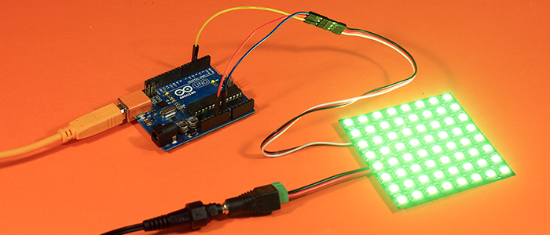

# WS2812: Controlling NeoPixel RGB LEDs

<video controls autoplay muted loop>
    <source src="./heading.mp4" type="video/mp4">
</video>

_Arduino Uno fills 1024 RGB LEDs with a two-color pattern_

WS2812 (also known as Adafruit NeoPixel) is an intelligent light source that combines RGB LED and a controlling chip in a single component. The components come in various forms and sizes but the principle is kept the same. The chip is receiving data over the one wire `Din`, takes the first bytes needed for itself, and passes the rest to the `Dout` pin. That makes it possible to daisy chain such LEDs into a long strip, or assemble into any form-factor like matrix, circle, or whatever.

XOD offers a [`xod-dev/ws2812`](https://xod.io/libs/xod-dev/ws2812) library to work with NeoPixel LEDs.

Note
This library differs from many other Arduino libraries for NeoPixel in that it allows controlling a huge amount of LEDs with constant and low memory footprint. For example, with most of the libraries, Arduino Uno can control no more than 552 LEDs using a program with no other logic. The XOD library places no such limits.

## Wiring

To connect a chain of NeoPixel LEDs to a controller hook up three wires:

- Voltage (usually labeled as `V`, `Vcc`, `5V` or `12V`) goes to the plus of a power source.
- Ground (`G` or `GND`) goes to power source ground/minus and should be additionally connected to the controller board ground if powered from a separate power source.
- Data input (`Din`, `D`, or `S`) goes to any digital GPIO pin of the controller board.

Here is a very basic example of the WS2812 LED strip connection to Arduino Uno:

Note

In this example, strips' `Vcc` and `Gnd` pins are connected directly to the Arduino Uno. However, if you have a long strip (more than 16 LEDs), you have to power it up from an external power source. Moreover, if your strip is very long, you have to cut it in several places and solder additional power and ground wires and connect two parts of the LED strip: `Dout` and `Din`.

In our examples below, we're using the 8x8 matrix. The data wire is connected to a digital pin `D4` of Arduino Uno. The matrix is controlled exactly the same way as a strip. You might consider it a strip that is funky-twisted in ZZZZ-order. The matrix is powered up from an external source and then it powers the controller.

## Solid color

To fill the whole strip with a solid color there is a quickstart node [`ws2812-mono`](https://xod.io/libs/xod-dev/ws2812/ws2812-mono). Here is a step-by-step recipe:

1. Place the [`ws2812-mono`](https://xod.io/libs/xod-dev/ws2812/ws2812-mono) node.
2. Bind the port. `D4` in our case.
3. Bind the number of LEDs you have. In our case: 16.
4. Bind any bright color to `C`. In this example green #00FF00.
5. Upload the program.

### Tweaking in real-time

<video controls autoplay muted loop>
    <source src="./tweaking.mp4" type="video/mp4">
</video>

One of the powerful XOD features is tweaking and watching values right on the patch in the debug mode. Place a [`tweak-color`](https://xod.io/libs/xod/debug/tweak-color) node and link it to the `C` color pin.

After uploading the program with a debug mode turned on, select the tweak node, open the color picker in the inspector, and start dragging the hue handle to change the color value. You will see the LED strip changing the color in real-time.

### Animating color

<video controls autoplay muted loop>
    <source src="./animated-color.mp4" type="video/mp4">
</video>

Instead of choosing the color you can generate it using other nodes. For example, to generate a smoothly changing color, replace the `tweak-color` node from the previous example with a combination of [`xod/core/sine-wave`](https://xod.io/libs/xod/core/sine-wave) and [`xod/color/color-hsl`](https://xod.io/libs/xod/color/color-hsl).

The `sine-wave` node generates a number that roams between 0 and 1 overtime. It controls the hue component of the color, so we get a smoothly changing color from red over all possible tones and then back. If you want to make something more complex, for example, light-music, you can make an audio analyzer node and replace the `sine-wave` node with it.

### Bar gauge

<video controls autoplay muted loop>
    <source src="./bar-gauge.mp4" type="video/mp4">
</video>

Imagine an LED strip that shows the potentiometer value. It fills the whole strip when it's 1, half when it’s 0.5, and so on. To make a bar gauge, the library has no quick-start node but there are device- and action nodes that can be used to implement high-level tasks such as this one.

First of all, place [`ws2812-device`](https://xod.io/libs/xod-dev/ws2812/ws2812-device) and [`fill-solid`](https://xod.io/libs/xod-dev/ws2812/fill-solid) nodes. Bind a port number and number of LEDs to the device node and any color you like to the `fill-solid` action node.

If you upload the program now, you'll get the same thing as with the `ws2812-mono` node you have used before. But you might notice that the `fill-solid` node has a `NUM` pin. It's a number of LEDs to fill up with a solid color. It's time to add a potentiometer and map its values to the `NUM` pin.

Now upload the program and rotate the knob. You might see no changes at all. The reason is we do not clear the LED strip from the previous values. So the program tries to color the specific amount of LED with the same color as before. Add a [`clear`](https://xod.io/libs/xod-dev/ws2812/clear) node, which will set the color of all LEDs to black and link its output pulse with the `DO` input of the `fill-solid` node.

## Pattern

The library also provides a feature to fill the LEDs with a repetitive pattern. The `pattern` type provided by the library represents a list of [`color`](https://xod.io/libs/xod/color) values which define the 1D-image.

1. Place a [`ws2812-pattern`](https://xod.io/libs/xod-dev/ws2812/ws2812-pattern) node.
2. Place a [`pattern`](https://xod.io/libs/xod-dev/ws2812/pattern) node.
3. [Expand the variadic node](/docs/guide/variadics/) `pattern` and bind different colors.
4. Upload the program.

Note

A pattern fill is only one of the possible ways to fill the LEDs with not just solid colors. However, it's only one implemented way right now. Feel free to [contribute](/docs/contributing/).

### Shifting pattern

One of the ways to animate a pattern is to shift it. It might look like running dots, police lights, etc.

The `ws2812-pattern` node has a `SHFT` input pin, which contains the number of pixels to shift/wrap in the pattern. Wrapping means that if you have only 4 pixels in the pattern and you shift it for two, the last two pixels will become first two and vice versa.

Here’s a recipe to make a crawling animation:

1. Add a [`clock`](https://xod.io/libs/xod/core/clock) node to generate pulse signals with a specifiс interval.
2. Add a [`count`](https://xod.io/libs/xod/core/count) node to increment the shift value. Link it with the clock to change the shift over time.
3. Link the output of the `count` node to the `SHFT` input pin.
4. Upload the program.

<video controls autoplay muted loop>
    <source src="./shifting-pattern.mp4" type="video/mp4">
</video>

If you do everything correctly you'd see a few dots crawling over your LED strip.

---

With the `xod-dev/ws2812`, you can control your NeoPixel devices with a considerable amount of LEDs using a controller like Arduino Uno. Only basic patterns are supported though. The timing restrictions of the WS2812 data protocol are strict. So if you need a custom behavior you have to [implement a new node similar](/docs/guide/nodes-for-xod-in-cpp/) to `fill-solid` or `fill-pattern` in C++ or assembly. See their implementation as a starting point.
