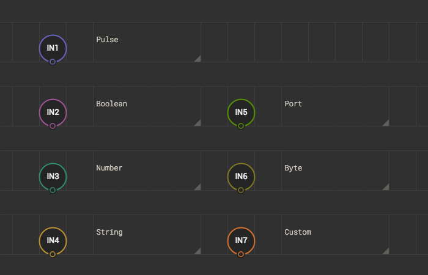

# Допустимые на типы данных

Здесь кратко описаны свойства встроенных типов данных XOD. Чтобы узнавать
о типах больше, смотрите [Data types guide](/docs/guide/data-types/).

## Цветовая кодировка

## Casting rules

В следующей таблице показаны допустимые взаимосвязи _implicit_. 
Здесь указано, когда прямая взаимосвязь между двумя различными типами данных возможна. 
Даже если прямая взаимосвязь запрещена, то существуют ноды, которые помогают преобразовать типы в допустимые.

<table class="ui definition single line table">
  <thead>
    <tr>
      <th></th>
      <th>→ Pulse</th>
      <th>→ Boolean</th>
      <th>→ Number</th>
      <th>→ Byte</th>
      <th>→ Port</th>
      <th>→ String</th>
    </tr>
  </thead>
  <tbody>
    <tr>
      <td>Pulse →</td>
      <td></td>
      <td class="disabled">no</td>
      <td class="disabled">no</td>
      <td class="disabled">no</td>
      <td class="disabled">no</td>
      <td class="disabled">no</td>
    </tr>
    <tr>
      <td>Boolean →</td>
      <td>yes</td>
      <td></td>
      <td>yes</td>
      <td>yes</td>
      <td class="disabled">no</td>
      <td>yes</td>
    </tr>
    <tr>
      <td>Number →</td>
      <td class="disabled">no</td>
      <td>yes</td>
      <td></td>
      <td class="disabled">no</td>
      <td class="disabled">no</td>
      <td>yes</td>
    </tr>
    <tr>
      <td>Byte →</td>
      <td class="disabled">no</td>
      <td>yes</td>
      <td class="disabled">no</td>
      <td></td>
      <td class="disabled">no</td>
      <td>yes</td>
    </tr>
    <tr>
      <td>Port →</td>
      <td class="disabled">no</td>
      <td class="disabled">no</td>
      <td class="disabled">no</td>
      <td class="disabled">no</td>
      <td></td>
      <td class="disabled">no</td>
    </tr>
    <tr>
      <td>String →</td>
      <td class="disabled">no</td>
      <td class="disabled">no</td>
      <td class="disabled">no</td>
      <td class="disabled">no</td>
      <td class="disabled">no</td>
      <td></td>
    </tr>
  </tbody>
</table>

Ниже приведены подробные сведения о преобразовании данных при неявном приведении.

<table class="ui table">
  <thead>
    <tr>
      <th>Из</th>
      <th>В</th>
      <th>Как</th>
    </tr>
  </thead>
  <tbody>
    <tr>
      <td>Boolean</td>
      <td>Pulse</td>
      <td>
          Смена на <code>True</code> считается импульсом. То есть, когда значение было
          <code>False</code> и стало<code>True</code> испускается один импульс.
      </td>
    </tr>
    <tr>
      <td>Boolean</td>
      <td>Number</td>
      <td>
          <code>False</code> конвертируется в <code>0.0</code> и 
          <code>True</code> конвертируется в <code>1.0</code>.
      </td>
    </tr>
    <tr>
      <td>Boolean</td>
      <td>Byte</td>
      <td>
        <code>False</code> конвертируется в  <code>0000 0000</code> and 
        <code>True</code конвертируется в <code>0000 0001</code>.
      </td>
    </tr>
    <tr>
      <td>Boolean</td>
      <td>String</td>
      <td>
        <code>True</code> конвертируется в <code>"true"</code> and 
        <code>False</code> конвертируется в <code>"false"</code>.
      </td>
    </tr>
    <tr>
      <td>Number</td>
      <td>Boolean</td>
      <td>
        Ноль (0) конвертируется в <code>False</code>, 
        любое другое значение конвертируется в <code>True</code>.
      </td>
    </tr>
    <tr>
      <td>Number</td>
      <td>String</td>
      <td>
          конвертируется с двумя значениями после запятой.
          <code>3.14159</code> → <code>"3.14"</code> и
          <code>0</code> → <code>"0.00"</code>.
      </td>
    </tr>
    <tr>
      <td>Byte</td>
      <td>Boolean</td>
      <td>
        <code>0000 0000</code> конвертируется в <code>False</code>, 
        любое другое значение конвертируется в <code>True</code>.
      </td>
    </tr>
    <tr>
      <td>Byte</td>
      <td>String</td>
      <td>
      Преобразуется в двузначное шестнадцатеричное число с H-суффиксом, например
        <code>0000 1101</code> → <code>0Dh</code>.
      </td>
    </tr>
  </tbody>
</table>

## Обозначения

В этом разделе обобщается допустимый ввод текста (т. е. грамматика) для различных типов данных. Это имеет значение, например, при вводе значений в IDE с помощью Inspector.

### Number literals

<table class="ui compact table">
  <thead>
    <tr>
      <th>Обозначение</th>
      <th>Комментарии</th>
    </tr>
  </thead>
  <tbody>
    <tr>
      <td class="right aligned"><code>1000</code></td>
      <td> В базовом случае константа является последовательностью десятичных цифр </td>
    </tr>
    <tr>
      <td class="right aligned"><code>+1000</code></td>
      <td>Константа может иметь явно указанный знак</td>
    </tr>
    <tr>
      <td class="right aligned"><code>-1000</code></td>
      <td>Константа может быть отрицательной</td>
    </tr>
    <tr>
      <td class="right aligned"><code>-1000.45</code></td>
      <td>Может иметь значения после запятой</td>
    </tr>
    <tr>
      <td class="right aligned"><code>-.45</code></td>
      <td> Если целая часть равна нулю,то она может быть отброшена </td>
    </tr>
    <tr>
      <td class="right aligned"><code>1000.</code></td>
      <td> Допускается конечная десятичная точка </td>
    </tr>
    <tr>
      <td class="right aligned"><code>2e6</code></td>
      <td>Константа может иметь десятичный показатель степени после символа “e”  (2×106 = 2 000 000)</td>
    </tr>
    <tr>
      <td class="right aligned"><code>2e+6</code></td>
      <td>Степень может иметь знак</td>
    </tr>
    <tr>
      <td class="right aligned"><code>2e-6</code></td>
      <td>Быть отрицательной (2×10-6 = 0.000002)</td>
    </tr>
    <tr>
      <td class="right aligned"><code>+.2e-3</code></td>
      <td> Правила для части перед “e” все еще применяются </td>
    </tr>
    <tr>
      <td class="right aligned"><code>Inf</code></td>
      <td> Особое значение для обозначения положительной бесконечности </td>
    </tr>
    <tr>
      <td class="right aligned"><code>+Inf</code></td>
      <td> Может включать явный знак </td>
    </tr>
    <tr>
      <td class="right aligned"><code>-Inf</code></td>
      <td>Или быть отрицательной бесконечностью</td>
    </tr>
    <tr>
      <td class="right aligned"><code>NaN</code></td>
      <td> Значение “Not A Number”, сигнализирующее об ошибке операции </td>
    </tr>
  </tbody>
</table>

### Логические обозначения

Допустимые обозначения:

- `True`
- `False`

### Byte обозначения

<table class="ui compact table">
  <thead>
    <tr>
      <th>Обозначение</th>
      <th>Комментарии</th>
    </tr>
  </thead>
  <tbody>
    <tr>
      <td class="right aligned"><code>1Ah</code></td>
      <td> Каноническая шестнадцатеричная форма содержит две цифры (0-9|A-F), за которыми следует h-суффикс </td>
    </tr>
    <tr>
      <td class="right aligned"><code>03h</code></td>
      <td> Значения менее 10h должна быть нулем </td>
    </tr>
    <tr>
      <td class="right aligned"><code>00011010b</code></td>
      <td> В двоичной форме литерал восемь цифр (0/1), а затем b -суффикс </td>
    </tr>
    <tr>
      <td class="right aligned"><code>26d</code></td>
      <td> Десятичная форма содержит целое число в диапазоне [0; 255], а затем d -суффикс </td>
    </tr>
    <tr>
      <td class="right aligned"><code>006d</code></td>
      <td> Начальные нули разрешены, но могут быть опущены </td>
    </tr>
    <tr>
      <td class="right aligned"><code>'a'</code></td>
      <td> Символ, заключенный в одинарные кавычки, преобразуется в байтовое значение, равное коду ASCII </td>
    </tr>
    <tr>
      <td class="right aligned"><code>'\n'</code></td>
      <td> Символ обратной косой черты задает управляющий символ ASCII, такой как перевод строки, возврат каретки, табуляция и т. д <a href="https://en.wikipedia.org/wiki/Control_character">control ASCII character</a </td>
    </tr>
  </tbody>
</table>

В некоторых случаях IDE или CLI может нормализовать почти допустимые константы как `3h` (нет начальных нулей), `0x03` (обычный шестнадцатеричный код для C\++, JavaScript и Python
программирования), `3` (подразумеваемый десятичный 3), однако каноническая форма, как показано.
### Обозначение портов

<table class="ui compact table">
  <thead>
    <tr>
      <th>Обозначение</th>
      <th>Комментарии</th>
    </tr>
  </thead>
  <tbody>
    <tr>
      <td class="right aligned"><code>D4</code></td>
      <td>Цифровой порта ничинается с “D”, а далее следует соответствующий номер порта</td>
    </tr>
    <tr>
      <td class="right aligned"><code>A6</code></td>
      <td>Аналоговый порт/канал начинается с “A” далее следует номер</td>
    </tr>
  </tbody>
</table>

Обратите внимание, что значения аналоговых портов могут быть преобразованы в значения цифровых портов, но не наоборот. Так, в случаях, когда аналоговый канал и цифровой порт делят один и тот же физический вывод платы (например, A6 and D4 на Arduino Leonardo) вам следует выбрать A6 для аналогового чтения данных, хотя и для цифровых операций, подойдет: `A6`, в таком случает будет автоматически скорректировано в `D4` движком программы.

### String обозначения

<table class="ui compact table">
  <thead>
    <tr>
      <th>Обозначение</th>
      <th>Комментарии</th>
    </tr>
  </thead>
  <tbody>
    <tr>
      <td><code>"Hello"</code></td>
      <td>String обозначения заключаются в двойные кавычки </td>
    </tr>
    <tr>
      <td class="single line"><code>"Dist: 10\""</code></td>
      <td>если строка содержит контейнер <code>"</code>  то должна быть отделена  <code>\</code> (Dist: 10")</td>
    </tr>
    <tr>
      <td class="single line"><code>"Hello\nWorld"</code></td>
      <td> Новая строка кодируется как <code>\n</code> </td>
    </tr>
    <tr>
      <td class="single line"><code>"Hello\r\nWorld"</code></td>
      <td><code>\r</code> кодирует возврат каретки </td>
    </tr>
    <tr>
      <td class="single line"><code>"1023.0\t244\t1"</code></td>
      <td><code>\t</code> кодирует TAB символ</td>
    </tr>
    <tr>
      <td class="single line"><code>"A\\B\\C"</code></td>
      <td> Обратные слеши отделяются обратными слешами (A\B\C)</td>
    </tr>
  </tbody>
</table>

### Обозначения импульсов

<table class="ui compact table">
  <thead>
    <tr>
      <th>Обозначение</th>
      <th>Комментарии</th>
    </tr>
  </thead>
  <tbody>
    <tr>
      <td><code>Never</code></td>
      <td> никогда не испускать импульс </td>
    </tr>
    <tr>
      <td><code>On Boot</code></td>
      <td>давать импульс только при старте программы</td>
    </tr>
    <tr>
      <td><code>Continuously</code></td>
      <td> Испускайть импульсы так быстро, как позволяет производительность, в каждом такте </td>
    </tr>
  </tbody>
</table>
