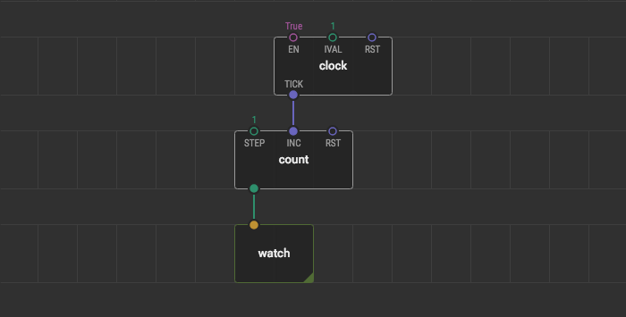

<!--
This file is auto-generated from the 'welcome-to-xod' project.
Do not change this file manually because your changes may be lost after
the tutorial update.

To make changes, change the 'welcome-to-xod' contents or 'before-1st-h2.md'.

If you want to change a Fritzing scheme or comments for it, change the
'before-1st-h2.md' in the documentation directory for the patch.

Then run auto-generator tool (xod/tools/generate-tutorial-docs.js).
-->

Note
This is a web-version of a tutorial chapter embedded right into the XOD IDE.
To get a better learning experience we recommend to install the
<a href="/downloads/">desktop IDE</a> or start the
<a href="/ide/">browser-based IDE</a>, and you’ll see the same tutorial there.

# Welcome to XOD, Maker!

In XOD, we do not use text to code; we use visual objects instead.

This large gray area with boxes is your program. It's called a _patch_. Patches are like documents or source files in other systems.

Several related patches form a _project_. Currently you are working on a project named `welcome-to-xod`.

## Exercise

Let’s learn how to navigate a project.

1.  On the left-hand side, you will find a list of patches grouped by a project or library name. The list is called a _Project Browser_. The first item in it is `welcome-to-xod`. Expand the project by clicking on it.

2.  As you can see, the tutorial consists of many patches. Right now, you are in the patch `001-hello`. The next chapter of the tutorial is in the patch `002-simulate`. Double-click it, and let's meet there!

## 👆 Web hints

If anything goes wrong or you have no idea what to do, we have [hints for every patch](https://xod.io/docs/tutorial/001-hello/?utm_source=ide&utm_medium=ide_comment&utm_campaign=tutorial) on the web.

  

    
  

  

    <a href="../">Index</a>
  

  

    <a href="../002-simulate/">Next lesson →</a>
  

