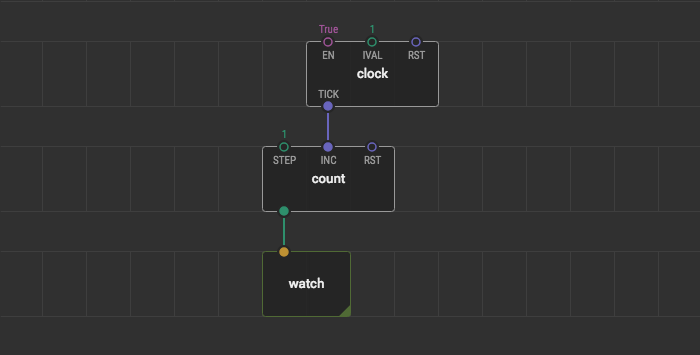

<!--
This file is auto-generated from the 'welcome-to-xod' project.
Do not change this file manually because your changes may be lost after
the tutorial update.

To make changes, change the 'welcome-to-xod' contents or 'before-1st-h2.md'.

If you want to change a Fritzing scheme or comments for it, change the
'before-1st-h2.md' in the documentation directory for the patch.

Then run auto-generator tool (xod/tools/generate-tutorial-docs.js).
-->

Note
This is a web-version of a tutorial chapter embedded right into the XOD IDE.
To get a better learning experience we recommend to install the
<a href="/downloads/">desktop IDE</a> or start the
<a href="/ide/">browser-based IDE</a>, and you’ll see the same tutorial there.

# Nodes, Pins, Inspector

Now that we've seen our program in action, let's take a closer look at it and tweak it a little.

The dark gray boxes on the patch are called _nodes_. A node is a visual representation of some physical device or some function: from math and logic to more complicated stuff like producing, filtering or accumulating values, measuring time, etc.

Our program consists of `clock`, `count`, and `watch` nodes. `clock` ticks at a given interval, `count` increments its value with each incoming tick, and `watch` displays the value during debug or simulation sessions.

The small colored circles on the nodes are called _pins_. They are used to transfer data between nodes. Pins are divided into inputs and outputs. Inputs are always on the top side of the nodes, outputs are on the bottom.

Nodes process the values from input pins and take some action or give a result. The values come to input pins from other nodes outputs through links during program execution or are constantly _bound_ to pins using _Inspector_ during program creation.

## Exercise

Let’s learn how to bind values to input pins with the Inspector pane.

1.  Click on the `clock` node. You will see the Inspector pane under Project Browser.

2.  In the Inspector, change the `IVAL` value from `1` to `0.1`.

Run the simulation. Notice that the counter value increments much faster. Try to bind another value to counter’s `STEP` and see how it affects the behavior.

  

    <a href="../002-simulate/">← Previous lesson</a>
  

  

    <a href="../">Index</a>
  

  

    <a href="../004-patching/">Next lesson →</a>
  

