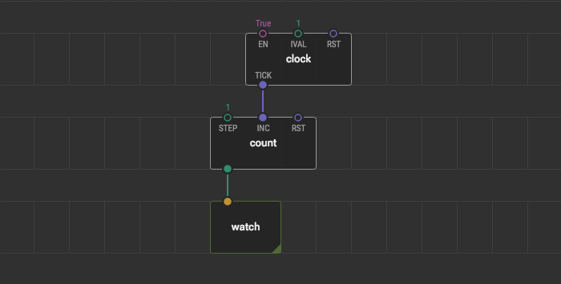

<!--
This file is auto-generated from the 'welcome-to-xod' project.
Do not change this file manually because your changes may be lost after
the tutorial update.

To make changes, change the 'welcome-to-xod' contents or 'before-1st-h2.md'.

If you want to change a Fritzing scheme or comments for it, change the
'before-1st-h2.md' in the documentation directory for the patch.

Then run auto-generator tool (xod/tools/generate-tutorial-docs.js).
-->

Note
This is a web-version of a tutorial chapter embedded right into the XOD IDE.
To get a better learning experience we recommend to install the
<a href="/downloads/">desktop IDE</a> or start the
<a href="/ide/">browser-based IDE</a>, and you’ll see the same tutorial there.

# Patching

You guessed correctly, you may add nodes and link them to build brand new programs and improve existing ones.

## Exercise

Let's extend our counting program so that we'll have two independent counters.

1.  Double-click on some empty space on the patch; the suggester line will appear.
2.  Start typing “clock” into it and press Enter once you see `xod/core/clock`.
3.  A new `clock` node will appear where you have double-clicked.
4.  Move the node around by dragging it.
5.  Repeat steps 1-4 to add `count` and `watch` nodes.
6.  Create a link between `clock`'s `TICK` pin and `count`'s `INC` pin by clicking on one pin, then the other.
7.  Create a link between `count`'s output pin and `watch`'s input pin.

Run the simulation to see how the counters work in parallel. Try to set different `IVAL` parameters and see how it changes the behavior.

## 👆 Ways to add node

Alternatively to double-clicking you can also press the “I” key or hit Edit → Add Node.

If you don’t remember the name of a node, try to find it in Project Browser. Once you spot it there, drag’n’drop the item to the patch board or hit Place in its context menu.

## 👆 Copy/paste

Another way of duplicating a group of nodes and links is selecting them by drawing a frame around to select multiple nodes at once and then copy/paste using the Edit menu or keyboard shortcuts traditional for your OS.

If you draw the selection frame from left to right, a node is selected only if fits inside completely; if you draw from right to left, the nodes which intersect the frame are also selected.

  

    <a href="../003-inspector/">← Previous lesson</a>
  

  

    <a href="../">Index</a>
  

  

    <a href="../005-tweaks/">Next lesson →</a>
  

