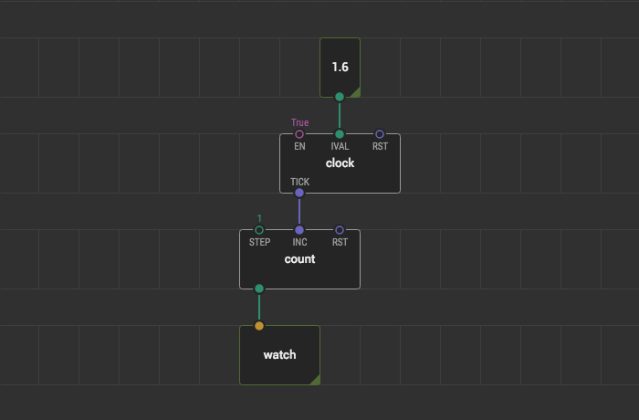

<!--
This file is auto-generated from the 'welcome-to-xod' project.
Do not change this file manually because your changes may be lost after
the tutorial update.

To make changes, change the 'welcome-to-xod' contents or 'before-1st-h2.md'.

If you want to change a Fritzing scheme or comments for it, change the
'before-1st-h2.md' in the documentation directory for the patch.

Then run auto-generator tool (xod/tools/generate-tutorial-docs.js).
-->

Note
This is a web-version of a tutorial chapter embedded right into the XOD IDE.
To get a better learning experience we recommend to install the
<a href="/downloads/">desktop IDE</a> or start the
<a href="/ide/">browser-based IDE</a>, and you’ll see the same tutorial there.

# Tweaks

Restarting a program every time you change a value in the Inspector is inconvenient. With `tweak-*` nodes, you can adjust values while the program is running.

On the current patch we added a `tweak-number` linked to `IVAL` already.

## Exercise

Let’s learn how to add new tweaks to your program and control them in runtime.

1. Add `tweak-number` node to the patch.
2. Link `tweak-number`'s output pin to `count`'s `STEP` pin.
3. Start the simulation.
4. Double click the tweak node; the text box for tweak value will focus in Inspector.
5. Change the value to `2.0` and press Enter.
6. Adjust the value of the tweak linked to `clock`'s `IVAL` pin.

Take a note how the changes are immediately applied while you are in the simulation mode. Try some other values and see how they behave.

## 👆 Save some typing

Use Up/Down keyboard keys in the Inspector to adjust numeric values by 0.1. Hold Shift to adjust by 1.0.

  

    <a href="../004-patching/">← Previous lesson</a>
  

  

    <a href="../">Index</a>
  

  

    <a href="../006-help/">Next lesson →</a>
  

