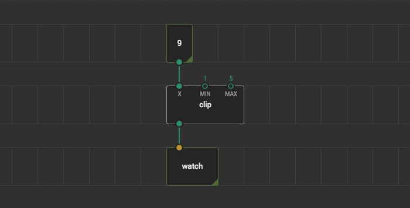

<!--
This file is auto-generated from the 'welcome-to-xod' project.
Do not change this file manually because your changes may be lost after
the tutorial update.

To make changes, change the 'welcome-to-xod' contents or 'before-1st-h2.md'.

If you want to change a Fritzing scheme or comments for it, change the
'before-1st-h2.md' in the documentation directory for the patch.

Then run auto-generator tool (xod/tools/generate-tutorial-docs.js).
-->

Note
This is a web-version of a tutorial chapter embedded right into the XOD IDE.
To get a better learning experience we recommend to install the
<a href="/downloads/">desktop IDE</a> or start the
<a href="/ide/">browser-based IDE</a>, and you’ll see the same tutorial there.

# Getting Help

By now you should be a bit bored by the `clock` and `counter`. XOD offers many more nodes to work with and yet more [nodes are shared by the community](https://xod.io/libs/?utm_source=ide&utm_medium=ide_comment&utm_campaign=tutorial) members. What a node does is described with a short annotation carried with the node. Your discovery starts with reading these descriptions.

## Exercise

Let's learn a few ways to see nodes’ descriptions.

1. Scroll to the `xod/math` section in the Project Browser and click to expand it.
2. Click on the `clip` patch, and then press the H key. A help box with the description will appear.
3. Click on another patch. Help panel will move and show a description for it.
4. Select some node on the patch board and press the H key. Quick Help panel will appear at the right side of the patch board.

Discover a few more nodes bundled within the XOD standard library.

## 👆 Help while searching

As you probably noticed from previous lessons, the help boxes also automatically appear when using Suggester.

## Extra exercise

Using all the knowledge you have up to this moment, try to make a program which shows a cosine of a continuously increasing angle. Math is beautiful!

  

    <a href="../005-tweaks/">← Previous lesson</a>
  

  

    <a href="../">Index</a>
  

  

    <a href="../007-booleans/">Next lesson →</a>
  

