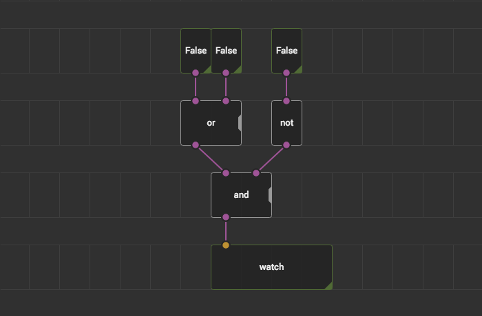

<!--
This file is auto-generated from the 'welcome-to-xod' project.
Do not change this file manually because your changes may be lost after
the tutorial update.

To make changes, change the 'welcome-to-xod' contents or 'before-1st-h2.md'.

If you want to change a Fritzing scheme or comments for it, change the
'before-1st-h2.md' in the documentation directory for the patch.

Then run auto-generator tool (xod/tools/generate-tutorial-docs.js).
-->

Note
This is a web-version of a tutorial chapter embedded right into the XOD IDE.
To get a better learning experience we recommend to install the
<a href="/downloads/">desktop IDE</a> or start the
<a href="/ide/">browser-based IDE</a>, and you’ll see the same tutorial there.

# Booleans

In previous lessons we mostly dealt with numbers adjusting counter step and clock interval. Now let's talk about _booleans_. They have only who possible values:

- _True_ (aka logic one, high signal)
- _False_ (aka logic zero, low signal)

Booleans are extremely useful and common. They may be used to indicate whether some condition is met, should a device be on or off, did some operation succeed, etc.

## Exercise

Let’s learn how boolean values can be combined.

1.  Read the descriptions for `and`, `or` and `not` nodes.
2.  Guess what the output value of `and` will be.
3.  Run the simulation to confirm it.
4.  Use `tweak-boolean` nodes to change it to the opposite value.

Check out descriptions for `nand`, `nor` and `xor` nodes. Add them onto the patch along with some additional tweaks to make a more complex processing.

## 👆 Ladder logic

If one would use binary sensors like buttons or mechanic switches as a source of boolean values and relays instead of watches, he can use XOD to program PLC devices resembling the ladder programming which is common in industrial applications.

  

    <a href="../006-help/">← Previous lesson</a>
  

  

    <a href="../">Index</a>
  

  

    <a href="../008-variadics/">Next lesson →</a>
  

