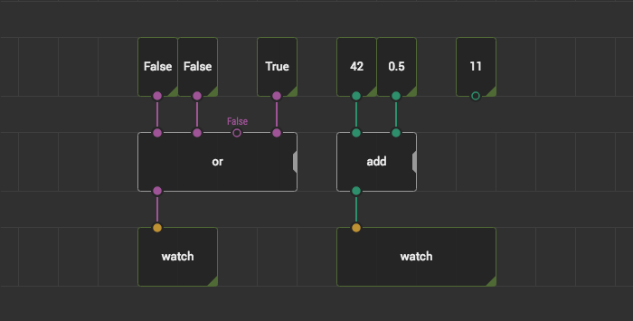

<!--
This file is auto-generated from the 'welcome-to-xod' project.
Do not change this file manually because your changes may be lost after
the tutorial update.

To make changes, change the 'welcome-to-xod' contents or 'before-1st-h2.md'.

If you want to change a Fritzing scheme or comments for it, change the
'before-1st-h2.md' in the documentation directory for the patch.

Then run auto-generator tool (xod/tools/generate-tutorial-docs.js).
-->

Note
This is a web-version of a tutorial chapter embedded right into the XOD IDE.
To get a better learning experience we recommend to install the
<a href="/downloads/">desktop IDE</a> or start the
<a href="/ide/">browser-based IDE</a>, and you’ll see the same tutorial there.

# Variadic Nodes

Check out the `or` node on this patch. In the previous lesson we saw that it has just two inputs, but now it has four! That's because some of the nodes in XOD are *variadic* — you can change their number of inputs.

Variadic nodes can be recognized by the handle on the right side. Also, their pins are marked as “variadic” in the help panels.

## Exercise

Let’s learn how to adjust the number of inputs.

1. Hover over the right side of the `add` node. Your cursor should become a double arrow.
2. Click and drag to the right to add more inputs.
3. Use the new inputs to link the “11” `tweak-number`, bind some values to others.

As you guess, `add` will sum all the inputs it got. Run the simulation to verify.

  

    <a href="../007-booleans/">← Previous lesson</a>
  

  

    <a href="../">Index</a>
  

  

    <a href="../009-pulses/">Next lesson →</a>
  

