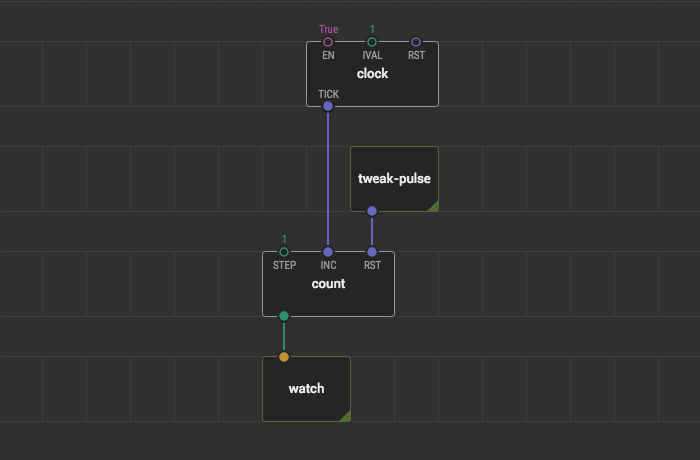

<!--
This file is auto-generated from the 'welcome-to-xod' project.
Do not change this file manually because your changes may be lost after
the tutorial update.

To make changes, change the 'welcome-to-xod' contents or 'before-1st-h2.md'.

If you want to change a Fritzing scheme or comments for it, change the
'before-1st-h2.md' in the documentation directory for the patch.

Then run auto-generator tool (xod/tools/generate-tutorial-docs.js).
-->

Note
This is a web-version of a tutorial chapter embedded right into the XOD IDE.
To get a better learning experience we recommend to install the
<a href="/downloads/">desktop IDE</a> or start the
<a href="/ide/">browser-based IDE</a>, and you’ll see the same tutorial there.

# Pulses

In previous lessons, we told that the `clock` node ticks. To be more precise, the node outputs _pulses_.

This data type is very different from all the others like numbers and booleans. Values ​​in the XOD are transferred to the links continuously, even if they don’t change. They are like voltage. The pulse data type is different. Imagine something like a flash. It’s basically a message to trigger something else. It does not transmit any data. Howerver, it is useful when you need to convey that an event has occurred or tell something else to work.

And of course, XOD offers a `tweak-pulse` node to send pulses manually during simulation.

## Exercice

Let’s play with pulses using `tweak-pulse`.

1. Run the simulation.
2. Select the `tweak-pulse` node.
3. Press the “pulse” button in the Inspector; the counter will reset back to 0.
4. Replace the `clock` node with an another `tweak-pulse` and restart the simulation.
5. Increment the counter by manually sending pulses to `INC` pin.

  

    <a href="../008-variadics/">← Previous lesson</a>
  

  

    <a href="../">Index</a>
  

  

    <a href="../010-flip-flop/">Next lesson →</a>
  

