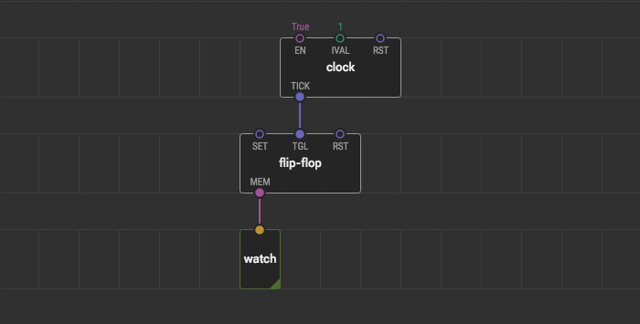

<!--
This file is auto-generated from the 'welcome-to-xod' project.
Do not change this file manually because your changes may be lost after
the tutorial update.

To make changes, change the 'welcome-to-xod' contents or 'before-1st-h2.md'.

If you want to change a Fritzing scheme or comments for it, change the
'before-1st-h2.md' in the documentation directory for the patch.

Then run auto-generator tool (xod/tools/generate-tutorial-docs.js).
-->

Note
This is a web-version of a tutorial chapter embedded right into the XOD IDE.
To get a better learning experience we recommend to install the
<a href="/downloads/">desktop IDE</a> or start the
<a href="/ide/">browser-based IDE</a>, and you’ll see the same tutorial there.

# Flip-flops

You can control the behavior of many nodes with pulses. A very useful node is `flip-flop`. It acts like a virtual switch, whose states can be controlled by pulses. A pulse on `SET` turns the stored `MEM` value to true. `RST` resets `MEM` to false. And a pulse on `TGL` inverses the `MEM` value.

The patch shown here toggles the output boolean value each second.

## Exercise

Let’s experiment with the `flip-flop` node.

1.  Replace `clock` node with `tweak-pulse` node.
2.  Add a couple more `tweak-pulse`s and connect them to `flip-flop`'s `SET` and `RST` pins.
3.  Run the simulation, and send pulses to each pin

Observe how the `MEM` value changes when sending several pulses to the same pin in a row.

  

    <a href="../009-pulses/">← Previous lesson</a>
  

  

    <a href="../">Index</a>
  

  

    <a href="../011-branching/">Next lesson →</a>
  

