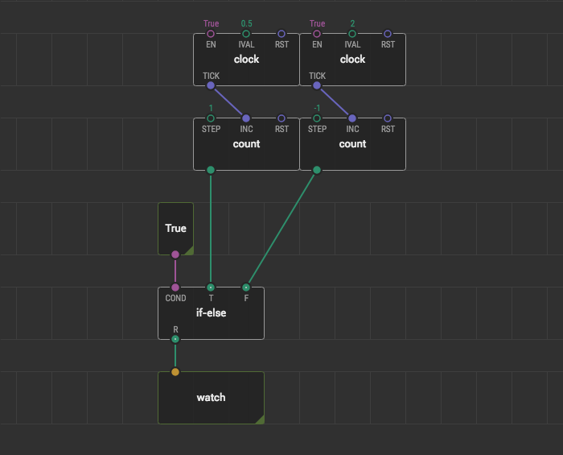

<!--
This file is auto-generated from the 'welcome-to-xod' project.
Do not change this file manually because your changes may be lost after
the tutorial update.

To make changes, change the 'welcome-to-xod' contents or 'before-1st-h2.md'.

If you want to change a Fritzing scheme or comments for it, change the
'before-1st-h2.md' in the documentation directory for the patch.

Then run auto-generator tool (xod/tools/generate-tutorial-docs.js).
-->

Note
This is a web-version of a tutorial chapter embedded right into the XOD IDE.
To get a better learning experience we recommend to install the
<a href="/downloads/">desktop IDE</a> or start the
<a href="/ide/">browser-based IDE</a>, and you’ll see the same tutorial there.

# Branching

Choosing between values based on some condition is a common task. For this, there is an `if-else` node in `xod/core`.

The `COND` pin of this node checks the boolean input value. If `COND` receives true, the node sets the value from the `T` pin to the `R` pin. When it receives false, it sets the value from the `F` pin to the `R` pin.

## Exercise

Learn how `if-else` behaves.

1.  Run the simulation.
2.  Change the value of the `tweak-boolean` node, observe how `if-else` output chenges.
3.  Replace `tweak-boolean` with a `flop-flop` with `TGL` pin connected to a `clock`.

  

    <a href="../010-flip-flop/">← Previous lesson</a>
  

  

    <a href="../">Index</a>
  

  

    <a href="../012-strings/">Next lesson →</a>
  

