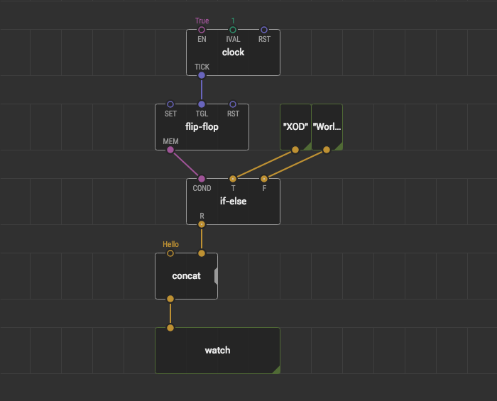

<!--
This file is auto-generated from the 'welcome-to-xod' project.
Do not change this file manually because your changes may be lost after
the tutorial update.

To make changes, change the 'welcome-to-xod' contents or 'before-1st-h2.md'.

If you want to change a Fritzing scheme or comments for it, change the
'before-1st-h2.md' in the documentation directory for the patch.

Then run auto-generator tool (xod/tools/generate-tutorial-docs.js).
-->

Note
This is a web-version of a tutorial chapter embedded right into the XOD IDE.
To get a better learning experience we recommend to install the
<a href="/downloads/">desktop IDE</a> or start the
<a href="/ide/">browser-based IDE</a>, and you’ll see the same tutorial there.

# Strings

Another important data type is a _string_. Strings represent pieces of text like “Hello World!” or "[https://xod.io](https://xod.io/?utm_source=ide&utm_medium=ide_comment&utm_campaign=tutorial)". XOD depicts the string type in yellow.

Tweak nodes for strings are a bit special. For optimisation purposes XOD needs to know the maximum length of the tweaked string, so there are several ones available. When you want to add a string tweak, choose the smallest one necessary.

The standard library contains a few nodes to work with strings and text. One useful node is `concat`. It joins several parts into a single one. This allows creating a message out of several data sources.

## Exercise

Try strings in runtime.

1.  Run the Simulation.
2.  Observe how the message alternates between "Hello World" and "Hello XOD".
3.  Change values of `tweak-string-16`s to change the message.
4.  Add a third pin to `concat` and bind an exclamation point to it.

## 👆 Generics

Note, the `if-else` node can work with numbers _or_ strings depending on the incoming value type. The pins which accept various types are called _generic_. You can spot them by the little dot in the center.

If you want to bind a string value to a generic pin, you should enquote it because the number `3.14` and the string `"3.14"` are different things. The quotes explicitly tell XOD you’ve meant a string value.

  

    <a href="../011-branching/">← Previous lesson</a>
  

  

    <a href="../">Index</a>
  

  

    <a href="../100-hardware/">Next lesson →</a>
  

