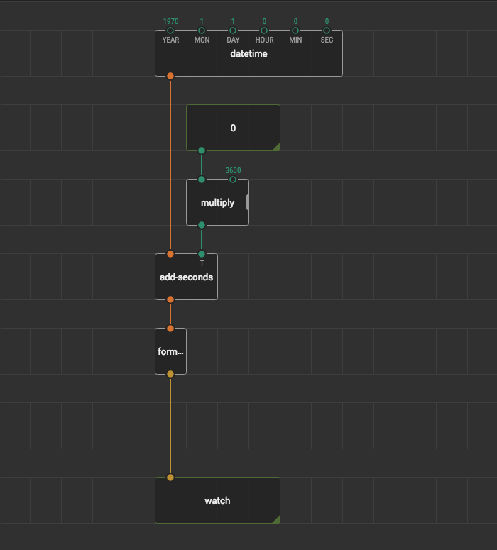

<!--
This file is auto-generated from the 'welcome-to-xod' project.
Do not change this file manually because your changes may be lost after
the tutorial update.

To make changes, change the 'welcome-to-xod' contents or 'before-1st-h2.md'.

If you want to change a Fritzing scheme or comments for it, change the
'before-1st-h2.md' in the documentation directory for the patch.

Then run auto-generator tool (xod/tools/generate-tutorial-docs.js).
-->

Note
This is a web-version of a tutorial chapter embedded right into the XOD IDE.
To get a better learning experience we recommend to install the
<a href="/downloads/">desktop IDE</a> or start the
<a href="/ide/">browser-based IDE</a>, and you’ll see the same tutorial there.

# Custom Types

In addition to the primitive data types, XOD has more complicated _custom_ types. Custom types can consist of other types or wrap C++ classes.

Consider custom type values like black boxes that can't do anything on their own. An author of the custom type always puts some nodes which operate on such custom type values. Use these to perform actions on custom type value, query the custom type data, or create and update the custom type values.

## Datetime

On this patch, you see the `datetime` node, which takes few numbers and outputs a value of a custom type `xod/datetime/datetime`.

This type contains a so-called POSIX timestamp inside. The `xod/datetime` library provides nodes to manipulate the `datetime` and format it to in arbitrary way.

- The `datetime` node is one of the _type constructors_. Note that the minimum value is 1st January of the 1970 year. It's a starting point of the Unix epoch.
- The `add-seconds` node shifts the date by adding some number of seconds.
- The `format-timestamp` node outputs the datetime in the default format.

Bind the current time and start the simulation.

## Excercise

Format the same datetime as "24.03.2019 9:47 am".

1.  Replace `format-timestamp` with the `unpack-datetime` node.
2.  Place an `am-pm` node and link it with the `HOUR` output.
3.  Place `if-else` node, link it with `AM` output and bind strings: "am" for `T` and "pm" for `F`.
4.  Construct a new datetime format using `concat` nodes as it is inside the `format-timestamp` node, including the "am"/"pm" suffix feature.

Run the simulation and check it out.

Add or subtract some hours using the `tweak-number` node that is already on the patch, to ensure that "am" and "pm" suffix works.

---

You'll discover that XOD uses custom types extensivelly. They encapsulate different hardware devices, interfaces, protocols, and so on.

If you want to learn how to implement your custom type, read the guide: "[Defining Custom Types](https://xod.io/docs/guide/custom-types/)".

  

    <a href="../012-strings/">← Previous lesson</a>
  

  

    <a href="../">Index</a>
  

  

    <a href="../014-internet-tethering/">Next lesson →</a>
  

